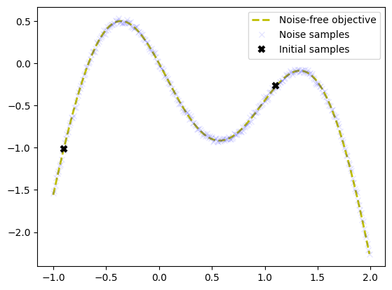
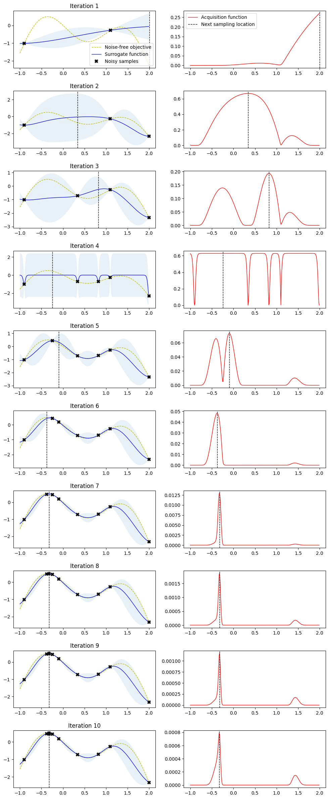

# Expected improvement

- https://nbviewer.org/github/krasserm/bayesian-machine-learning/blob/dev/bayesian-optimization/bayesian_optimization.ipynb
- https://towardsdatascience.com/conceptual-overview-of-bayesian-optimization-for-parameter-tuning-in-machine-learning-a3b1b4b9339f/
- https://medium.com/towards-data-science/bayesian-optimization-a-step-by-step-approach-a1cb678dd2ec


```python
import matplotlib.pyplot as plt
import numpy as np
from scipy.optimize import minimize
from scipy.stats import norm
from sklearn.gaussian_process import GaussianProcessRegressor
from sklearn.gaussian_process.kernels import ConstantKernel, Matern
```


```python
bounds = np.array([[-1.0, 2.0]])
noise = 0.02


def f(X, noise=noise):
    return -np.sin(3 * X) - X**2 + 0.7 * X + noise * np.random.randn(*X.shape)


X_init = np.array([[-0.9], [1.1]])
Y_init = f(X_init)
```


```python
# Dense grid of points within bounds.
X = np.arange(*bounds[0], 0.01).reshape(-1, 1)

# Noise-free objective function values at X
Y = f(X, 0)

# Plot optimization objective with noise level.
plt.plot(X, Y, "y--", lw=2, label="Noise-free objective")
plt.plot(X, f(X), "bx", lw=1, alpha=0.1, label="Noise samples")
plt.plot(X_init, Y_init, "kx", mew=3, label="Initial samples")
plt.legend();
```


    

    


```python
def expected_improvement(X, X_sample, Y_sample, gpr, xi=0.01):
    """
    Computes the EI at points X based on existing samples X_sample and Y_sample
    using Gaussian process surrogate model.

    Args:
        X: Points at which EI should be computed (m x d).
        X_sample: Sample locations (n x d)
        Y_sample: Sample values (n x 1)
        gpr: A GaussianProcessRegressor fitted to samples
        xi: Exploitation-exploration trade-off parameter.

    Returns:
        Expected improvements at points X.
    """
    mu, sigma = gpr.predict(X, return_std=True)
    mu_sample = gpr.predict(X_sample)
    mu_sample_opt = np.max(mu_sample)

    with np.errstate(divide="warn"):
        imp = mu - mu_sample_opt - xi
        Z = imp / sigma
        ei = imp * norm.cdf(Z) + sigma * norm.pdf(Z)
        ei[sigma == 0.0] = 0.0

    return ei
```


```python
def propose_location(acquisition, X_sample, Y_sample, gpr, bounds, n_restarts=25):
    """
    Proposes the next sampling point by optimizing the acquisition function.

    Args:
        acquisition: Acquisition function.
        X_sample: Sample locations (n x d).
        Y_sample: Sample values (n x 1).
        gpr: A GaussianProcessRegressor fitted to samples.

    Returns:
        Location of the acquisition function maximum.
    """
    dim = X_sample.shape[1]
    min_val = 1
    min_x = None

    def min_obj(X):
        # Minimization objective is the negative acquisition function
        return -acquisition(X.reshape(-1, dim), X_sample, Y_sample, gpr)

    # Find the best optimum by starting from n_restart different random points.
    for x0 in np.random.uniform(bounds[:, 0], bounds[:, 1], size=(n_restarts, dim)):
        res = minimize(min_obj, x0=x0, bounds=bounds, method="L-BFGS-B")
        if res.fun < min_val:
            min_val = res.fun
            min_x = res.x

    return min_x.reshape(-1, 1)
```


```python
def plot_approximation(gpr, X, Y, X_sample, Y_sample, X_next=None, show_legend=False):
    mu, std = gpr.predict(X, return_std=True)
    plt.fill_between(
        X.ravel(), mu.ravel() + 1.96 * std, mu.ravel() - 1.96 * std, alpha=0.1
    )
    plt.plot(X, Y, "y--", lw=1, label="Noise-free objective")
    plt.plot(X, mu, "b-", lw=1, label="Surrogate function")
    plt.plot(X_sample, Y_sample, "kx", mew=3, label="Noisy samples")
    if X_next:
        plt.axvline(x=X_next, ls="--", c="k", lw=1)
    if show_legend:
        plt.legend()


def plot_acquisition(X, Y, X_next, show_legend=False):
    plt.plot(X, Y, "r-", lw=1, label="Acquisition function")
    plt.axvline(x=X_next, ls="--", c="k", lw=1, label="Next sampling location")
    if show_legend:
        plt.legend()
```


```python
from sklearn.gaussian_process import GaussianProcessRegressor
from sklearn.gaussian_process.kernels import ConstantKernel, Matern

# Gaussian process with Matérn kernel as surrogate model
m52 = ConstantKernel(1.0) * Matern(length_scale=1.0, nu=2.5)
gpr = GaussianProcessRegressor(kernel=m52, alpha=noise**2)

# Initialize samples
X_sample = X_init
Y_sample = Y_init

# Number of iterations
n_iter = 10

plt.figure(figsize=(12, n_iter * 3))
plt.subplots_adjust(hspace=0.4)

for i in range(n_iter):
    # Update Gaussian process with existing samples
    gpr.fit(X_sample, Y_sample)

    # Obtain next sampling point from the acquisition function (expected_improvement)
    X_next = propose_location(expected_improvement, X_sample, Y_sample, gpr, bounds)

    # Obtain next noisy sample from the objective function
    Y_next = f(X_next, noise)

    # Plot samples, surrogate function, noise-free objective and next sampling location
    plt.subplot(n_iter, 2, 2 * i + 1)
    plot_approximation(gpr, X, Y, X_sample, Y_sample, X_next, show_legend=i == 0)
    plt.title(f"Iteration {i+1}")

    plt.subplot(n_iter, 2, 2 * i + 2)
    plot_acquisition(
        X, expected_improvement(X, X_sample, Y_sample, gpr), X_next, show_legend=i == 0
    )

    # Add sample to previous samples
    X_sample = np.vstack((X_sample, X_next))
    Y_sample = np.vstack((Y_sample, Y_next))
```


    

    

