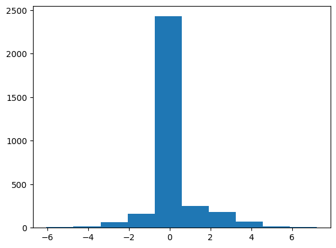
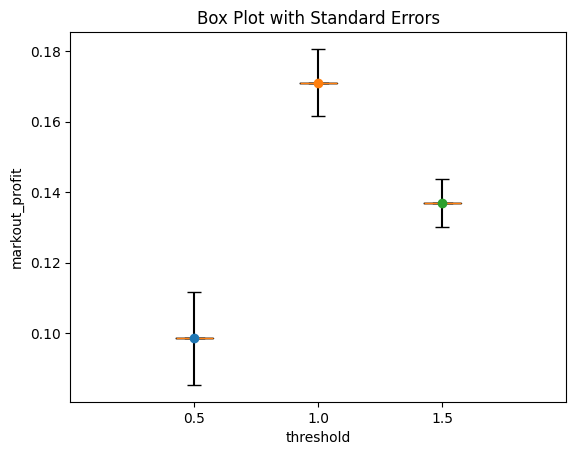
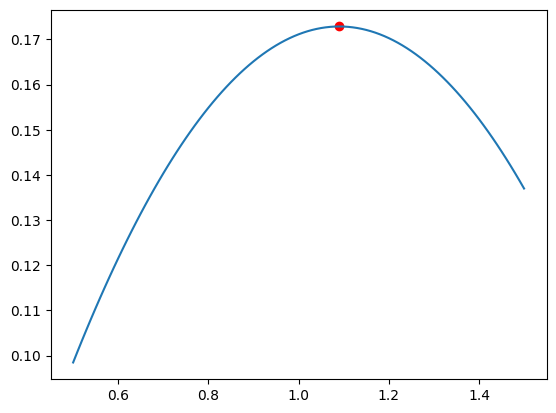
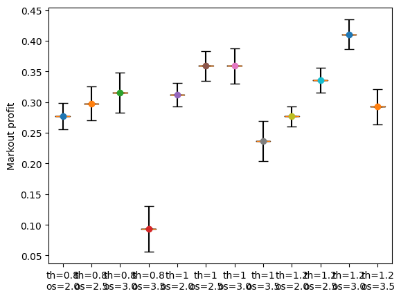
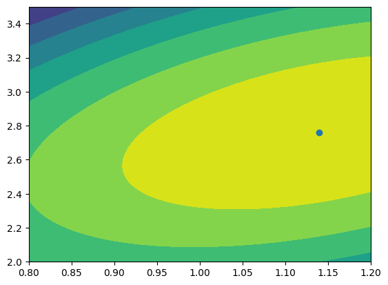

# Response Surface Methodology


```python
import matplotlib.pyplot as plt
import numpy as np
from numpy.polynomial import Polynomial
from sklearn.linear_model import LinearRegression
from sklearn.preprocessing import PolynomialFeatures

from rsm import (
    boxplot,
    design_ccd,
    markout_profit,
    markout_profit_2D,
    run_experiment,
    run_experiment_2D,
)
```


```python
np.random.seed(17)
data = [markout_profit(threshold=1) for _ in range(3200)]
plt.hist(data);
```


    

    


```python
np.mean(data), np.std(data)
```


    (0.20921999649715084, 1.163925290620134)


```python
np.random.seed(17)
thresholds = np.array([0.5, 1.0, 1.5])
aggregate_measurements, standard_errors = run_experiment(15000, thresholds)
aggregate_measurements, standard_errors
```


    ([0.09848496576216006, 0.1711214205711533, 0.13699263220703944],
     [0.013267765976681866, 0.00957041724519083, 0.006796544642991194])


```python
# For boxplot, every group should be an array of measurements,
# that is why we reshape the 1d array of aggregate measurements.
boxplot(np.array(aggregate_measurements).reshape(1, -1), standard_errors, thresholds);
```


    

    


```python
X = np.array(thresholds)
X = np.stack([np.ones(len(X)), X, X**2], axis=1)  # Add bias at first position.
y = np.array(aggregate_measurements)
beta = np.linalg.solve(X, y)
beta
```


    array([-0.08091673,  0.46556864, -0.21353049])


```python
from sklearn.linear_model import LinearRegression

reg = LinearRegression().fit(X, y)
reg.coef_, reg.intercept_
```


    (array([ 0.        ,  0.46556864, -0.21353049]), -0.08091673221993967)


```python
reg = LinearRegression().fit(
    PolynomialFeatures(degree=2).fit_transform(thresholds.reshape(-1, 1)), y
)
reg.coef_, reg.intercept_
```


    (array([ 0.        ,  0.46556864, -0.21353049]), -0.08091673221993967)


```python
from numpy.polynomial import Polynomial

p = Polynomial.fit(thresholds, aggregate_measurements, deg=2)
print(p)
np.allclose(p(thresholds), aggregate_measurements)
```

    0.17112142 + 0.01925383·x - 0.05338262·x²


    True


```python
def linear_regression(thresholds, aggregate_measurements):
    x = thresholds
    y = aggregate_measurements
    X = np.array([np.ones(len(y)), x, x**2]).T
    beta = np.linalg.inv(X.T @ X) @ (X.T @ y)
    return beta


beta = linear_regression(thresholds, aggregate_measurements)
beta
```


    array([-0.08091673,  0.46556864, -0.21353049])


```python
def interpolate(thresholds, beta):
    xhat = np.arange(thresholds.min(), thresholds.max() + 1e-6, 0.01)
    XHat = np.array([np.ones(len(xhat)), xhat, xhat**2]).T
    yhat = XHat @ beta
    return xhat, yhat
```


```python
xhat, yhat = interpolate(thresholds, beta)
```


```python
def optimize(thresholds, beta):
    xhat, yhat = interpolate(thresholds, beta)
    i = yhat.argmax()
    return xhat[i], yhat[i]
```


```python
x_max, y_max = optimize(thresholds, beta)
x_max, y_max
```


    (1.0900000000000005, 0.1728575136117838)


```python
plt.plot(xhat, yhat)
plt.scatter(x_max, y_max, color="red");
```


    

    


```python
np.random.seed(17)
aggregate_measurement, standard_error = run_experiment(15000, [x_max])
aggregate_measurement, standard_error
```


    ([0.1583811639290035], [0.008945771088795991])


```python
aggregate_measurement[0] - 2 * standard_error[0], aggregate_measurement[
    0
] + 2 * standard_error[0]
```


    (0.14048962175141153, 0.17627270610659548)


## Optimizing two or more continuous parameters


```python
np.random.seed(17)
# parameters = design_ccd(thresholds=[0.5, 1.0, 1.5], order_sizes=[1, 1.5, 2])
parameters = design_ccd(thresholds=[0.8, 1, 1.2], order_sizes=[2.0, 2.5, 3.0, 3.5])
aggregate_measurements, standard_errors = run_experiment_2D(15000, parameters)
# parameters, aggregate_measurements, standard_errors
```


```python
_fig, ax = plt.subplots()
ax.boxplot(
    np.array(aggregate_measurements).reshape(1, -1),
    positions=range(len(aggregate_measurements)),
)
# Add standard error bars
for i, (x, y, serr) in enumerate(
    zip(range(len(aggregate_measurements)), aggregate_measurements, standard_errors)
):
    ax.errorbar(x, y, yerr=serr, fmt="o", capsize=5, ecolor="black")

ax.set_xticklabels(["th={}\nos={}".format(*p) for p in parameters])
ax.set_ylabel("Markout profit");
```


    

    


```python
p = LinearRegression().fit(
    PolynomialFeatures(degree=2).fit_transform(parameters),
    aggregate_measurements,
)
p.coef_
```


    array([ 0.        ,  0.76655867,  0.71015834, -0.73040861,  0.32774051,
           -0.19642281])


```python
p.predict(
    PolynomialFeatures(degree=2).fit_transform(parameters)
), aggregate_measurements
```


    (array([0.27791466, 0.32213871, 0.26815135, 0.11595259, 0.2993755 ,
            0.3763736 , 0.3551603 , 0.23573558, 0.26240365, 0.3721758 ,
            0.38373655, 0.29708589]),
     [0.27708940099281754,
      0.29784893520006794,
      0.31588886931844135,
      0.09333010788066991,
      0.311876398646593,
      0.35901735287078407,
      0.3590057270728719,
      0.236745503170859,
      0.2767465777872881,
      0.3357661393728166,
      0.4102092885362126,
      0.29267988932693567])


```python
def linear_regression_2D(parameters, aggregate_measurements):
    parameters = np.array(parameters)
    x0 = parameters[:, 0]
    x1 = parameters[:, 1]
    y = aggregate_measurements
    X = np.array([np.ones(len(y)), x0, x1, x0**2, x0 * x1, x1**2]).T
    beta = np.linalg.inv(X.T @ X) @ (X.T @ y)
    return beta
```


```python
beta = linear_regression_2D(parameters, aggregate_measurements)
beta
```


    array([-1.02688101,  0.76655867,  0.71015834, -0.73040861,  0.32774051,
           -0.19642281])


```python
def interpolate_2D(parameters, beta):
    parameters = np.array(parameters)
    x0_values = np.arange(parameters[:, 0].min(), parameters[:, 0].max() + 1e-6, 0.01)
    x1_values = np.arange(parameters[:, 1].min(), parameters[:, 1].max() + 1e-6, 0.01)
    x0hat_2d, x1hat_2d = np.meshgrid(x0_values, x1_values)
    x0hat = x0hat_2d.flatten()
    x1hat = x1hat_2d.flatten()
    XHat = np.array(
        [np.ones(len(x0hat)), x0hat, x1hat, x0hat**2, x0hat * x1hat, x1hat**2]
    ).T
    yhat = XHat @ beta
    yhat_2d = np.reshape(yhat, (len(x1_values), len(x0_values)))
    return x0hat_2d, x1hat_2d, yhat_2d
```


```python
def optimize_2D(parameters, beta):
    x0hat, x1hat, yhat = interpolate_2D(parameters, beta)
    i = np.where(yhat == yhat.max())
    return x0hat[i][0], x1hat[i][0], yhat[i][0]
    # x, y = np.unravel_index(np.argmax(yhat), yhat.shape)
    # i = ([x], [y])
    # return x0hat[i][0], x1hat[i][0], yhat[i][0]
```


```python
np.random.seed(17)
beta = linear_regression_2D(parameters, aggregate_measurements)
threshold_opt, order_size_opt, estimated_max_profit = optimize_2D(parameters, beta)
threshold_opt, order_size_opt, estimated_max_profit
```


    (1.1400000000000003, 2.759999999999984, 0.39272619450695345)


```python
x, y = np.meshgrid([1, 2, 3], [4, 5, 6])
x, y, x.flatten(), y.flatten()
```


    (array([[1, 2, 3],
            [1, 2, 3],
            [1, 2, 3]]),
     array([[4, 4, 4],
            [5, 5, 5],
            [6, 6, 6]]),
     array([1, 2, 3, 1, 2, 3, 1, 2, 3]),
     array([4, 4, 4, 5, 5, 5, 6, 6, 6]))


```python
import itertools

# Note that the x and y is inversed
y, x = list(zip(*itertools.product([4, 5, 6], [1, 2, 3])))
y, x
```


    ((4, 4, 4, 5, 5, 5, 6, 6, 6), (1, 2, 3, 1, 2, 3, 1, 2, 3))


```python
parameters = np.array(parameters)
x0_values = np.arange(parameters[:, 0].min(), parameters[:, 0].max() + 1e-6, 0.01)
x1_values = np.arange(parameters[:, 1].min(), parameters[:, 1].max() + 1e-6, 0.01)
# x = np.array(list(itertools.product(x0_values, x1_values)))
x0hat_2d, x1hat_2d = np.meshgrid(x0_values, x1_values)
x0hat = x0hat_2d.flatten()
x1hat = x1hat_2d.flatten()
x = list(zip(x0hat, x1hat))
y = p.predict(PolynomialFeatures(degree=2).fit_transform(x))

i = y.argmax()
print(x[i], y[i])
```

    (1.1400000000000003, 2.759999999999984) 0.3927261945067131


```python
plt.contourf(x0_values, x1_values, y.reshape(-1, x0_values.shape[0]))
plt.scatter(*x[i]);
```


    

    


```python
aggregate_measurement, standard_error = run_experiment_2D(
    15000, parameters=[(threshold_opt, order_size_opt)]
)
aggregate_measurement, standard_error
```


    ([0.37001384966623435], [0.023458944375782362])


```python
aggregate_measurement[0] - 2 * standard_error[0], aggregate_measurement[
    0
] + 2 * standard_error[0]
```


    (0.32309596091466963, 0.41693173841779907)


