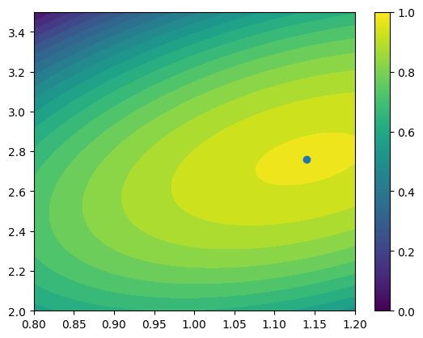

# Response Surface Methodology


```python
import matplotlib.pyplot as plt
import numpy as np
from numpy.polynomial import Polynomial
from sklearn.linear_model import LinearRegression
from sklearn.preprocessing import PolynomialFeatures

from rsm import (
    boxplot,
    design_ccd,
    markout_profit,
    markout_profit_2D,
    run_experiment,
    run_experiment_2D,
)
```


```python
np.random.seed(17)
data = [markout_profit(threshold=1) for _ in range(3200)]
plt.hist(data);
```


    

    


```python
np.mean(data), np.std(data)
```


    (0.20921999649715084, 1.163925290620134)


```python
np.random.seed(17)
thresholds = np.array([0.5, 1.0, 1.5])
aggregate_measurements, standard_errors = run_experiment(15000, thresholds)
aggregate_measurements, standard_errors
```


    ([0.09848496576216006, 0.1711214205711533, 0.13699263220703944],
     [0.013267765976681866, 0.00957041724519083, 0.006796544642991194])


```python
# For boxplot, every group should be an array of measurements,
# that is why we reshape the 1d array of aggregate measurements.
boxplot(np.array(aggregate_measurements).reshape(1, -1), standard_errors, thresholds);
```


    

    


```python
X = np.array(thresholds)
X = np.stack([np.ones(len(X)), X, X**2], axis=1)  # Add bias at first position.
y = np.array(aggregate_measurements)
beta = np.linalg.solve(X, y)
beta
```


    array([-0.08091673,  0.46556864, -0.21353049])


```python
from sklearn.linear_model import LinearRegression

reg = LinearRegression().fit(X, y)
reg.coef_, reg.intercept_
```


    (array([ 0.        ,  0.46556864, -0.21353049]), -0.08091673221993967)


```python
reg = LinearRegression().fit(
    PolynomialFeatures(degree=2).fit_transform(thresholds.reshape(-1, 1)), y
)
reg.coef_, reg.intercept_
```


    (array([ 0.        ,  0.46556864, -0.21353049]), -0.08091673221993967)


```python
from numpy.polynomial import Polynomial

p = Polynomial.fit(thresholds, aggregate_measurements, deg=2)
print(p)
np.allclose(p(thresholds), aggregate_measurements)
```

    0.17112142 + 0.01925383·x - 0.05338262·x²


    True


```python
def linear_regression(thresholds, aggregate_measurements):
    x = thresholds
    y = aggregate_measurements
    X = np.array([np.ones(len(y)), x, x**2]).T
    beta = np.linalg.inv(X.T @ X) @ (X.T @ y)
    return beta


beta = linear_regression(thresholds, aggregate_measurements)
beta
```


    array([-0.08091673,  0.46556864, -0.21353049])


```python
def interpolate(thresholds, beta):
    xhat = np.arange(thresholds.min(), thresholds.max() + 1e-6, 0.01)
    XHat = np.array([np.ones(len(xhat)), xhat, xhat**2]).T
    yhat = XHat @ beta
    return xhat, yhat
```


```python
xhat, yhat = interpolate(thresholds, beta)
```


```python
def optimize(thresholds, beta):
    xhat, yhat = interpolate(thresholds, beta)
    i = yhat.argmax()
    return xhat[i], yhat[i]
```


```python
x_max, y_max = optimize(thresholds, beta)
x_max, y_max
```


    (1.0900000000000005, 0.1728575136117838)


```python
plt.plot(xhat, yhat)
plt.scatter(x_max, y_max, color="red");
```


    

    


```python
np.random.seed(17)
aggregate_measurement, standard_error = run_experiment(15000, [x_max])
aggregate_measurement, standard_error
```


    ([0.1583811639290035], [0.008945771088795991])


```python
aggregate_measurement[0] - 2 * standard_error[0], aggregate_measurement[
    0
] + 2 * standard_error[0]
```


    (0.14048962175141153, 0.17627270610659548)


## Optimizing two or more continuous parameters


```python
np.random.seed(17)
# parameters = design_ccd(thresholds=[0.5, 1.0, 1.5], order_sizes=[1, 1.5, 2])
parameters = design_ccd(thresholds=[0.8, 1, 1.2], order_sizes=[2.0, 2.5, 3.0, 3.5])
aggregate_measurements, standard_errors = run_experiment_2D(15000, parameters)
# parameters, aggregate_measurements, standard_errors
```


```python
_fig, ax = plt.subplots()
ax.boxplot(
    np.array(aggregate_measurements).reshape(1, -1),
    positions=range(len(aggregate_measurements)),
)
# Add standard error bars
for i, (x, y, serr) in enumerate(
    zip(range(len(aggregate_measurements)), aggregate_measurements, standard_errors)
):
    ax.errorbar(x, y, yerr=serr, fmt="o", capsize=5, ecolor="black")

ax.set_xticklabels(["th={}\nos={}".format(*p) for p in parameters])
ax.set_ylabel("Markout profit");
```


    

    


```python
p = LinearRegression().fit(
    PolynomialFeatures(degree=2).fit_transform(parameters),
    aggregate_measurements,
)
p.coef_
```


    array([ 0.        ,  0.76655867,  0.71015834, -0.73040861,  0.32774051,
           -0.19642281])


```python
p.predict(
    PolynomialFeatures(degree=2).fit_transform(parameters)
), aggregate_measurements
```


    (array([0.27791466, 0.32213871, 0.26815135, 0.11595259, 0.2993755 ,
            0.3763736 , 0.3551603 , 0.23573558, 0.26240365, 0.3721758 ,
            0.38373655, 0.29708589]),
     [0.27708940099281754,
      0.29784893520006794,
      0.31588886931844135,
      0.09333010788066991,
      0.311876398646593,
      0.35901735287078407,
      0.3590057270728719,
      0.236745503170859,
      0.2767465777872881,
      0.3357661393728166,
      0.4102092885362126,
      0.29267988932693567])


```python
def linear_regression_2D(parameters, aggregate_measurements):
    parameters = np.array(parameters)
    x0 = parameters[:, 0]
    x1 = parameters[:, 1]
    y = aggregate_measurements
    X = np.array([np.ones(len(y)), x0, x1, x0**2, x0 * x1, x1**2]).T
    beta = np.linalg.inv(X.T @ X) @ (X.T @ y)
    return beta
```


```python
beta = linear_regression_2D(parameters, aggregate_measurements)
beta
```


    array([-1.02688101,  0.76655867,  0.71015834, -0.73040861,  0.32774051,
           -0.19642281])


```python
def interpolate_2D(parameters, beta):
    parameters = np.array(parameters)
    x0_values = np.arange(parameters[:, 0].min(), parameters[:, 0].max() + 1e-6, 0.01)
    x1_values = np.arange(parameters[:, 1].min(), parameters[:, 1].max() + 1e-6, 0.01)
    x0hat_2d, x1hat_2d = np.meshgrid(x0_values, x1_values)
    x0hat = x0hat_2d.flatten()
    x1hat = x1hat_2d.flatten()
    XHat = np.array(
        [np.ones(len(x0hat)), x0hat, x1hat, x0hat**2, x0hat * x1hat, x1hat**2]
    ).T
    yhat = XHat @ beta
    yhat_2d = np.reshape(yhat, (len(x1_values), len(x0_values)))
    return x0hat_2d, x1hat_2d, yhat_2d
```


```python
def optimize_2D(parameters, beta):
    x0hat, x1hat, yhat = interpolate_2D(parameters, beta)
    i = np.where(yhat == yhat.max())
    return x0hat[i][0], x1hat[i][0], yhat[i][0]
    # x, y = np.unravel_index(np.argmax(yhat), yhat.shape)
    # i = ([x], [y])
    # return x0hat[i][0], x1hat[i][0], yhat[i][0]
```


```python
np.random.seed(17)
beta = linear_regression_2D(parameters, aggregate_measurements)
threshold_opt, order_size_opt, estimated_max_profit = optimize_2D(parameters, beta)
threshold_opt, order_size_opt, estimated_max_profit
```


    (1.1400000000000003, 2.759999999999984, 0.39272619450695345)


```python
x, y = np.meshgrid([1, 2, 3], [4, 5, 6])
x, y, x.flatten(), y.flatten()
```


    (array([[1, 2, 3],
            [1, 2, 3],
            [1, 2, 3]]),
     array([[4, 4, 4],
            [5, 5, 5],
            [6, 6, 6]]),
     array([1, 2, 3, 1, 2, 3, 1, 2, 3]),
     array([4, 4, 4, 5, 5, 5, 6, 6, 6]))


```python
import itertools

# Note that the x and y is inversed
y, x = list(zip(*itertools.product([4, 5, 6], [1, 2, 3])))
y, x
```


    ((4, 4, 4, 5, 5, 5, 6, 6, 6), (1, 2, 3, 1, 2, 3, 1, 2, 3))


```python
parameters = np.array(parameters)
x0_values = np.arange(parameters[:, 0].min(), parameters[:, 0].max() + 1e-6, 0.01)
x1_values = np.arange(parameters[:, 1].min(), parameters[:, 1].max() + 1e-6, 0.01)
# x = np.array(list(itertools.product(x0_values, x1_values)))
x0hat_2d, x1hat_2d = np.meshgrid(x0_values, x1_values)
x0hat = x0hat_2d.flatten()
x1hat = x1hat_2d.flatten()
x = list(zip(x0hat, x1hat))
y = p.predict(PolynomialFeatures(degree=2).fit_transform(x))

i = y.argmax()
print(x[i], y[i])
```

    (1.1400000000000003, 2.759999999999984) 0.3927261945067131


```python
plt.contourf(x0_values, x1_values, y.reshape(-1, x0_values.shape[0]), levels=20)
plt.scatter(*x[i])
plt.colorbar();
```


    

    


```python
aggregate_measurement, standard_error = run_experiment_2D(
    15000, parameters=[(threshold_opt, order_size_opt)]
)
aggregate_measurement, standard_error
```


    ([0.37001384966623435], [0.023458944375782362])


```python
aggregate_measurement[0] - 2 * standard_error[0], aggregate_measurement[
    0
] + 2 * standard_error[0]
```


    (0.32309596091466963, 0.41693173841779907)


```python
from scipy.optimize import minimize
```


```python
def objective(args):
    # The negative is to minimize the value, so we are finding the max values.
    return -p.predict(PolynomialFeatures(degree=2).fit_transform(args.reshape(-1, 2)))


minimize(objective, (0, 0))
```


      message: Optimization terminated successfully.
      success: True
       status: 0
          fun: -0.39273874534807307
            x: [ 1.145e+00  2.763e+00]
          nit: 5
          jac: [ 6.557e-07  2.965e-06]
     hess_inv: [[ 8.385e-01  6.888e-01]
                [ 6.888e-01  3.080e+00]]
         nfev: 18
         njev: 6


```python
import numpy as np
from skopt import gp_minimize


def f(x):
    threshold, order_size = x
    return markout_profit_2D(threshold, order_size)


res = gp_minimize(f, [(0.8, 1.2), (2.0, 4.0)])
res
```


              fun: -15.877798248051867
                x: [0.9169705384277906, 3.6323398419933977]
        func_vals: [ 0.000e+00  0.000e+00 ...  0.000e+00 -5.832e+00]
          x_iters: [[0.9554047435470472, 2.713037349595759], [0.808207066479466, 3.983614621916495], [0.9746846148334046, 3.268154609996426], [0.9236504347757156, 2.116419207320988], [0.9483294464730802, 3.31565234865968], [0.8864964945564563, 3.879851038283865], [0.9016084673397688, 2.5213513612660825], [1.0404081336673954, 3.085851467839118], [1.0127370049428732, 3.426348395928438], [1.048604742555415, 3.5061112706242943], [1.0180925010444823, 3.4341502283178906], [0.8712969770868741, 3.9317328378418077], [0.8869284600760208, 3.8783341301171905], [0.8912158408998976, 3.8633593898272336], [0.9252544821027229, 3.881568803255582], [1.1805467627879098, 3.469907540006979], [0.8832888369132977, 2.1084509872935624], [0.9177329609858532, 2.7596520704734417], [0.9167861199507926, 3.0166879029609355], [0.9130464094003774, 2.572234373857027], [0.9197287469483563, 2.740557737681586], [1.0291832783129404, 3.661725540470191], [1.0015044605641876, 3.89999757121934], [1.0600367050752844, 2.6510965323059397], [0.932869929047897, 2.4231711600419668], [1.071654731120106, 2.924189588093394], [1.0833354672732238, 2.6635838772172824], [1.090382293969787, 3.3171090793235605], [1.169585680216496, 3.1723815695433633], [0.8182340625405433, 2.966662769658707], [1.0779970331559392, 3.654554083404318], [0.9178143318021472, 2.303335696122897], [0.9178301670544127, 3.4022263997753166], [0.917836602923861, 2.1417838915859178], [0.9178289264819128, 3.5483620352197276], [0.9192106817789315, 3.9945767788557283], [0.920141239655532, 3.8973056513369677], [0.9171116626368258, 2.207341992689291], [0.9176423035559487, 2.7605194201542687], [0.917701208918538, 2.7599558545327536], [0.8869096379717478, 3.818713939901233], [0.8869108062738115, 3.820588014924734], [0.8869123872727455, 3.822560012909359], [0.9170630864197477, 3.521092461546985], [0.9170152501478188, 3.583353483756487], [0.9169705384277906, 3.6323398419933977], [0.9166783159854424, 3.656600541305524], [0.9166737807129497, 3.654190513683929], [0.9166694420019027, 3.6514261219072095], [0.9166652766500847, 3.6488443754559343], [0.9166375771195915, 3.642758227212087], [0.9166344784358084, 3.640386120181791], [0.9166314981227994, 3.6379459014351507], [0.9166286265358475, 3.63561649981564], [0.916611650179011, 3.6367675197402503], [0.9163009825522522, 3.669640863725382], [0.9158896906944674, 3.7004766636872524], [0.9159388516663378, 3.692522811298903], [0.915988081716164, 3.6841084249979654], [0.9160378813230614, 3.675221186760708], [0.9160885392858182, 3.6656857190555723], [0.9160892698142152, 3.6576748842165863], [0.9166405956983934, 3.6273148288642103], [0.9164433060339459, 3.5512173063389314], [0.9164883003616624, 3.570869598712867], [1.1444721654054584, 3.596752960704289], [0.9036692858734096, 3.624768522464381], [0.9171142802558463, 3.6238863146522657], [0.9143090449597049, 4.0], [0.9138767547642981, 4.0], [0.9139973991159339, 4.0], [0.9141279047120524, 4.0], [0.9177341687630757, 4.0], [0.9176952405419309, 4.0], [0.9176539042143287, 4.0], [0.9173080103432811, 3.6130767836630455], [0.9172341209121844, 3.6134247883006134], [0.9161210373452536, 4.0], [0.9159691501325821, 4.0], [0.9159390085586634, 4.0], [0.9163578636965688, 3.6286618740723044], [0.916061878334372, 3.623615892331368], [0.9153999653556425, 3.615784860882461], [0.9150590057913468, 3.6131120497064817], [0.9157191157309358, 3.618137910698798], [0.9157712298387028, 3.6187196563759065], [0.915828716435013, 3.619355927190352], [0.9158944099918839, 3.620062172698014], [0.9159748203479027, 3.62088524636482], [0.9160910370685761, 3.621967740308061], [0.9171521495550669, 3.631057317773336], [0.9155638151074093, 3.61999513593997], [0.9175947060712855, 3.6361318352253], [0.9153424911864693, 3.6196192319253173], [0.9177840701759152, 3.6393804592123793], [0.9151740649381346, 3.616461606357455], [0.918132211945708, 2.7765795296541738], [0.91862170482758, 2.0], [0.91867916228019, 2.0], [0.9187348131238011, 2.0]]
           models: [GaussianProcessRegressor(kernel=1**2 * Matern(length_scale=[1, 1], nu=2.5) + WhiteKernel(noise_level=1),
                                            n_restarts_optimizer=2, noise='gaussian',
                                            normalize_y=True, random_state=504678031), GaussianProcessRegressor(kernel=1**2 * Matern(length_scale=[1, 1], nu=2.5) + WhiteKernel(noise_level=1),
                                            n_restarts_optimizer=2, noise='gaussian',
                                            normalize_y=True, random_state=504678031), GaussianProcessRegressor(kernel=1**2 * Matern(length_scale=[1, 1], nu=2.5) + WhiteKernel(noise_level=1),
                                            n_restarts_optimizer=2, noise='gaussian',
                                            normalize_y=True, random_state=504678031), GaussianProcessRegressor(kernel=1**2 * Matern(length_scale=[1, 1], nu=2.5) + WhiteKernel(noise_level=1),
                                            n_restarts_optimizer=2, noise='gaussian',
                                            normalize_y=True, random_state=504678031), GaussianProcessRegressor(kernel=1**2 * Matern(length_scale=[1, 1], nu=2.5) + WhiteKernel(noise_level=1),
                                            n_restarts_optimizer=2, noise='gaussian',
                                            normalize_y=True, random_state=504678031), GaussianProcessRegressor(kernel=1**2 * Matern(length_scale=[1, 1], nu=2.5) + WhiteKernel(noise_level=1),
                                            n_restarts_optimizer=2, noise='gaussian',
                                            normalize_y=True, random_state=504678031), GaussianProcessRegressor(kernel=1**2 * Matern(length_scale=[1, 1], nu=2.5) + WhiteKernel(noise_level=1),
                                            n_restarts_optimizer=2, noise='gaussian',
                                            normalize_y=True, random_state=504678031), GaussianProcessRegressor(kernel=1**2 * Matern(length_scale=[1, 1], nu=2.5) + WhiteKernel(noise_level=1),
                                            n_restarts_optimizer=2, noise='gaussian',
                                            normalize_y=True, random_state=504678031), GaussianProcessRegressor(kernel=1**2 * Matern(length_scale=[1, 1], nu=2.5) + WhiteKernel(noise_level=1),
                                            n_restarts_optimizer=2, noise='gaussian',
                                            normalize_y=True, random_state=504678031), GaussianProcessRegressor(kernel=1**2 * Matern(length_scale=[1, 1], nu=2.5) + WhiteKernel(noise_level=1),
                                            n_restarts_optimizer=2, noise='gaussian',
                                            normalize_y=True, random_state=504678031), GaussianProcessRegressor(kernel=1**2 * Matern(length_scale=[1, 1], nu=2.5) + WhiteKernel(noise_level=1),
                                            n_restarts_optimizer=2, noise='gaussian',
                                            normalize_y=True, random_state=504678031), GaussianProcessRegressor(kernel=1**2 * Matern(length_scale=[1, 1], nu=2.5) + WhiteKernel(noise_level=1),
                                            n_restarts_optimizer=2, noise='gaussian',
                                            normalize_y=True, random_state=504678031), GaussianProcessRegressor(kernel=1**2 * Matern(length_scale=[1, 1], nu=2.5) + WhiteKernel(noise_level=1),
                                            n_restarts_optimizer=2, noise='gaussian',
                                            normalize_y=True, random_state=504678031), GaussianProcessRegressor(kernel=1**2 * Matern(length_scale=[1, 1], nu=2.5) + WhiteKernel(noise_level=1),
                                            n_restarts_optimizer=2, noise='gaussian',
                                            normalize_y=True, random_state=504678031), GaussianProcessRegressor(kernel=1**2 * Matern(length_scale=[1, 1], nu=2.5) + WhiteKernel(noise_level=1),
                                            n_restarts_optimizer=2, noise='gaussian',
                                            normalize_y=True, random_state=504678031), GaussianProcessRegressor(kernel=1**2 * Matern(length_scale=[1, 1], nu=2.5) + WhiteKernel(noise_level=1),
                                            n_restarts_optimizer=2, noise='gaussian',
                                            normalize_y=True, random_state=504678031), GaussianProcessRegressor(kernel=1**2 * Matern(length_scale=[1, 1], nu=2.5) + WhiteKernel(noise_level=1),
                                            n_restarts_optimizer=2, noise='gaussian',
                                            normalize_y=True, random_state=504678031), GaussianProcessRegressor(kernel=1**2 * Matern(length_scale=[1, 1], nu=2.5) + WhiteKernel(noise_level=1),
                                            n_restarts_optimizer=2, noise='gaussian',
                                            normalize_y=True, random_state=504678031), GaussianProcessRegressor(kernel=1**2 * Matern(length_scale=[1, 1], nu=2.5) + WhiteKernel(noise_level=1),
                                            n_restarts_optimizer=2, noise='gaussian',
                                            normalize_y=True, random_state=504678031), GaussianProcessRegressor(kernel=1**2 * Matern(length_scale=[1, 1], nu=2.5) + WhiteKernel(noise_level=1),
                                            n_restarts_optimizer=2, noise='gaussian',
                                            normalize_y=True, random_state=504678031), GaussianProcessRegressor(kernel=1**2 * Matern(length_scale=[1, 1], nu=2.5) + WhiteKernel(noise_level=1),
                                            n_restarts_optimizer=2, noise='gaussian',
                                            normalize_y=True, random_state=504678031), GaussianProcessRegressor(kernel=1**2 * Matern(length_scale=[1, 1], nu=2.5) + WhiteKernel(noise_level=1),
                                            n_restarts_optimizer=2, noise='gaussian',
                                            normalize_y=True, random_state=504678031), GaussianProcessRegressor(kernel=1**2 * Matern(length_scale=[1, 1], nu=2.5) + WhiteKernel(noise_level=1),
                                            n_restarts_optimizer=2, noise='gaussian',
                                            normalize_y=True, random_state=504678031), GaussianProcessRegressor(kernel=1**2 * Matern(length_scale=[1, 1], nu=2.5) + WhiteKernel(noise_level=1),
                                            n_restarts_optimizer=2, noise='gaussian',
                                            normalize_y=True, random_state=504678031), GaussianProcessRegressor(kernel=1**2 * Matern(length_scale=[1, 1], nu=2.5) + WhiteKernel(noise_level=1),
                                            n_restarts_optimizer=2, noise='gaussian',
                                            normalize_y=True, random_state=504678031), GaussianProcessRegressor(kernel=1**2 * Matern(length_scale=[1, 1], nu=2.5) + WhiteKernel(noise_level=1),
                                            n_restarts_optimizer=2, noise='gaussian',
                                            normalize_y=True, random_state=504678031), GaussianProcessRegressor(kernel=1**2 * Matern(length_scale=[1, 1], nu=2.5) + WhiteKernel(noise_level=1),
                                            n_restarts_optimizer=2, noise='gaussian',
                                            normalize_y=True, random_state=504678031), GaussianProcessRegressor(kernel=1**2 * Matern(length_scale=[1, 1], nu=2.5) + WhiteKernel(noise_level=1),
                                            n_restarts_optimizer=2, noise='gaussian',
                                            normalize_y=True, random_state=504678031), GaussianProcessRegressor(kernel=1**2 * Matern(length_scale=[1, 1], nu=2.5) + WhiteKernel(noise_level=1),
                                            n_restarts_optimizer=2, noise='gaussian',
                                            normalize_y=True, random_state=504678031), GaussianProcessRegressor(kernel=1**2 * Matern(length_scale=[1, 1], nu=2.5) + WhiteKernel(noise_level=1),
                                            n_restarts_optimizer=2, noise='gaussian',
                                            normalize_y=True, random_state=504678031), GaussianProcessRegressor(kernel=1**2 * Matern(length_scale=[1, 1], nu=2.5) + WhiteKernel(noise_level=1),
                                            n_restarts_optimizer=2, noise='gaussian',
                                            normalize_y=True, random_state=504678031), GaussianProcessRegressor(kernel=1**2 * Matern(length_scale=[1, 1], nu=2.5) + WhiteKernel(noise_level=1),
                                            n_restarts_optimizer=2, noise='gaussian',
                                            normalize_y=True, random_state=504678031), GaussianProcessRegressor(kernel=1**2 * Matern(length_scale=[1, 1], nu=2.5) + WhiteKernel(noise_level=1),
                                            n_restarts_optimizer=2, noise='gaussian',
                                            normalize_y=True, random_state=504678031), GaussianProcessRegressor(kernel=1**2 * Matern(length_scale=[1, 1], nu=2.5) + WhiteKernel(noise_level=1),
                                            n_restarts_optimizer=2, noise='gaussian',
                                            normalize_y=True, random_state=504678031), GaussianProcessRegressor(kernel=1**2 * Matern(length_scale=[1, 1], nu=2.5) + WhiteKernel(noise_level=1),
                                            n_restarts_optimizer=2, noise='gaussian',
                                            normalize_y=True, random_state=504678031), GaussianProcessRegressor(kernel=1**2 * Matern(length_scale=[1, 1], nu=2.5) + WhiteKernel(noise_level=1),
                                            n_restarts_optimizer=2, noise='gaussian',
                                            normalize_y=True, random_state=504678031), GaussianProcessRegressor(kernel=1**2 * Matern(length_scale=[1, 1], nu=2.5) + WhiteKernel(noise_level=1),
                                            n_restarts_optimizer=2, noise='gaussian',
                                            normalize_y=True, random_state=504678031), GaussianProcessRegressor(kernel=1**2 * Matern(length_scale=[1, 1], nu=2.5) + WhiteKernel(noise_level=1),
                                            n_restarts_optimizer=2, noise='gaussian',
                                            normalize_y=True, random_state=504678031), GaussianProcessRegressor(kernel=1**2 * Matern(length_scale=[1, 1], nu=2.5) + WhiteKernel(noise_level=1),
                                            n_restarts_optimizer=2, noise='gaussian',
                                            normalize_y=True, random_state=504678031), GaussianProcessRegressor(kernel=1**2 * Matern(length_scale=[1, 1], nu=2.5) + WhiteKernel(noise_level=1),
                                            n_restarts_optimizer=2, noise='gaussian',
                                            normalize_y=True, random_state=504678031), GaussianProcessRegressor(kernel=1**2 * Matern(length_scale=[1, 1], nu=2.5) + WhiteKernel(noise_level=1),
                                            n_restarts_optimizer=2, noise='gaussian',
                                            normalize_y=True, random_state=504678031), GaussianProcessRegressor(kernel=1**2 * Matern(length_scale=[1, 1], nu=2.5) + WhiteKernel(noise_level=1),
                                            n_restarts_optimizer=2, noise='gaussian',
                                            normalize_y=True, random_state=504678031), GaussianProcessRegressor(kernel=1**2 * Matern(length_scale=[1, 1], nu=2.5) + WhiteKernel(noise_level=1),
                                            n_restarts_optimizer=2, noise='gaussian',
                                            normalize_y=True, random_state=504678031), GaussianProcessRegressor(kernel=1**2 * Matern(length_scale=[1, 1], nu=2.5) + WhiteKernel(noise_level=1),
                                            n_restarts_optimizer=2, noise='gaussian',
                                            normalize_y=True, random_state=504678031), GaussianProcessRegressor(kernel=1**2 * Matern(length_scale=[1, 1], nu=2.5) + WhiteKernel(noise_level=1),
                                            n_restarts_optimizer=2, noise='gaussian',
                                            normalize_y=True, random_state=504678031), GaussianProcessRegressor(kernel=1**2 * Matern(length_scale=[1, 1], nu=2.5) + WhiteKernel(noise_level=1),
                                            n_restarts_optimizer=2, noise='gaussian',
                                            normalize_y=True, random_state=504678031), GaussianProcessRegressor(kernel=1**2 * Matern(length_scale=[1, 1], nu=2.5) + WhiteKernel(noise_level=1),
                                            n_restarts_optimizer=2, noise='gaussian',
                                            normalize_y=True, random_state=504678031), GaussianProcessRegressor(kernel=1**2 * Matern(length_scale=[1, 1], nu=2.5) + WhiteKernel(noise_level=1),
                                            n_restarts_optimizer=2, noise='gaussian',
                                            normalize_y=True, random_state=504678031), GaussianProcessRegressor(kernel=1**2 * Matern(length_scale=[1, 1], nu=2.5) + WhiteKernel(noise_level=1),
                                            n_restarts_optimizer=2, noise='gaussian',
                                            normalize_y=True, random_state=504678031), GaussianProcessRegressor(kernel=1**2 * Matern(length_scale=[1, 1], nu=2.5) + WhiteKernel(noise_level=1),
                                            n_restarts_optimizer=2, noise='gaussian',
                                            normalize_y=True, random_state=504678031), GaussianProcessRegressor(kernel=1**2 * Matern(length_scale=[1, 1], nu=2.5) + WhiteKernel(noise_level=1),
                                            n_restarts_optimizer=2, noise='gaussian',
                                            normalize_y=True, random_state=504678031), GaussianProcessRegressor(kernel=1**2 * Matern(length_scale=[1, 1], nu=2.5) + WhiteKernel(noise_level=1),
                                            n_restarts_optimizer=2, noise='gaussian',
                                            normalize_y=True, random_state=504678031), GaussianProcessRegressor(kernel=1**2 * Matern(length_scale=[1, 1], nu=2.5) + WhiteKernel(noise_level=1),
                                            n_restarts_optimizer=2, noise='gaussian',
                                            normalize_y=True, random_state=504678031), GaussianProcessRegressor(kernel=1**2 * Matern(length_scale=[1, 1], nu=2.5) + WhiteKernel(noise_level=1),
                                            n_restarts_optimizer=2, noise='gaussian',
                                            normalize_y=True, random_state=504678031), GaussianProcessRegressor(kernel=1**2 * Matern(length_scale=[1, 1], nu=2.5) + WhiteKernel(noise_level=1),
                                            n_restarts_optimizer=2, noise='gaussian',
                                            normalize_y=True, random_state=504678031), GaussianProcessRegressor(kernel=1**2 * Matern(length_scale=[1, 1], nu=2.5) + WhiteKernel(noise_level=1),
                                            n_restarts_optimizer=2, noise='gaussian',
                                            normalize_y=True, random_state=504678031), GaussianProcessRegressor(kernel=1**2 * Matern(length_scale=[1, 1], nu=2.5) + WhiteKernel(noise_level=1),
                                            n_restarts_optimizer=2, noise='gaussian',
                                            normalize_y=True, random_state=504678031), GaussianProcessRegressor(kernel=1**2 * Matern(length_scale=[1, 1], nu=2.5) + WhiteKernel(noise_level=1),
                                            n_restarts_optimizer=2, noise='gaussian',
                                            normalize_y=True, random_state=504678031), GaussianProcessRegressor(kernel=1**2 * Matern(length_scale=[1, 1], nu=2.5) + WhiteKernel(noise_level=1),
                                            n_restarts_optimizer=2, noise='gaussian',
                                            normalize_y=True, random_state=504678031), GaussianProcessRegressor(kernel=1**2 * Matern(length_scale=[1, 1], nu=2.5) + WhiteKernel(noise_level=1),
                                            n_restarts_optimizer=2, noise='gaussian',
                                            normalize_y=True, random_state=504678031), GaussianProcessRegressor(kernel=1**2 * Matern(length_scale=[1, 1], nu=2.5) + WhiteKernel(noise_level=1),
                                            n_restarts_optimizer=2, noise='gaussian',
                                            normalize_y=True, random_state=504678031), GaussianProcessRegressor(kernel=1**2 * Matern(length_scale=[1, 1], nu=2.5) + WhiteKernel(noise_level=1),
                                            n_restarts_optimizer=2, noise='gaussian',
                                            normalize_y=True, random_state=504678031), GaussianProcessRegressor(kernel=1**2 * Matern(length_scale=[1, 1], nu=2.5) + WhiteKernel(noise_level=1),
                                            n_restarts_optimizer=2, noise='gaussian',
                                            normalize_y=True, random_state=504678031), GaussianProcessRegressor(kernel=1**2 * Matern(length_scale=[1, 1], nu=2.5) + WhiteKernel(noise_level=1),
                                            n_restarts_optimizer=2, noise='gaussian',
                                            normalize_y=True, random_state=504678031), GaussianProcessRegressor(kernel=1**2 * Matern(length_scale=[1, 1], nu=2.5) + WhiteKernel(noise_level=1),
                                            n_restarts_optimizer=2, noise='gaussian',
                                            normalize_y=True, random_state=504678031), GaussianProcessRegressor(kernel=1**2 * Matern(length_scale=[1, 1], nu=2.5) + WhiteKernel(noise_level=1),
                                            n_restarts_optimizer=2, noise='gaussian',
                                            normalize_y=True, random_state=504678031), GaussianProcessRegressor(kernel=1**2 * Matern(length_scale=[1, 1], nu=2.5) + WhiteKernel(noise_level=1),
                                            n_restarts_optimizer=2, noise='gaussian',
                                            normalize_y=True, random_state=504678031), GaussianProcessRegressor(kernel=1**2 * Matern(length_scale=[1, 1], nu=2.5) + WhiteKernel(noise_level=1),
                                            n_restarts_optimizer=2, noise='gaussian',
                                            normalize_y=True, random_state=504678031), GaussianProcessRegressor(kernel=1**2 * Matern(length_scale=[1, 1], nu=2.5) + WhiteKernel(noise_level=1),
                                            n_restarts_optimizer=2, noise='gaussian',
                                            normalize_y=True, random_state=504678031), GaussianProcessRegressor(kernel=1**2 * Matern(length_scale=[1, 1], nu=2.5) + WhiteKernel(noise_level=1),
                                            n_restarts_optimizer=2, noise='gaussian',
                                            normalize_y=True, random_state=504678031), GaussianProcessRegressor(kernel=1**2 * Matern(length_scale=[1, 1], nu=2.5) + WhiteKernel(noise_level=1),
                                            n_restarts_optimizer=2, noise='gaussian',
                                            normalize_y=True, random_state=504678031), GaussianProcessRegressor(kernel=1**2 * Matern(length_scale=[1, 1], nu=2.5) + WhiteKernel(noise_level=1),
                                            n_restarts_optimizer=2, noise='gaussian',
                                            normalize_y=True, random_state=504678031), GaussianProcessRegressor(kernel=1**2 * Matern(length_scale=[1, 1], nu=2.5) + WhiteKernel(noise_level=1),
                                            n_restarts_optimizer=2, noise='gaussian',
                                            normalize_y=True, random_state=504678031), GaussianProcessRegressor(kernel=1**2 * Matern(length_scale=[1, 1], nu=2.5) + WhiteKernel(noise_level=1),
                                            n_restarts_optimizer=2, noise='gaussian',
                                            normalize_y=True, random_state=504678031), GaussianProcessRegressor(kernel=1**2 * Matern(length_scale=[1, 1], nu=2.5) + WhiteKernel(noise_level=1),
                                            n_restarts_optimizer=2, noise='gaussian',
                                            normalize_y=True, random_state=504678031), GaussianProcessRegressor(kernel=1**2 * Matern(length_scale=[1, 1], nu=2.5) + WhiteKernel(noise_level=1),
                                            n_restarts_optimizer=2, noise='gaussian',
                                            normalize_y=True, random_state=504678031), GaussianProcessRegressor(kernel=1**2 * Matern(length_scale=[1, 1], nu=2.5) + WhiteKernel(noise_level=1),
                                            n_restarts_optimizer=2, noise='gaussian',
                                            normalize_y=True, random_state=504678031), GaussianProcessRegressor(kernel=1**2 * Matern(length_scale=[1, 1], nu=2.5) + WhiteKernel(noise_level=1),
                                            n_restarts_optimizer=2, noise='gaussian',
                                            normalize_y=True, random_state=504678031), GaussianProcessRegressor(kernel=1**2 * Matern(length_scale=[1, 1], nu=2.5) + WhiteKernel(noise_level=1),
                                            n_restarts_optimizer=2, noise='gaussian',
                                            normalize_y=True, random_state=504678031), GaussianProcessRegressor(kernel=1**2 * Matern(length_scale=[1, 1], nu=2.5) + WhiteKernel(noise_level=1),
                                            n_restarts_optimizer=2, noise='gaussian',
                                            normalize_y=True, random_state=504678031), GaussianProcessRegressor(kernel=1**2 * Matern(length_scale=[1, 1], nu=2.5) + WhiteKernel(noise_level=1),
                                            n_restarts_optimizer=2, noise='gaussian',
                                            normalize_y=True, random_state=504678031), GaussianProcessRegressor(kernel=1**2 * Matern(length_scale=[1, 1], nu=2.5) + WhiteKernel(noise_level=1),
                                            n_restarts_optimizer=2, noise='gaussian',
                                            normalize_y=True, random_state=504678031), GaussianProcessRegressor(kernel=1**2 * Matern(length_scale=[1, 1], nu=2.5) + WhiteKernel(noise_level=1),
                                            n_restarts_optimizer=2, noise='gaussian',
                                            normalize_y=True, random_state=504678031), GaussianProcessRegressor(kernel=1**2 * Matern(length_scale=[1, 1], nu=2.5) + WhiteKernel(noise_level=1),
                                            n_restarts_optimizer=2, noise='gaussian',
                                            normalize_y=True, random_state=504678031), GaussianProcessRegressor(kernel=1**2 * Matern(length_scale=[1, 1], nu=2.5) + WhiteKernel(noise_level=1),
                                            n_restarts_optimizer=2, noise='gaussian',
                                            normalize_y=True, random_state=504678031), GaussianProcessRegressor(kernel=1**2 * Matern(length_scale=[1, 1], nu=2.5) + WhiteKernel(noise_level=1),
                                            n_restarts_optimizer=2, noise='gaussian',
                                            normalize_y=True, random_state=504678031), GaussianProcessRegressor(kernel=1**2 * Matern(length_scale=[1, 1], nu=2.5) + WhiteKernel(noise_level=1),
                                            n_restarts_optimizer=2, noise='gaussian',
                                            normalize_y=True, random_state=504678031), GaussianProcessRegressor(kernel=1**2 * Matern(length_scale=[1, 1], nu=2.5) + WhiteKernel(noise_level=1),
                                            n_restarts_optimizer=2, noise='gaussian',
                                            normalize_y=True, random_state=504678031), GaussianProcessRegressor(kernel=1**2 * Matern(length_scale=[1, 1], nu=2.5) + WhiteKernel(noise_level=1),
                                            n_restarts_optimizer=2, noise='gaussian',
                                            normalize_y=True, random_state=504678031), GaussianProcessRegressor(kernel=1**2 * Matern(length_scale=[1, 1], nu=2.5) + WhiteKernel(noise_level=1),
                                            n_restarts_optimizer=2, noise='gaussian',
                                            normalize_y=True, random_state=504678031), GaussianProcessRegressor(kernel=1**2 * Matern(length_scale=[1, 1], nu=2.5) + WhiteKernel(noise_level=1),
                                            n_restarts_optimizer=2, noise='gaussian',
                                            normalize_y=True, random_state=504678031)]
            space: Space([Real(low=0.8, high=1.2, prior='uniform', transform='normalize'),
                          Real(low=2.0, high=4.0, prior='uniform', transform='normalize')])
     random_state: RandomState(MT19937)
            specs:     args:                    func: <function f at 0x176782980>
                                          dimensions: Space([Real(low=0.8, high=1.2, prior='uniform', transform='normalize'),
                                                             Real(low=2.0, high=4.0, prior='uniform', transform='normalize')])
                                      base_estimator: GaussianProcessRegressor(kernel=1**2 * Matern(length_scale=[1, 1], nu=2.5),
                                                                               n_restarts_optimizer=2, noise='gaussian',
                                                                               normalize_y=True, random_state=504678031)
                                             n_calls: 100
                                     n_random_starts: None
                                    n_initial_points: 10
                             initial_point_generator: random
                                            acq_func: gp_hedge
                                       acq_optimizer: auto
                                                  x0: None
                                                  y0: None
                                        random_state: RandomState(MT19937)
                                             verbose: False
                                            callback: None
                                            n_points: 10000
                                n_restarts_optimizer: 5
                                                  xi: 0.01
                                               kappa: 1.96
                                              n_jobs: 1
                                    model_queue_size: None
                                    space_constraint: None
                   function: base_minimize


