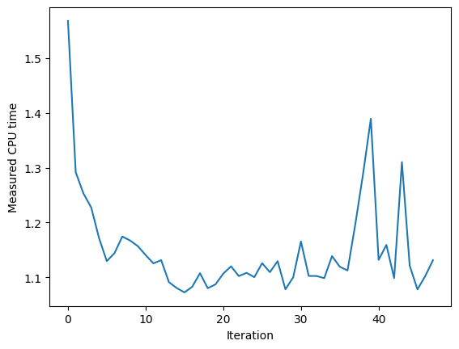

# Bayesian Optimization

https://www.miguelgondu.com/blogposts/2023-07-31/intro-to-bo/


```python
import matplotlib.pyplot as plt
import numpy as np
import optuna
from skopt import Optimizer, gp_minimize
from tqdm.notebook import trange

from bayesian_optimization import jit_plus_server, plot_example_gpr
```


```python
x = np.arange(0, 1, 0.01)
y = [jit_plus_server([i]) for i in x]
plt.plot(x, y)
plt.xlabel("Parameter")
plt.ylabel("CPU Time");
```


    

    


```python
np.random.seed(17)

jit_plus_server([0]), jit_plus_server([0.5])
```


    (1.2025010344211848, 1.5500903091206684)


## Optuna


```python
def objective(trial):
    x = trial.suggest_float("x", 0, 1)
    return jit_plus_server([x])


study = optuna.create_study()
study.optimize(objective, n_trials=100, show_progress_bar=True)

study.best_params  # E.g. {'x': 2.002108042}
```

    [I 2025-01-27 11:47:25,157] A new study created in memory with name: no-name-78791379-0c53-4bf3-8b42-d1a9f314a071


      0%|          | 0/100 [00:00<?, ?it/s]


    [I 2025-01-27 11:47:25,190] Trial 0 finished with value: 1.2573208654495611 and parameters: {'x': 0.3353054701815764}. Best is trial 0 with value: 1.2573208654495611.
    [I 2025-01-27 11:47:25,192] Trial 1 finished with value: 1.6012008068516452 and parameters: {'x': 0.5808000152579456}. Best is trial 0 with value: 1.2573208654495611.
    [I 2025-01-27 11:47:25,194] Trial 2 finished with value: 1.4413260576512512 and parameters: {'x': 0.4221509268606062}. Best is trial 0 with value: 1.2573208654495611.
    [I 2025-01-27 11:47:25,195] Trial 3 finished with value: 1.567684427738567 and parameters: {'x': 0.6804187533535294}. Best is trial 0 with value: 1.2573208654495611.
    [I 2025-01-27 11:47:25,196] Trial 4 finished with value: 1.1347109557484045 and parameters: {'x': 0.02749654076566499}. Best is trial 4 with value: 1.1347109557484045.
    [I 2025-01-27 11:47:25,197] Trial 5 finished with value: 1.495860746906338 and parameters: {'x': 0.8541459592636004}. Best is trial 4 with value: 1.1347109557484045.
    [I 2025-01-27 11:47:25,198] Trial 6 finished with value: 1.032126949477445 and parameters: {'x': 0.08726745137862779}. Best is trial 6 with value: 1.032126949477445.
    [I 2025-01-27 11:47:25,199] Trial 7 finished with value: 1.0355986711657483 and parameters: {'x': 0.09372337476913273}. Best is trial 6 with value: 1.032126949477445.
    [I 2025-01-27 11:47:25,200] Trial 8 finished with value: 1.5474071466526247 and parameters: {'x': 0.7103577090556735}. Best is trial 6 with value: 1.032126949477445.
    [I 2025-01-27 11:47:25,201] Trial 9 finished with value: 1.5371168190709352 and parameters: {'x': 0.73264016651213}. Best is trial 6 with value: 1.032126949477445.
    [I 2025-01-27 11:47:25,203] Trial 10 finished with value: 1.0449086072564184 and parameters: {'x': 0.22688634933113694}. Best is trial 6 with value: 1.032126949477445.
    [I 2025-01-27 11:47:25,206] Trial 11 finished with value: 1.197287940820623 and parameters: {'x': 0.003472696466886027}. Best is trial 6 with value: 1.032126949477445.
    [I 2025-01-27 11:47:25,209] Trial 12 finished with value: 1.0035684610336109 and parameters: {'x': 0.18388450312730076}. Best is trial 12 with value: 1.0035684610336109.
    [I 2025-01-27 11:47:25,212] Trial 13 finished with value: 1.0357774962935147 and parameters: {'x': 0.2185250535628418}. Best is trial 12 with value: 1.0035684610336109.
    [I 2025-01-27 11:47:25,215] Trial 14 finished with value: 1.0325116579372031 and parameters: {'x': 0.21554009148982772}. Best is trial 12 with value: 1.0035684610336109.
    [I 2025-01-27 11:47:25,217] Trial 15 finished with value: 1.384992640582612 and parameters: {'x': 0.39427165215820964}. Best is trial 12 with value: 1.0035684610336109.
    [I 2025-01-27 11:47:25,220] Trial 16 finished with value: 1.0089965511664996 and parameters: {'x': 0.11826126786548477}. Best is trial 12 with value: 1.0035684610336109.
    [I 2025-01-27 11:47:25,222] Trial 17 finished with value: 1.1368010315448926 and parameters: {'x': 0.27887826426268403}. Best is trial 12 with value: 1.0035684610336109.
    [I 2025-01-27 11:47:25,225] Trial 18 finished with value: 1.5983072167188435 and parameters: {'x': 0.9972176991349407}. Best is trial 12 with value: 1.0035684610336109.
    [I 2025-01-27 11:47:25,227] Trial 19 finished with value: 1.5850289050690891 and parameters: {'x': 0.534849588909992}. Best is trial 12 with value: 1.0035684610336109.
    [I 2025-01-27 11:47:25,229] Trial 20 finished with value: 0.989180651174446 and parameters: {'x': 0.14137977261806178}. Best is trial 20 with value: 0.989180651174446.
    [I 2025-01-27 11:47:25,231] Trial 21 finished with value: 0.9987169045691783 and parameters: {'x': 0.13775782959153282}. Best is trial 20 with value: 0.989180651174446.
    [I 2025-01-27 11:47:25,233] Trial 22 finished with value: 0.9995320076199579 and parameters: {'x': 0.13780051663811413}. Best is trial 20 with value: 0.989180651174446.
    [I 2025-01-27 11:47:25,235] Trial 23 finished with value: 1.234722526335495 and parameters: {'x': 0.3267722438446459}. Best is trial 20 with value: 0.989180651174446.
    [I 2025-01-27 11:47:25,238] Trial 24 finished with value: 0.9937782357198108 and parameters: {'x': 0.13312444731737616}. Best is trial 20 with value: 0.989180651174446.
    [I 2025-01-27 11:47:25,241] Trial 25 finished with value: 1.4382400335555574 and parameters: {'x': 0.41424923246881196}. Best is trial 20 with value: 0.989180651174446.
    [I 2025-01-27 11:47:25,244] Trial 26 finished with value: 1.168413583623355 and parameters: {'x': 0.2943968432042355}. Best is trial 20 with value: 0.989180651174446.
    [I 2025-01-27 11:47:25,246] Trial 27 finished with value: 1.0964570714962214 and parameters: {'x': 0.05245117670102738}. Best is trial 20 with value: 0.989180651174446.
    [I 2025-01-27 11:47:25,248] Trial 28 finished with value: 1.008930748973512 and parameters: {'x': 0.1591166482245694}. Best is trial 20 with value: 0.989180651174446.
    [I 2025-01-27 11:47:25,249] Trial 29 finished with value: 1.3382430087319461 and parameters: {'x': 0.3678250264938408}. Best is trial 20 with value: 0.989180651174446.
    [I 2025-01-27 11:47:25,251] Trial 30 finished with value: 1.5276504136064908 and parameters: {'x': 0.48065163581551623}. Best is trial 20 with value: 0.989180651174446.
    [I 2025-01-27 11:47:25,253] Trial 31 finished with value: 0.9900822355260632 and parameters: {'x': 0.13704325546663632}. Best is trial 20 with value: 0.989180651174446.
    [I 2025-01-27 11:47:25,256] Trial 32 finished with value: 1.1095076064309208 and parameters: {'x': 0.27342089162603905}. Best is trial 20 with value: 0.989180651174446.
    [I 2025-01-27 11:47:25,258] Trial 33 finished with value: 1.0572363555886355 and parameters: {'x': 0.0711752356214448}. Best is trial 20 with value: 0.989180651174446.
    [I 2025-01-27 11:47:25,261] Trial 34 finished with value: 1.0081526682658877 and parameters: {'x': 0.1841487471154621}. Best is trial 20 with value: 0.989180651174446.
    [I 2025-01-27 11:47:25,263] Trial 35 finished with value: 1.1808009683281824 and parameters: {'x': 0.005875098042613214}. Best is trial 20 with value: 0.989180651174446.
    [I 2025-01-27 11:47:25,264] Trial 36 finished with value: 1.5955599625258094 and parameters: {'x': 0.6151139297438174}. Best is trial 20 with value: 0.989180651174446.
    [I 2025-01-27 11:47:25,267] Trial 37 finished with value: 0.9992515094556865 and parameters: {'x': 0.12382155877979192}. Best is trial 20 with value: 0.989180651174446.
    [I 2025-01-27 11:47:25,269] Trial 38 finished with value: 1.072657730317617 and parameters: {'x': 0.2481679650554341}. Best is trial 20 with value: 0.989180651174446.
    [I 2025-01-27 11:47:25,271] Trial 39 finished with value: 1.2671625646134264 and parameters: {'x': 0.3354011519060401}. Best is trial 20 with value: 0.989180651174446.
    [I 2025-01-27 11:47:25,274] Trial 40 finished with value: 1.0776673614742434 and parameters: {'x': 0.062484696548111035}. Best is trial 20 with value: 0.989180651174446.
    [I 2025-01-27 11:47:25,277] Trial 41 finished with value: 0.998994617280653 and parameters: {'x': 0.12736437579332732}. Best is trial 20 with value: 0.989180651174446.
    [I 2025-01-27 11:47:25,279] Trial 42 finished with value: 1.0007314302980888 and parameters: {'x': 0.15303020889994054}. Best is trial 20 with value: 0.989180651174446.
    [I 2025-01-27 11:47:25,281] Trial 43 finished with value: 1.0482809129926203 and parameters: {'x': 0.07900481454758466}. Best is trial 20 with value: 0.989180651174446.
    [I 2025-01-27 11:47:25,283] Trial 44 finished with value: 1.0117108694392782 and parameters: {'x': 0.19703752237900748}. Best is trial 20 with value: 0.989180651174446.
    [I 2025-01-27 11:47:25,285] Trial 45 finished with value: 1.0203007628850445 and parameters: {'x': 0.1013830369630436}. Best is trial 20 with value: 0.989180651174446.
    [I 2025-01-27 11:47:25,287] Trial 46 finished with value: 1.1026325972186186 and parameters: {'x': 0.04518183736027315}. Best is trial 20 with value: 0.989180651174446.
    [I 2025-01-27 11:47:25,290] Trial 47 finished with value: 1.066062967254757 and parameters: {'x': 0.24241588540943598}. Best is trial 20 with value: 0.989180651174446.
    [I 2025-01-27 11:47:25,292] Trial 48 finished with value: 0.9929661587315115 and parameters: {'x': 0.14736831843266684}. Best is trial 20 with value: 0.989180651174446.
    [I 2025-01-27 11:47:25,294] Trial 49 finished with value: 1.508555967903066 and parameters: {'x': 0.45694694810138653}. Best is trial 20 with value: 0.989180651174446.
    [I 2025-01-27 11:47:25,296] Trial 50 finished with value: 0.9985428711080637 and parameters: {'x': 0.18226500009161636}. Best is trial 20 with value: 0.989180651174446.
    [I 2025-01-27 11:47:25,298] Trial 51 finished with value: 1.0114186646080043 and parameters: {'x': 0.18178937272765375}. Best is trial 20 with value: 0.989180651174446.
    [I 2025-01-27 11:47:25,300] Trial 52 finished with value: 1.163129020813545 and parameters: {'x': 0.020211173542712124}. Best is trial 20 with value: 0.989180651174446.
    [I 2025-01-27 11:47:25,302] Trial 53 finished with value: 0.9912603857337422 and parameters: {'x': 0.1552438757018206}. Best is trial 20 with value: 0.989180651174446.
    [I 2025-01-27 11:47:25,304] Trial 54 finished with value: 1.4978185225659668 and parameters: {'x': 0.8047895258575309}. Best is trial 20 with value: 0.989180651174446.
    [I 2025-01-27 11:47:25,307] Trial 55 finished with value: 1.046834781257073 and parameters: {'x': 0.22778929357322034}. Best is trial 20 with value: 0.989180651174446.
    [I 2025-01-27 11:47:25,309] Trial 56 finished with value: 1.0262645909838535 and parameters: {'x': 0.09358357148959795}. Best is trial 20 with value: 0.989180651174446.
    [I 2025-01-27 11:47:25,311] Trial 57 finished with value: 1.1849243907800784 and parameters: {'x': 0.30209895076634186}. Best is trial 20 with value: 0.989180651174446.
    [I 2025-01-27 11:47:25,314] Trial 58 finished with value: 0.994963168025298 and parameters: {'x': 0.17320342258541307}. Best is trial 20 with value: 0.989180651174446.
    [I 2025-01-27 11:47:25,315] Trial 59 finished with value: 0.99958322510395 and parameters: {'x': 0.15864488512224623}. Best is trial 20 with value: 0.989180651174446.
    [I 2025-01-27 11:47:25,318] Trial 60 finished with value: 1.1013823540127137 and parameters: {'x': 0.2618771095827886}. Best is trial 20 with value: 0.989180651174446.
    [I 2025-01-27 11:47:25,320] Trial 61 finished with value: 1.019381575247604 and parameters: {'x': 0.1964036133551848}. Best is trial 20 with value: 0.989180651174446.
    [I 2025-01-27 11:47:25,322] Trial 62 finished with value: 1.0220812901992853 and parameters: {'x': 0.10009566687532363}. Best is trial 20 with value: 0.989180651174446.
    [I 2025-01-27 11:47:25,325] Trial 63 finished with value: 0.9931025095211332 and parameters: {'x': 0.16628132205832433}. Best is trial 20 with value: 0.989180651174446.
    [I 2025-01-27 11:47:25,327] Trial 64 finished with value: 1.0322732849865863 and parameters: {'x': 0.2194014838752219}. Best is trial 20 with value: 0.989180651174446.
    [I 2025-01-27 11:47:25,329] Trial 65 finished with value: 0.9921224596663297 and parameters: {'x': 0.16277772019487446}. Best is trial 20 with value: 0.989180651174446.
    [I 2025-01-27 11:47:25,331] Trial 66 finished with value: 1.134482865358154 and parameters: {'x': 0.03072181312116684}. Best is trial 20 with value: 0.989180651174446.
    [I 2025-01-27 11:47:25,333] Trial 67 finished with value: 1.0019555362008032 and parameters: {'x': 0.13608128456244892}. Best is trial 20 with value: 0.989180651174446.
    [I 2025-01-27 11:47:25,335] Trial 68 finished with value: 1.5532072606277851 and parameters: {'x': 0.9642408968048353}. Best is trial 20 with value: 0.989180651174446.
    [I 2025-01-27 11:47:25,337] Trial 69 finished with value: 1.3081637902078653 and parameters: {'x': 0.35898676393017853}. Best is trial 20 with value: 0.989180651174446.
    [I 2025-01-27 11:47:25,341] Trial 70 finished with value: 1.0119974375582805 and parameters: {'x': 0.11801620880636343}. Best is trial 20 with value: 0.989180651174446.
    [I 2025-01-27 11:47:25,343] Trial 71 finished with value: 0.9939701845926812 and parameters: {'x': 0.1631400446583527}. Best is trial 20 with value: 0.989180651174446.
    [I 2025-01-27 11:47:25,345] Trial 72 finished with value: 1.0020056352044946 and parameters: {'x': 0.15054918588754077}. Best is trial 20 with value: 0.989180651174446.
    [I 2025-01-27 11:47:25,347] Trial 73 finished with value: 1.0618148507881453 and parameters: {'x': 0.061381072286194355}. Best is trial 20 with value: 0.989180651174446.
    [I 2025-01-27 11:47:25,349] Trial 74 finished with value: 1.0220555796007367 and parameters: {'x': 0.20636693530379863}. Best is trial 20 with value: 0.989180651174446.
    [I 2025-01-27 11:47:25,351] Trial 75 finished with value: 1.1556750333794876 and parameters: {'x': 0.288789578523186}. Best is trial 20 with value: 0.989180651174446.
    [I 2025-01-27 11:47:25,353] Trial 76 finished with value: 1.0209290306392675 and parameters: {'x': 0.11085186059435528}. Best is trial 20 with value: 0.989180651174446.
    [I 2025-01-27 11:47:25,356] Trial 77 finished with value: 1.5926899144029176 and parameters: {'x': 0.6271396752877317}. Best is trial 20 with value: 0.989180651174446.
    [I 2025-01-27 11:47:25,358] Trial 78 finished with value: 1.0309695914637436 and parameters: {'x': 0.08852621002874984}. Best is trial 20 with value: 0.989180651174446.
    [I 2025-01-27 11:47:25,360] Trial 79 finished with value: 1.0757690127257613 and parameters: {'x': 0.2451725439639117}. Best is trial 20 with value: 0.989180651174446.
    [I 2025-01-27 11:47:25,363] Trial 80 finished with value: 1.2221477860078576 and parameters: {'x': 0.31889999133227165}. Best is trial 20 with value: 0.989180651174446.
    [I 2025-01-27 11:47:25,365] Trial 81 finished with value: 0.9975902076317678 and parameters: {'x': 0.1700260413131777}. Best is trial 20 with value: 0.989180651174446.
    [I 2025-01-27 11:47:25,367] Trial 82 finished with value: 0.9985768964992221 and parameters: {'x': 0.15874419189899192}. Best is trial 20 with value: 0.989180651174446.
    [I 2025-01-27 11:47:25,370] Trial 83 finished with value: 1.0183801128731143 and parameters: {'x': 0.12291181597588868}. Best is trial 20 with value: 0.989180651174446.
    [I 2025-01-27 11:47:25,372] Trial 84 finished with value: 1.0986880653555884 and parameters: {'x': 0.04761905598241242}. Best is trial 20 with value: 0.989180651174446.
    [I 2025-01-27 11:47:25,375] Trial 85 finished with value: 1.0274868472435963 and parameters: {'x': 0.20925528994160453}. Best is trial 20 with value: 0.989180651174446.
    [I 2025-01-27 11:47:25,378] Trial 86 finished with value: 1.0031494011043758 and parameters: {'x': 0.1814989579431546}. Best is trial 20 with value: 0.989180651174446.
    [I 2025-01-27 11:47:25,380] Trial 87 finished with value: 1.1927669213555947 and parameters: {'x': 0.0004313090690753474}. Best is trial 20 with value: 0.989180651174446.
    [I 2025-01-27 11:47:25,382] Trial 88 finished with value: 1.0502457436733437 and parameters: {'x': 0.07631510235934573}. Best is trial 20 with value: 0.989180651174446.
    [I 2025-01-27 11:47:25,384] Trial 89 finished with value: 1.0025083330398574 and parameters: {'x': 0.13819996918445657}. Best is trial 20 with value: 0.989180651174446.
    [I 2025-01-27 11:47:25,386] Trial 90 finished with value: 1.1140254192808858 and parameters: {'x': 0.265466730197237}. Best is trial 20 with value: 0.989180651174446.
    [I 2025-01-27 11:47:25,388] Trial 91 finished with value: 0.9955586771235231 and parameters: {'x': 0.16902118452928516}. Best is trial 20 with value: 0.989180651174446.
    [I 2025-01-27 11:47:25,390] Trial 92 finished with value: 0.998635775514336 and parameters: {'x': 0.16687225316696472}. Best is trial 20 with value: 0.989180651174446.
    [I 2025-01-27 11:47:25,393] Trial 93 finished with value: 1.0202150866755475 and parameters: {'x': 0.20327153496183917}. Best is trial 20 with value: 0.989180651174446.
    [I 2025-01-27 11:47:25,395] Trial 94 finished with value: 1.0426439530874796 and parameters: {'x': 0.22497572215603967}. Best is trial 20 with value: 0.989180651174446.
    [I 2025-01-27 11:47:25,398] Trial 95 finished with value: 1.0022057778122662 and parameters: {'x': 0.14375121470752322}. Best is trial 20 with value: 0.989180651174446.
    [I 2025-01-27 11:47:25,400] Trial 96 finished with value: 1.0151586303868438 and parameters: {'x': 0.11034067882374234}. Best is trial 20 with value: 0.989180651174446.
    [I 2025-01-27 11:47:25,402] Trial 97 finished with value: 1.0040564768350426 and parameters: {'x': 0.1789916121272434}. Best is trial 20 with value: 0.989180651174446.
    [I 2025-01-27 11:47:25,404] Trial 98 finished with value: 1.0574798031918795 and parameters: {'x': 0.2379817271040245}. Best is trial 20 with value: 0.989180651174446.
    [I 2025-01-27 11:47:25,407] Trial 99 finished with value: 1.598314134817171 and parameters: {'x': 0.5548427420156169}. Best is trial 20 with value: 0.989180651174446.


    {'x': 0.14137977261806178}


```python
jit_plus_server([study.best_params["x"]])
```


    0.997755347342968


```python
class GPR1:
    def __init__(self, parameters, measurements):
        self.x = parameters
        self.y = np.array(measurements)
        self.mean_y = self.y.mean()

    def estimate(self, query_parameter):
        return self.mean_y
```


```python
x = np.arange(0, 1, 0.1)
parameter = 0.0
weight = np.exp(-((x - parameter) ** 2))
plt.plot(x, weight);
```


    

    


```python
class GPR2:
    def __init__(self, parameters, measurements, sigma):
        self.x = parameters
        self.y = np.array(measurements)
        self.sigma = sigma

        self.mean_y = self.y.mean()
        self.y -= self.mean_y

    def kernel(self, x1, x2):
        distance_squared = ((x1 - x2) ** 2).sum()
        return np.exp(-distance_squared / (2 * self.sigma**2))

    def estimate(self, query_parameter):
        weights = [self.kernel(x, query_parameter) for x in self.x]
        weights = np.array(weights)
        weights = weights / weights.sum()
        return self.mean_y + weights @ self.y
```


```python
parameters = np.array([0.5, 0.0])
measurements = np.array([1.52, 1.21])
gpr = GPR2(parameters, measurements, sigma=0.25)
gpr.estimate(0.25), gpr.estimate(0.4)
```


    (1.365, 1.4482426828846955)


```python
np.random.seed(17)

ax = plt.gca()
plot_example_gpr(GPR2, ax, parameters, measurements, err_bars=True)
plt.xlabel("Parameter")
plt.ylabel("CPU time");
```


    

    


```python
class GPR3:
    def __init__(self, parameters, measurements, sigma):
        self.x = parameters
        self.y = np.array(measurements)
        self.sigma = sigma

        self.mean_y = self.y.mean()
        self.y -= self.mean_y

    def kernel(self, x1, x2):
        distance_squared = ((x1 - x2) ** 2).sum()
        return np.exp(-distance_squared / (2 * self.sigma**2))

    def estimate(self, query_parameter):
        kernels_x_query = np.array([self.kernel(x, query_parameter) for x in self.x])
        kernels_x_x = np.array(
            [[self.kernel(x1, x2) for x1 in self.x] for x2 in self.x]
        )
        weights = kernels_x_query.T @ np.linalg.inv(kernels_x_x)
        return self.mean_y + weights @ self.y
```


```python
gpr = GPR3(parameters, measurements, sigma=0.15)
gpr.estimate(0.25), gpr.estimate(0.4)
```


    (1.365, 1.4851511395406307)


```python
np.random.seed(17)

ax = plt.gca()
plot_example_gpr(GPR3, ax, parameters, measurements, err_bars=True)
plt.xlabel("Parameter")
plt.ylabel("CPU time");
```


    

    


```python
class GPR4:
    def __init__(self, parameters, measurements, sigma):
        self.x = parameters
        self.y = np.array(measurements)
        self.sigma = sigma

        self.mean_y = self.y.mean()
        # Need at least 2 values to compute std dev.
        if len(self.y) > 1:
            self.std_y = self.y.std()
        else:
            self.std_y = 1
        self.y -= self.mean_y

    def kernel(self, x1, x2):
        distance_squared = ((x1 - x2) ** 2).sum()
        return np.exp(-distance_squared / (2 * self.sigma**2))

    def estimate(self, query_parameter):
        kernels_x_query = np.array([self.kernel(x, query_parameter) for x in self.x])
        kernels_x_x = np.array(
            [[self.kernel(x1, x2) for x1 in self.x] for x2 in self.x]
        )
        weights = kernels_x_query.T @ np.linalg.pinv(kernels_x_x)
        expectation = self.mean_y + weights @ self.y
        uncertainty_squared = 1 - weights @ kernels_x_query
        uncertainty = np.sqrt(uncertainty_squared)
        return expectation, self.std_y * uncertainty
```


```python
gpr = GPR4(parameters, measurements, sigma=0.15)
gpr.estimate(0.25), gpr.estimate(0.4)
```


    ((1.365, 0.14508247066963484), (1.4851511395406307, 0.09276343849139895))


```python
np.random.seed(17)

ax = plt.gca()
plot_example_gpr(GPR4, ax, parameters, measurements, err_bars=True)
plt.xlabel("Parameter")
plt.ylabel("CPU time");
```


    

    


```python
np.random.seed(17)

gpr = GPR4(parameters, measurements, sigma=0.15)
x_hats = np.linspace(0, 1, 100)
y_hats, sigma_y_hats = zip(*[gpr.estimate(x_hat) for x_hat in x_hats])
k = 1
lcb = np.array(y_hats) - k * np.array(sigma_y_hats)
i = np.where(lcb == lcb.min())
x_hats[i]
```


    array([0.11111111])


```python
np.random.seed(17)

ax = plt.gca()
plot_example_gpr(GPR4, ax, parameters, measurements, err_bars=True)
plt.xlabel("Parameter")
plt.ylabel("CPU time")
plt.scatter(x_hats[i], lcb.min())
plt.text(x_hats[i] - 0.1, lcb.min() + 0.02, "Min uncertainty");
```


    

    


## Optimizing all seven compiler parameters


```python
def evaluate(gpr, x):
    # Ensure the parameter values are in [0, 1]
    x = np.mod(x, 1)
    y, sigma_y = gpr.estimate(x)
    lcb = y - sigma_y
    return x, lcb


def random_search(gpr, num_parameters, num_iterations=1000):
    step_size = 0.1
    x_current = np.random.normal(size=num_parameters)
    x_current, lcb_current = evaluate(gpr, x_current)
    trace = []
    for _ in range(num_iterations):
        x_test = x_current + step_size * np.random.normal(size=num_parameters)
        x_test, lcb_test = evaluate(gpr, x_test)
        if lcb_test < lcb_current:
            lcb_current = lcb_test
            x_current = x_test
        trace.append(lcb_current)
    return x_current, np.array(trace)
```


```python
np.random.seed(17)


gpr = GPR4(parameters, measurements, sigma=0.15)
x_opt, trace = random_search(gpr, num_parameters=1)
x_opt
```


    array([0.11096591])


```python
plt.plot(trace, ".--")
plt.xlabel("Iteration")
plt.ylabel("lcb_current");
```


    

    


```python
class BayesianOptimizer:
    def __init__(self, num_parameters):
        self.num_parameters = num_parameters
        self.parameters = []
        self.measurements = []
        self.x0 = np.array([0.5] * num_parameters)

    def ask(self):
        if len(self.measurements) == 0:
            return self.x0
        return self.new_parameter()

    def new_parameter(self):
        gpr = GPR4(self.parameters, self.measurements, sigma=0.15)
        return random_search(gpr, self.num_parameters, num_iterations=500)[0]

    def tell(self, parameter, measurement):
        self.parameters.append(parameter)
        self.measurements.append(measurement)
```


```python
np.random.seed(7)
bo = BayesianOptimizer(num_parameters=7)
for _ in trange(48):
    parameter = bo.ask()
    cpu_time = jit_plus_server(parameter)
    bo.tell(parameter, cpu_time)
```


      0%|          | 0/48 [00:00<?, ?it/s]


```python
plt.plot(bo.measurements)
plt.xlabel("Iteration")
plt.ylabel("Measured CPU time");
```


    

    


```python
def f(x):
    return jit_plus_server(x)


res = gp_minimize(f, [(0.0, 1.0)] * 7)
res
```


              fun: 1.0741683509160753
                x: [0.0, 0.1645154997161642, 0.0, 0.14860109169418706, 0.15450440433199167, 0.0, 0.1573533283838304]
        func_vals: [ 1.483e+00  1.299e+00 ...  1.076e+00  1.092e+00]
          x_iters: [[0.9505428900132081, 0.4662570884902242, 0.4536753543417824, 0.8107386699627013, 0.300800419180937, 0.7276852018786215, 0.983343586937705], [0.006457465031792566, 0.31514822385587843, 0.3645925262461109, 0.29411545984823456, 0.7322300364577708, 0.3810796910538483, 0.37571356688086066], [0.20648423501023877, 0.4059568733651626, 0.2800630922140909, 0.14219028758064559, 0.5897616000671844, 0.4457521125885734, 0.24460758432850543], [0.47107340482377413, 0.22846805426656008, 0.338707804192315, 0.6224099686001775, 0.09019509841287689, 0.5382257082818528, 0.3863636539586247], [0.2504480641094953, 0.0688740210179586, 0.5281090361360566, 0.4368148030594404, 0.6118550870708113, 0.3111998916925755, 0.132525109833493], [0.42459254470999563, 0.4532312942585197, 0.6224936112772299, 0.32105957035882854, 0.5736063540759813, 0.2795117029282141, 0.723583155288023], [0.5371032693873481, 0.24226893256629461, 0.964878867637184, 0.05228853425486425, 0.28752317247425224, 0.8548849411030509, 0.10081675865427511], [0.1793647281833515, 0.9177878352679655, 0.6562026000134868, 0.8620554336306679, 0.9042631981328264, 0.40868764624282994, 0.41025481809760056], [0.676085402275938, 0.8661289577426643, 0.8579113273341855, 0.5733462345996885, 0.8887498164954386, 0.2789417296301259, 0.39911487312406735], [0.7230509610507342, 0.45434882958065614, 0.545532554493297, 0.38704172814219073, 0.2110927536785397, 0.5363590257915973, 0.7005903738863446], [0.15432442322711196, 0.3983385775383926, 0.1955209689942971, 0.01627531861790872, 0.602058424202936, 0.446213154972514, 0.1599130030431709], [0.0, 0.5094600904310705, 0.9566587274745549, 0.9404613247588058, 0.6204763063526297, 0.4979091952725701, 0.0], [0.24129630680456451, 0.0, 0.33050298207627915, 0.057894434482082646, 0.3763512274715211, 0.48544049558190505, 0.0], [0.4010196554793208, 0.12286275648248542, 0.12303457803780041, 0.0, 0.43273498151857126, 0.7468343713342068, 0.160507835038974], [0.0, 0.0, 0.0, 0.24765254766961783, 1.0, 0.0, 0.12870129795516558], [0.0, 0.9522611181548722, 0.0, 0.6524141449197535, 0.47881118720209875, 0.4917736737223696, 0.02996824552019447], [1.0, 1.0, 0.0, 0.0, 0.39728327202139013, 0.16235142152434576, 0.0], [0.0, 0.0, 0.0, 0.11955598188757538, 0.0, 0.9544081156590364, 0.1756985437967113], [0.0, 0.0, 0.0, 0.0, 0.0, 0.0, 0.26612824448250083], [0.0, 0.0, 1.0, 0.0, 0.0, 0.7942294606657353, 0.23746921797618836], [0.0, 1.0137629682568915e-19, 0.0, 0.0, 0.06851096776127949, 0.09791645800266238, 1.0], [0.0, 0.0, 0.0, 0.10467338538493305, 0.0, 0.5796552598332869, 0.5138759764764328], [0.0, 1.0, 0.0, 0.0, 0.0, 0.0, 1.0], [0.0, 0.0, 0.0, 0.18701314275626968, 1.0, 0.0, 0.24441487272053927], [0.0, 0.0, 0.0, 1.0, 0.0, 1.0, 1.0], [0.0, 0.0, 0.0, 0.0, 1.0, 0.2983709971288371, 0.16777753243334778], [0.0, 0.0, 0.0, 0.18134896909471973, 0.0, 0.0, 0.18785197660796624], [0.0, 0.0, 0.0, 0.29420709720535, 0.0, 0.0, 0.1908965686346432], [1.0, 0.0, 1.0, 0.0, 1.0, 0.0, 1.0], [0.0, 0.0, 0.0, 0.13117495483736608, 0.0, 0.0, 0.12493804986976378], [0.3592734517702141, 0.0, 0.0, 0.16636907046166252, 0.0, 0.0, 0.15175252329648695], [0.0, 0.0, 0.0, 0.3331467654945081, 0.0, 0.0, 1.0], [0.0, 0.0, 0.0, 0.1385890322420665, 0.0, 0.0, 0.16407471081025912], [0.0, 0.0, 0.0, 0.1283207885951816, 0.0, 0.0, 0.15646874241701628], [0.0, 0.0, 0.0, 0.1228612686491672, 0.0, 0.0, 0.16601251836365857], [0.0, 8.732978456063329e-18, 0.0, 0.0, 1.0, 1.0, 1.0], [0.0, 0.1985752894395088, 0.0, 0.13017635403935807, 0.0, 0.0, 0.16341710213675215], [0.0, 0.4051787240351032, 0.0, 0.13301910679395176, 0.0, 0.0, 0.09911730064004504], [0.0, 0.18936051926765474, 0.0, 0.14555442294618282, 0.0, 0.0, 0.21744066933060444], [0.0, 0.1633862421459429, 0.0, 0.17473776369622368, 0.0, 0.0, 0.13856145912936063], [0.0, 0.16959044286490194, 0.0, 0.1536277878693484, 0.0, 0.0, 0.09788738410419404], [0.0, 1.0, 0.0, 0.0, 0.0, 0.0, 0.4509337278758676], [0.0, 0.18005180546571278, 0.0, 0.2088108073820646, 0.0, 0.0, 0.15243869703826524], [0.0, 0.16253182924200738, 0.0, 0.1637200162838658, 0.1883321687411437, 0.0, 0.1517144539227277], [0.0, 0.17850899861317293, 0.0, 0.1742400065095865, 0.3602714039191687, 0.0, 0.14575076908227153], [0.0, 0.1585578294758855, 0.0, 0.1960861611066117, 0.0, 0.0, 0.03212037838396622], [0.0, 0.19505229095294974, 0.0, 0.21240573751855496, 0.1584900143782267, 0.0, 0.12514979042334634], [0.0, 1.0, 0.0, 0.0, 1.0, 1.0, 1.0], [0.0, 0.12226996510520315, 0.0, 0.14292293450219917, 0.16978137171892557, 0.0, 0.18836520258208095], [0.0, 0.17985933584763295, 0.0, 0.09819192168176663, 0.16710416424684166, 0.0, 0.1479310554893474], [0.0, 0.12865814837629735, 0.0, 0.14909747186473368, 0.15484828059852931, 0.0, 0.13939793783069498], [0.0, 0.20472609721642018, 0.0, 0.14598533261715474, 0.18138631337546246, 0.0, 0.20337198598039774], [0.0, 0.1603706834219272, 0.0, 0.1353354812523073, 0.14898835800676216, 0.0, 0.14890320542261942], [0.0, 0.14874175758783312, 0.0, 0.16399388467352247, 0.15074751604255632, 0.0, 0.16262047359010248], [0.0, 0.17185721947699029, 0.0, 0.11957609087866228, 0.15836853397006534, 0.0, 0.14352403089707352], [0.0, 0.17215364507757325, 0.0, 0.11899087989858279, 0.15958864983083082, 0.0, 0.14351338831197186], [0.0, 0.16440429436663212, 0.0, 0.13764212800611314, 0.15250139122588857, 0.0, 0.1524888887113042], [0.0, 0.1594821881809285, 0.0, 0.14359180084233805, 0.15382368658939474, 0.0, 0.15651151160589874], [0.0, 0.1572774536995688, 0.0, 0.12028482554207515, 0.16994744378978485, 0.0, 0.15548140789002854], [0.0, 0.1645154997161642, 0.0, 0.14860109169418706, 0.15450440433199167, 0.0, 0.1573533283838304], [0.0, 0.1599368663255344, 0.0, 0.1591015805173497, 0.14901902258473615, 0.0, 0.15988897147513692], [0.0, 0.15958127044349474, 0.0, 0.1605477151277099, 0.1491332095654388, 0.0, 0.1610156554660975], [0.0, 0.15731154209826995, 0.0, 0.16470799419708881, 0.1495288816147093, 0.0, 0.1632770437060423], [0.0, 0.17838722500198956, 0.0, 0.14673909455500692, 0.15043074359218941, 0.0, 0.15061352495075783], [0.0, 0.1472989050141106, 0.0, 0.15665931755181192, 0.1553058609887965, 0.0, 0.16236652993911807], [0.0, 0.14685921397116214, 0.0, 0.15710658076144352, 0.15643390479206556, 0.0, 0.1633797493031848], [0.0, 0.13901501207339967, 0.0, 0.1650895619130822, 0.15995191574486436, 0.0, 0.16584398496812586], [0.0, 0.14231490622842125, 0.0, 0.16100977808765138, 0.15735542127784927, 0.0, 0.1650956924378317], [0.0, 0.14558862255952165, 0.0, 0.15624211623392076, 0.15435166270141007, 0.0, 0.16510453826724655], [0.0, 0.14703357144383283, 0.0, 0.13966693099418992, 0.15472983388882058, 0.0, 0.1632972447715282], [0.0, 0.16215329949165438, 0.0, 0.16043113858074357, 0.15010211392679965, 0.0, 0.16140533413560368], [0.0, 0.1416163324650062, 0.0, 0.13662558486110232, 0.16403674318554395, 0.0, 0.15084759956784977], [0.0, 0.15217672536956592, 0.0, 0.13081079409109886, 0.15822573645036295, 0.0, 0.1650102169033776], [0.0, 0.1562469984698191, 0.0, 0.15706209190948775, 0.15419803877233812, 0.0, 0.14521900525250037], [0.0, 0.15329937454361744, 0.0, 0.15771588589667684, 0.15592181982070571, 0.0, 0.14171241721442718], [0.0, 0.16872963388909457, 0.0, 0.15504600894979437, 0.15121566801470918, 0.0, 0.14968728394822994], [0.0, 0.15042465679328204, 0.0, 0.16112195217153785, 0.15852403460418346, 0.0, 0.14769263395823404], [0.0, 0.14907973123673554, 0.0, 0.1615797466450878, 0.16082445189593653, 0.0, 0.14763968531430682], [0.0, 0.17035070685971374, 0.0, 0.15489673246629787, 0.15210737386376597, 0.0, 0.15357217999894943], [0.0, 0.13949284507434861, 0.0, 0.15706269337623474, 0.16751069325645399, 0.0, 0.15421850497231654], [0.0, 0.17324347560979728, 0.0, 0.13999548784663648, 0.14543461893989665, 0.0, 0.15144430039944065], [0.0, 0.16667970909506616, 0.0, 0.15438310472512942, 0.14522782176658178, 0.0, 0.1626770095160112], [0.0, 0.16775737053743078, 0.0, 0.15881623137406384, 0.1461246142100717, 0.0, 0.16514489653593772], [0.0, 0.16773342810574096, 0.0, 0.15759870144265095, 0.14575779819791462, 0.0, 0.164681920877439], [0.0, 0.1682342974732939, 0.0, 0.1517873059239598, 0.14362956773057714, 0.0, 0.1619940841696781], [0.0, 0.15961784701980133, 0.0, 0.1391748740851769, 0.14055726002850727, 0.0, 0.15855093825091923], [0.0, 0.160951288002199, 0.0, 0.16926626825190952, 0.15828479931569728, 0.0, 0.16794546890526685], [0.0, 0.1597012636082084, 0.0, 0.1734226976858224, 0.1598219337073463, 0.0, 0.17041733019474464], [0.0, 0.15981248998484548, 0.0, 0.17290651346479974, 0.16011423385853352, 0.0, 0.17027284773586515], [0.0, 0.17458239309428203, 0.0, 0.14614085471745888, 0.15623723454903798, 0.0, 0.1479436638439915], [0.0, 0.1535449555502273, 0.0, 0.1437928971946246, 0.1411636585371233, 0.0, 0.15787586218363703], [0.0, 0.15262850411059833, 0.0, 0.14159986300687472, 0.1411417625434243, 0.0, 0.1594030167604208], [0.0, 0.15010358596335963, 0.0, 0.13619135004819755, 0.13939603951658244, 0.0, 0.1602682634973026], [0.0, 0.1707316962580306, 0.0, 0.15222120452637394, 0.15121651286711307, 0.0, 0.14635169891961178], [0.0, 0.15035721969711532, 0.0, 0.16760486231985833, 0.1515909596729463, 0.0, 0.16596719201218307], [0.0, 0.16086202767402966, 0.0, 0.13107523364931686, 0.1627311145371244, 0.0, 0.16450053863232286], [0.0, 0.1578531064436693, 0.0, 0.14937976672885858, 0.14913685641325636, 0.0, 0.1430180769133338], [0.0, 0.15876677174429105, 0.0, 0.1401980009972717, 0.16393305610489403, 0.0, 0.17223667862159345], [0.0, 0.15889713627539287, 0.0, 0.14100485519846814, 0.16387609390294036, 0.0, 0.1718809322322375], [0.0, 0.15728251008968755, 0.0, 0.13518173272942566, 0.1681135515018385, 0.0, 0.17573688946574675]]
           models: [GaussianProcessRegressor(kernel=1**2 * Matern(length_scale=[1, 1, 1, 1, 1, 1, 1], nu=2.5) + WhiteKernel(noise_level=1),
                                            n_restarts_optimizer=2, noise='gaussian',
                                            normalize_y=True, random_state=685425392), GaussianProcessRegressor(kernel=1**2 * Matern(length_scale=[1, 1, 1, 1, 1, 1, 1], nu=2.5) + WhiteKernel(noise_level=1),
                                            n_restarts_optimizer=2, noise='gaussian',
                                            normalize_y=True, random_state=685425392), GaussianProcessRegressor(kernel=1**2 * Matern(length_scale=[1, 1, 1, 1, 1, 1, 1], nu=2.5) + WhiteKernel(noise_level=1),
                                            n_restarts_optimizer=2, noise='gaussian',
                                            normalize_y=True, random_state=685425392), GaussianProcessRegressor(kernel=1**2 * Matern(length_scale=[1, 1, 1, 1, 1, 1, 1], nu=2.5) + WhiteKernel(noise_level=1),
                                            n_restarts_optimizer=2, noise='gaussian',
                                            normalize_y=True, random_state=685425392), GaussianProcessRegressor(kernel=1**2 * Matern(length_scale=[1, 1, 1, 1, 1, 1, 1], nu=2.5) + WhiteKernel(noise_level=1),
                                            n_restarts_optimizer=2, noise='gaussian',
                                            normalize_y=True, random_state=685425392), GaussianProcessRegressor(kernel=1**2 * Matern(length_scale=[1, 1, 1, 1, 1, 1, 1], nu=2.5) + WhiteKernel(noise_level=1),
                                            n_restarts_optimizer=2, noise='gaussian',
                                            normalize_y=True, random_state=685425392), GaussianProcessRegressor(kernel=1**2 * Matern(length_scale=[1, 1, 1, 1, 1, 1, 1], nu=2.5) + WhiteKernel(noise_level=1),
                                            n_restarts_optimizer=2, noise='gaussian',
                                            normalize_y=True, random_state=685425392), GaussianProcessRegressor(kernel=1**2 * Matern(length_scale=[1, 1, 1, 1, 1, 1, 1], nu=2.5) + WhiteKernel(noise_level=1),
                                            n_restarts_optimizer=2, noise='gaussian',
                                            normalize_y=True, random_state=685425392), GaussianProcessRegressor(kernel=1**2 * Matern(length_scale=[1, 1, 1, 1, 1, 1, 1], nu=2.5) + WhiteKernel(noise_level=1),
                                            n_restarts_optimizer=2, noise='gaussian',
                                            normalize_y=True, random_state=685425392), GaussianProcessRegressor(kernel=1**2 * Matern(length_scale=[1, 1, 1, 1, 1, 1, 1], nu=2.5) + WhiteKernel(noise_level=1),
                                            n_restarts_optimizer=2, noise='gaussian',
                                            normalize_y=True, random_state=685425392), GaussianProcessRegressor(kernel=1**2 * Matern(length_scale=[1, 1, 1, 1, 1, 1, 1], nu=2.5) + WhiteKernel(noise_level=1),
                                            n_restarts_optimizer=2, noise='gaussian',
                                            normalize_y=True, random_state=685425392), GaussianProcessRegressor(kernel=1**2 * Matern(length_scale=[1, 1, 1, 1, 1, 1, 1], nu=2.5) + WhiteKernel(noise_level=1),
                                            n_restarts_optimizer=2, noise='gaussian',
                                            normalize_y=True, random_state=685425392), GaussianProcessRegressor(kernel=1**2 * Matern(length_scale=[1, 1, 1, 1, 1, 1, 1], nu=2.5) + WhiteKernel(noise_level=1),
                                            n_restarts_optimizer=2, noise='gaussian',
                                            normalize_y=True, random_state=685425392), GaussianProcessRegressor(kernel=1**2 * Matern(length_scale=[1, 1, 1, 1, 1, 1, 1], nu=2.5) + WhiteKernel(noise_level=1),
                                            n_restarts_optimizer=2, noise='gaussian',
                                            normalize_y=True, random_state=685425392), GaussianProcessRegressor(kernel=1**2 * Matern(length_scale=[1, 1, 1, 1, 1, 1, 1], nu=2.5) + WhiteKernel(noise_level=1),
                                            n_restarts_optimizer=2, noise='gaussian',
                                            normalize_y=True, random_state=685425392), GaussianProcessRegressor(kernel=1**2 * Matern(length_scale=[1, 1, 1, 1, 1, 1, 1], nu=2.5) + WhiteKernel(noise_level=1),
                                            n_restarts_optimizer=2, noise='gaussian',
                                            normalize_y=True, random_state=685425392), GaussianProcessRegressor(kernel=1**2 * Matern(length_scale=[1, 1, 1, 1, 1, 1, 1], nu=2.5) + WhiteKernel(noise_level=1),
                                            n_restarts_optimizer=2, noise='gaussian',
                                            normalize_y=True, random_state=685425392), GaussianProcessRegressor(kernel=1**2 * Matern(length_scale=[1, 1, 1, 1, 1, 1, 1], nu=2.5) + WhiteKernel(noise_level=1),
                                            n_restarts_optimizer=2, noise='gaussian',
                                            normalize_y=True, random_state=685425392), GaussianProcessRegressor(kernel=1**2 * Matern(length_scale=[1, 1, 1, 1, 1, 1, 1], nu=2.5) + WhiteKernel(noise_level=1),
                                            n_restarts_optimizer=2, noise='gaussian',
                                            normalize_y=True, random_state=685425392), GaussianProcessRegressor(kernel=1**2 * Matern(length_scale=[1, 1, 1, 1, 1, 1, 1], nu=2.5) + WhiteKernel(noise_level=1),
                                            n_restarts_optimizer=2, noise='gaussian',
                                            normalize_y=True, random_state=685425392), GaussianProcessRegressor(kernel=1**2 * Matern(length_scale=[1, 1, 1, 1, 1, 1, 1], nu=2.5) + WhiteKernel(noise_level=1),
                                            n_restarts_optimizer=2, noise='gaussian',
                                            normalize_y=True, random_state=685425392), GaussianProcessRegressor(kernel=1**2 * Matern(length_scale=[1, 1, 1, 1, 1, 1, 1], nu=2.5) + WhiteKernel(noise_level=1),
                                            n_restarts_optimizer=2, noise='gaussian',
                                            normalize_y=True, random_state=685425392), GaussianProcessRegressor(kernel=1**2 * Matern(length_scale=[1, 1, 1, 1, 1, 1, 1], nu=2.5) + WhiteKernel(noise_level=1),
                                            n_restarts_optimizer=2, noise='gaussian',
                                            normalize_y=True, random_state=685425392), GaussianProcessRegressor(kernel=1**2 * Matern(length_scale=[1, 1, 1, 1, 1, 1, 1], nu=2.5) + WhiteKernel(noise_level=1),
                                            n_restarts_optimizer=2, noise='gaussian',
                                            normalize_y=True, random_state=685425392), GaussianProcessRegressor(kernel=1**2 * Matern(length_scale=[1, 1, 1, 1, 1, 1, 1], nu=2.5) + WhiteKernel(noise_level=1),
                                            n_restarts_optimizer=2, noise='gaussian',
                                            normalize_y=True, random_state=685425392), GaussianProcessRegressor(kernel=1**2 * Matern(length_scale=[1, 1, 1, 1, 1, 1, 1], nu=2.5) + WhiteKernel(noise_level=1),
                                            n_restarts_optimizer=2, noise='gaussian',
                                            normalize_y=True, random_state=685425392), GaussianProcessRegressor(kernel=1**2 * Matern(length_scale=[1, 1, 1, 1, 1, 1, 1], nu=2.5) + WhiteKernel(noise_level=1),
                                            n_restarts_optimizer=2, noise='gaussian',
                                            normalize_y=True, random_state=685425392), GaussianProcessRegressor(kernel=1**2 * Matern(length_scale=[1, 1, 1, 1, 1, 1, 1], nu=2.5) + WhiteKernel(noise_level=1),
                                            n_restarts_optimizer=2, noise='gaussian',
                                            normalize_y=True, random_state=685425392), GaussianProcessRegressor(kernel=1**2 * Matern(length_scale=[1, 1, 1, 1, 1, 1, 1], nu=2.5) + WhiteKernel(noise_level=1),
                                            n_restarts_optimizer=2, noise='gaussian',
                                            normalize_y=True, random_state=685425392), GaussianProcessRegressor(kernel=1**2 * Matern(length_scale=[1, 1, 1, 1, 1, 1, 1], nu=2.5) + WhiteKernel(noise_level=1),
                                            n_restarts_optimizer=2, noise='gaussian',
                                            normalize_y=True, random_state=685425392), GaussianProcessRegressor(kernel=1**2 * Matern(length_scale=[1, 1, 1, 1, 1, 1, 1], nu=2.5) + WhiteKernel(noise_level=1),
                                            n_restarts_optimizer=2, noise='gaussian',
                                            normalize_y=True, random_state=685425392), GaussianProcessRegressor(kernel=1**2 * Matern(length_scale=[1, 1, 1, 1, 1, 1, 1], nu=2.5) + WhiteKernel(noise_level=1),
                                            n_restarts_optimizer=2, noise='gaussian',
                                            normalize_y=True, random_state=685425392), GaussianProcessRegressor(kernel=1**2 * Matern(length_scale=[1, 1, 1, 1, 1, 1, 1], nu=2.5) + WhiteKernel(noise_level=1),
                                            n_restarts_optimizer=2, noise='gaussian',
                                            normalize_y=True, random_state=685425392), GaussianProcessRegressor(kernel=1**2 * Matern(length_scale=[1, 1, 1, 1, 1, 1, 1], nu=2.5) + WhiteKernel(noise_level=1),
                                            n_restarts_optimizer=2, noise='gaussian',
                                            normalize_y=True, random_state=685425392), GaussianProcessRegressor(kernel=1**2 * Matern(length_scale=[1, 1, 1, 1, 1, 1, 1], nu=2.5) + WhiteKernel(noise_level=1),
                                            n_restarts_optimizer=2, noise='gaussian',
                                            normalize_y=True, random_state=685425392), GaussianProcessRegressor(kernel=1**2 * Matern(length_scale=[1, 1, 1, 1, 1, 1, 1], nu=2.5) + WhiteKernel(noise_level=1),
                                            n_restarts_optimizer=2, noise='gaussian',
                                            normalize_y=True, random_state=685425392), GaussianProcessRegressor(kernel=1**2 * Matern(length_scale=[1, 1, 1, 1, 1, 1, 1], nu=2.5) + WhiteKernel(noise_level=1),
                                            n_restarts_optimizer=2, noise='gaussian',
                                            normalize_y=True, random_state=685425392), GaussianProcessRegressor(kernel=1**2 * Matern(length_scale=[1, 1, 1, 1, 1, 1, 1], nu=2.5) + WhiteKernel(noise_level=1),
                                            n_restarts_optimizer=2, noise='gaussian',
                                            normalize_y=True, random_state=685425392), GaussianProcessRegressor(kernel=1**2 * Matern(length_scale=[1, 1, 1, 1, 1, 1, 1], nu=2.5) + WhiteKernel(noise_level=1),
                                            n_restarts_optimizer=2, noise='gaussian',
                                            normalize_y=True, random_state=685425392), GaussianProcessRegressor(kernel=1**2 * Matern(length_scale=[1, 1, 1, 1, 1, 1, 1], nu=2.5) + WhiteKernel(noise_level=1),
                                            n_restarts_optimizer=2, noise='gaussian',
                                            normalize_y=True, random_state=685425392), GaussianProcessRegressor(kernel=1**2 * Matern(length_scale=[1, 1, 1, 1, 1, 1, 1], nu=2.5) + WhiteKernel(noise_level=1),
                                            n_restarts_optimizer=2, noise='gaussian',
                                            normalize_y=True, random_state=685425392), GaussianProcessRegressor(kernel=1**2 * Matern(length_scale=[1, 1, 1, 1, 1, 1, 1], nu=2.5) + WhiteKernel(noise_level=1),
                                            n_restarts_optimizer=2, noise='gaussian',
                                            normalize_y=True, random_state=685425392), GaussianProcessRegressor(kernel=1**2 * Matern(length_scale=[1, 1, 1, 1, 1, 1, 1], nu=2.5) + WhiteKernel(noise_level=1),
                                            n_restarts_optimizer=2, noise='gaussian',
                                            normalize_y=True, random_state=685425392), GaussianProcessRegressor(kernel=1**2 * Matern(length_scale=[1, 1, 1, 1, 1, 1, 1], nu=2.5) + WhiteKernel(noise_level=1),
                                            n_restarts_optimizer=2, noise='gaussian',
                                            normalize_y=True, random_state=685425392), GaussianProcessRegressor(kernel=1**2 * Matern(length_scale=[1, 1, 1, 1, 1, 1, 1], nu=2.5) + WhiteKernel(noise_level=1),
                                            n_restarts_optimizer=2, noise='gaussian',
                                            normalize_y=True, random_state=685425392), GaussianProcessRegressor(kernel=1**2 * Matern(length_scale=[1, 1, 1, 1, 1, 1, 1], nu=2.5) + WhiteKernel(noise_level=1),
                                            n_restarts_optimizer=2, noise='gaussian',
                                            normalize_y=True, random_state=685425392), GaussianProcessRegressor(kernel=1**2 * Matern(length_scale=[1, 1, 1, 1, 1, 1, 1], nu=2.5) + WhiteKernel(noise_level=1),
                                            n_restarts_optimizer=2, noise='gaussian',
                                            normalize_y=True, random_state=685425392), GaussianProcessRegressor(kernel=1**2 * Matern(length_scale=[1, 1, 1, 1, 1, 1, 1], nu=2.5) + WhiteKernel(noise_level=1),
                                            n_restarts_optimizer=2, noise='gaussian',
                                            normalize_y=True, random_state=685425392), GaussianProcessRegressor(kernel=1**2 * Matern(length_scale=[1, 1, 1, 1, 1, 1, 1], nu=2.5) + WhiteKernel(noise_level=1),
                                            n_restarts_optimizer=2, noise='gaussian',
                                            normalize_y=True, random_state=685425392), GaussianProcessRegressor(kernel=1**2 * Matern(length_scale=[1, 1, 1, 1, 1, 1, 1], nu=2.5) + WhiteKernel(noise_level=1),
                                            n_restarts_optimizer=2, noise='gaussian',
                                            normalize_y=True, random_state=685425392), GaussianProcessRegressor(kernel=1**2 * Matern(length_scale=[1, 1, 1, 1, 1, 1, 1], nu=2.5) + WhiteKernel(noise_level=1),
                                            n_restarts_optimizer=2, noise='gaussian',
                                            normalize_y=True, random_state=685425392), GaussianProcessRegressor(kernel=1**2 * Matern(length_scale=[1, 1, 1, 1, 1, 1, 1], nu=2.5) + WhiteKernel(noise_level=1),
                                            n_restarts_optimizer=2, noise='gaussian',
                                            normalize_y=True, random_state=685425392), GaussianProcessRegressor(kernel=1**2 * Matern(length_scale=[1, 1, 1, 1, 1, 1, 1], nu=2.5) + WhiteKernel(noise_level=1),
                                            n_restarts_optimizer=2, noise='gaussian',
                                            normalize_y=True, random_state=685425392), GaussianProcessRegressor(kernel=1**2 * Matern(length_scale=[1, 1, 1, 1, 1, 1, 1], nu=2.5) + WhiteKernel(noise_level=1),
                                            n_restarts_optimizer=2, noise='gaussian',
                                            normalize_y=True, random_state=685425392), GaussianProcessRegressor(kernel=1**2 * Matern(length_scale=[1, 1, 1, 1, 1, 1, 1], nu=2.5) + WhiteKernel(noise_level=1),
                                            n_restarts_optimizer=2, noise='gaussian',
                                            normalize_y=True, random_state=685425392), GaussianProcessRegressor(kernel=1**2 * Matern(length_scale=[1, 1, 1, 1, 1, 1, 1], nu=2.5) + WhiteKernel(noise_level=1),
                                            n_restarts_optimizer=2, noise='gaussian',
                                            normalize_y=True, random_state=685425392), GaussianProcessRegressor(kernel=1**2 * Matern(length_scale=[1, 1, 1, 1, 1, 1, 1], nu=2.5) + WhiteKernel(noise_level=1),
                                            n_restarts_optimizer=2, noise='gaussian',
                                            normalize_y=True, random_state=685425392), GaussianProcessRegressor(kernel=1**2 * Matern(length_scale=[1, 1, 1, 1, 1, 1, 1], nu=2.5) + WhiteKernel(noise_level=1),
                                            n_restarts_optimizer=2, noise='gaussian',
                                            normalize_y=True, random_state=685425392), GaussianProcessRegressor(kernel=1**2 * Matern(length_scale=[1, 1, 1, 1, 1, 1, 1], nu=2.5) + WhiteKernel(noise_level=1),
                                            n_restarts_optimizer=2, noise='gaussian',
                                            normalize_y=True, random_state=685425392), GaussianProcessRegressor(kernel=1**2 * Matern(length_scale=[1, 1, 1, 1, 1, 1, 1], nu=2.5) + WhiteKernel(noise_level=1),
                                            n_restarts_optimizer=2, noise='gaussian',
                                            normalize_y=True, random_state=685425392), GaussianProcessRegressor(kernel=1**2 * Matern(length_scale=[1, 1, 1, 1, 1, 1, 1], nu=2.5) + WhiteKernel(noise_level=1),
                                            n_restarts_optimizer=2, noise='gaussian',
                                            normalize_y=True, random_state=685425392), GaussianProcessRegressor(kernel=1**2 * Matern(length_scale=[1, 1, 1, 1, 1, 1, 1], nu=2.5) + WhiteKernel(noise_level=1),
                                            n_restarts_optimizer=2, noise='gaussian',
                                            normalize_y=True, random_state=685425392), GaussianProcessRegressor(kernel=1**2 * Matern(length_scale=[1, 1, 1, 1, 1, 1, 1], nu=2.5) + WhiteKernel(noise_level=1),
                                            n_restarts_optimizer=2, noise='gaussian',
                                            normalize_y=True, random_state=685425392), GaussianProcessRegressor(kernel=1**2 * Matern(length_scale=[1, 1, 1, 1, 1, 1, 1], nu=2.5) + WhiteKernel(noise_level=1),
                                            n_restarts_optimizer=2, noise='gaussian',
                                            normalize_y=True, random_state=685425392), GaussianProcessRegressor(kernel=1**2 * Matern(length_scale=[1, 1, 1, 1, 1, 1, 1], nu=2.5) + WhiteKernel(noise_level=1),
                                            n_restarts_optimizer=2, noise='gaussian',
                                            normalize_y=True, random_state=685425392), GaussianProcessRegressor(kernel=1**2 * Matern(length_scale=[1, 1, 1, 1, 1, 1, 1], nu=2.5) + WhiteKernel(noise_level=1),
                                            n_restarts_optimizer=2, noise='gaussian',
                                            normalize_y=True, random_state=685425392), GaussianProcessRegressor(kernel=1**2 * Matern(length_scale=[1, 1, 1, 1, 1, 1, 1], nu=2.5) + WhiteKernel(noise_level=1),
                                            n_restarts_optimizer=2, noise='gaussian',
                                            normalize_y=True, random_state=685425392), GaussianProcessRegressor(kernel=1**2 * Matern(length_scale=[1, 1, 1, 1, 1, 1, 1], nu=2.5) + WhiteKernel(noise_level=1),
                                            n_restarts_optimizer=2, noise='gaussian',
                                            normalize_y=True, random_state=685425392), GaussianProcessRegressor(kernel=1**2 * Matern(length_scale=[1, 1, 1, 1, 1, 1, 1], nu=2.5) + WhiteKernel(noise_level=1),
                                            n_restarts_optimizer=2, noise='gaussian',
                                            normalize_y=True, random_state=685425392), GaussianProcessRegressor(kernel=1**2 * Matern(length_scale=[1, 1, 1, 1, 1, 1, 1], nu=2.5) + WhiteKernel(noise_level=1),
                                            n_restarts_optimizer=2, noise='gaussian',
                                            normalize_y=True, random_state=685425392), GaussianProcessRegressor(kernel=1**2 * Matern(length_scale=[1, 1, 1, 1, 1, 1, 1], nu=2.5) + WhiteKernel(noise_level=1),
                                            n_restarts_optimizer=2, noise='gaussian',
                                            normalize_y=True, random_state=685425392), GaussianProcessRegressor(kernel=1**2 * Matern(length_scale=[1, 1, 1, 1, 1, 1, 1], nu=2.5) + WhiteKernel(noise_level=1),
                                            n_restarts_optimizer=2, noise='gaussian',
                                            normalize_y=True, random_state=685425392), GaussianProcessRegressor(kernel=1**2 * Matern(length_scale=[1, 1, 1, 1, 1, 1, 1], nu=2.5) + WhiteKernel(noise_level=1),
                                            n_restarts_optimizer=2, noise='gaussian',
                                            normalize_y=True, random_state=685425392), GaussianProcessRegressor(kernel=1**2 * Matern(length_scale=[1, 1, 1, 1, 1, 1, 1], nu=2.5) + WhiteKernel(noise_level=1),
                                            n_restarts_optimizer=2, noise='gaussian',
                                            normalize_y=True, random_state=685425392), GaussianProcessRegressor(kernel=1**2 * Matern(length_scale=[1, 1, 1, 1, 1, 1, 1], nu=2.5) + WhiteKernel(noise_level=1),
                                            n_restarts_optimizer=2, noise='gaussian',
                                            normalize_y=True, random_state=685425392), GaussianProcessRegressor(kernel=1**2 * Matern(length_scale=[1, 1, 1, 1, 1, 1, 1], nu=2.5) + WhiteKernel(noise_level=1),
                                            n_restarts_optimizer=2, noise='gaussian',
                                            normalize_y=True, random_state=685425392), GaussianProcessRegressor(kernel=1**2 * Matern(length_scale=[1, 1, 1, 1, 1, 1, 1], nu=2.5) + WhiteKernel(noise_level=1),
                                            n_restarts_optimizer=2, noise='gaussian',
                                            normalize_y=True, random_state=685425392), GaussianProcessRegressor(kernel=1**2 * Matern(length_scale=[1, 1, 1, 1, 1, 1, 1], nu=2.5) + WhiteKernel(noise_level=1),
                                            n_restarts_optimizer=2, noise='gaussian',
                                            normalize_y=True, random_state=685425392), GaussianProcessRegressor(kernel=1**2 * Matern(length_scale=[1, 1, 1, 1, 1, 1, 1], nu=2.5) + WhiteKernel(noise_level=1),
                                            n_restarts_optimizer=2, noise='gaussian',
                                            normalize_y=True, random_state=685425392), GaussianProcessRegressor(kernel=1**2 * Matern(length_scale=[1, 1, 1, 1, 1, 1, 1], nu=2.5) + WhiteKernel(noise_level=1),
                                            n_restarts_optimizer=2, noise='gaussian',
                                            normalize_y=True, random_state=685425392), GaussianProcessRegressor(kernel=1**2 * Matern(length_scale=[1, 1, 1, 1, 1, 1, 1], nu=2.5) + WhiteKernel(noise_level=1),
                                            n_restarts_optimizer=2, noise='gaussian',
                                            normalize_y=True, random_state=685425392), GaussianProcessRegressor(kernel=1**2 * Matern(length_scale=[1, 1, 1, 1, 1, 1, 1], nu=2.5) + WhiteKernel(noise_level=1),
                                            n_restarts_optimizer=2, noise='gaussian',
                                            normalize_y=True, random_state=685425392), GaussianProcessRegressor(kernel=1**2 * Matern(length_scale=[1, 1, 1, 1, 1, 1, 1], nu=2.5) + WhiteKernel(noise_level=1),
                                            n_restarts_optimizer=2, noise='gaussian',
                                            normalize_y=True, random_state=685425392), GaussianProcessRegressor(kernel=1**2 * Matern(length_scale=[1, 1, 1, 1, 1, 1, 1], nu=2.5) + WhiteKernel(noise_level=1),
                                            n_restarts_optimizer=2, noise='gaussian',
                                            normalize_y=True, random_state=685425392), GaussianProcessRegressor(kernel=1**2 * Matern(length_scale=[1, 1, 1, 1, 1, 1, 1], nu=2.5) + WhiteKernel(noise_level=1),
                                            n_restarts_optimizer=2, noise='gaussian',
                                            normalize_y=True, random_state=685425392), GaussianProcessRegressor(kernel=1**2 * Matern(length_scale=[1, 1, 1, 1, 1, 1, 1], nu=2.5) + WhiteKernel(noise_level=1),
                                            n_restarts_optimizer=2, noise='gaussian',
                                            normalize_y=True, random_state=685425392), GaussianProcessRegressor(kernel=1**2 * Matern(length_scale=[1, 1, 1, 1, 1, 1, 1], nu=2.5) + WhiteKernel(noise_level=1),
                                            n_restarts_optimizer=2, noise='gaussian',
                                            normalize_y=True, random_state=685425392), GaussianProcessRegressor(kernel=1**2 * Matern(length_scale=[1, 1, 1, 1, 1, 1, 1], nu=2.5) + WhiteKernel(noise_level=1),
                                            n_restarts_optimizer=2, noise='gaussian',
                                            normalize_y=True, random_state=685425392), GaussianProcessRegressor(kernel=1**2 * Matern(length_scale=[1, 1, 1, 1, 1, 1, 1], nu=2.5) + WhiteKernel(noise_level=1),
                                            n_restarts_optimizer=2, noise='gaussian',
                                            normalize_y=True, random_state=685425392), GaussianProcessRegressor(kernel=1**2 * Matern(length_scale=[1, 1, 1, 1, 1, 1, 1], nu=2.5) + WhiteKernel(noise_level=1),
                                            n_restarts_optimizer=2, noise='gaussian',
                                            normalize_y=True, random_state=685425392), GaussianProcessRegressor(kernel=1**2 * Matern(length_scale=[1, 1, 1, 1, 1, 1, 1], nu=2.5) + WhiteKernel(noise_level=1),
                                            n_restarts_optimizer=2, noise='gaussian',
                                            normalize_y=True, random_state=685425392)]
            space: Space([Real(low=0.0, high=1.0, prior='uniform', transform='normalize'),
                          Real(low=0.0, high=1.0, prior='uniform', transform='normalize'),
                          Real(low=0.0, high=1.0, prior='uniform', transform='normalize'),
                          Real(low=0.0, high=1.0, prior='uniform', transform='normalize'),
                          Real(low=0.0, high=1.0, prior='uniform', transform='normalize'),
                          Real(low=0.0, high=1.0, prior='uniform', transform='normalize'),
                          Real(low=0.0, high=1.0, prior='uniform', transform='normalize')])
     random_state: RandomState(MT19937)
            specs:     args:                    func: <function f at 0x311948900>
                                          dimensions: Space([Real(low=0.0, high=1.0, prior='uniform', transform='normalize'),
                                                             Real(low=0.0, high=1.0, prior='uniform', transform='normalize'),
                                                             Real(low=0.0, high=1.0, prior='uniform', transform='normalize'),
                                                             Real(low=0.0, high=1.0, prior='uniform', transform='normalize'),
                                                             Real(low=0.0, high=1.0, prior='uniform', transform='normalize'),
                                                             Real(low=0.0, high=1.0, prior='uniform', transform='normalize'),
                                                             Real(low=0.0, high=1.0, prior='uniform', transform='normalize')])
                                      base_estimator: GaussianProcessRegressor(kernel=1**2 * Matern(length_scale=[1, 1, 1, 1, 1, 1, 1], nu=2.5),
                                                                               n_restarts_optimizer=2, noise='gaussian',
                                                                               normalize_y=True, random_state=685425392)
                                             n_calls: 100
                                     n_random_starts: None
                                    n_initial_points: 10
                             initial_point_generator: random
                                            acq_func: gp_hedge
                                       acq_optimizer: auto
                                                  x0: None
                                                  y0: None
                                        random_state: RandomState(MT19937)
                                             verbose: False
                                            callback: None
                                            n_points: 10000
                                n_restarts_optimizer: 5
                                                  xi: 0.01
                                               kappa: 1.96
                                              n_jobs: 1
                                    model_queue_size: None
                                    space_constraint: None
                   function: base_minimize


```python
opt = Optimizer([(0.0, 1.0)] * 7)

for i in range(48):
    suggested = opt.ask()
    y = f(suggested)
    opt.tell(suggested, y)
    print("iteration:", i, suggested, y)
```

    iteration: 0 [0.6233023746504386, 0.4025911026747392, 0.9994495671753644, 0.13782209408606175, 0.02705476423100906, 0.3077290426699178, 0.7610864262355843] 1.3455154219413459
    iteration: 1 [0.46970258282977717, 0.5689077643444623, 0.2483063600287871, 0.7796452212373016, 0.06529263500167738, 0.055695585331788325, 0.8965716745326854] 1.3380359360294403
    iteration: 2 [0.10997011990358377, 0.9431402077069008, 0.9110530221930692, 0.7396053363194061, 0.4095219672170234, 0.9239261059211114, 0.3252273951374803] 1.3989616540356749
    iteration: 3 [0.3700846411929187, 0.7541436790044371, 0.5208024865380146, 0.7438273239555127, 0.5265627385476246, 0.21960020544617948, 0.9384296993777578] 1.4476078810037394
    iteration: 4 [0.19231958939777077, 0.6114201972180733, 0.7559199472344309, 0.6056534028400627, 0.3643068234917198, 0.8365307248770119, 0.30831369342756826] 1.3922262884644057
    iteration: 5 [0.1894543155823259, 0.18193713647961343, 0.3981806362069156, 0.4846704672328773, 0.4054755007479751, 0.600002553051403, 0.7426134365106395] 1.3579419634760046
    iteration: 6 [0.15024112733620468, 0.5659850714227047, 0.32126098694194943, 0.046694265964836286, 0.6617641167512578, 0.9631070418330514, 0.904135666798844] 1.371682356899024
    iteration: 7 [0.6166063330068294, 0.24605063171107905, 0.1997243384480118, 0.4462391022865988, 0.7793205848374932, 0.015721221032378833, 0.5748767158119881] 1.3491535026029358
    iteration: 8 [0.3052296240195789, 0.778031359913155, 0.12667347209378113, 0.39730741696429694, 0.5340659570552084, 0.6523056474576149, 0.638780962657196] 1.4139711579128145
    iteration: 9 [0.828809630355193, 0.5151941959582257, 0.7790083153668176, 0.21540284234430446, 0.6812339076136793, 0.705536142811467, 1.4283467452913538e-05] 1.4272469548062126
    iteration: 10 [0.2074402426263665, 0.28595784713700106, 0.09281968830690805, 0.8733699551122186, 0.07620609430345063, 0.015412244947254305, 0.9572903883118686] 1.2169788432685988
    iteration: 11 [0.0, 0.0, 0.0, 0.0, 0.0, 1.0, 1.6496330607247022e-18] 1.2583423347330485
    iteration: 12 [0.1993340181359733, 0.0, 0.6560209015865586, 0.70181796020726, 0.022945633128248943, 0.0229234284641177, 0.08540811021014202] 1.2437967519184157
    iteration: 13 [0.0017404927179765402, 0.4230777965698061, 1.0, 1.0, 0.023816318582652783, 0.2251966006891259, 0.7993368230099851] 1.3573455972165978
    iteration: 14 [0.9873875289708745, 0.10728641063633046, 0.20622490365138907, 0.20486885330289287, 0.13389175036884338, 0.8788859643359125, 1.0] 1.2532502478404481
    iteration: 15 [0.9229736202078175, 0.1646585586368717, 0.0, 0.5489240428540876, 0.012992821196152653, 0.0, 0.8584802978884186] 1.3070889617498627
    iteration: 16 [0.0, 0.09321611567777027, 0.13025312391536634, 0.9913268020296989, 0.14087247890680796, 0.15224455919891175, 0.8972199792879837] 1.1838832040331377
    iteration: 17 [0.0, 0.0, 0.5170378737578117, 0.09257827098920689, 0.14363739854280042, 0.7728070712591226, 0.38539135168362926] 1.2669942846579496
    iteration: 18 [0.16723410979107325, 0.009846765385315632, 0.0, 1.0, 0.10432777205486164, 0.10623336700930847, 0.9442863574031997] 1.2200056643232637
    iteration: 19 [0.0, 0.21908320998684555, 0.0, 0.9604531583743948, 0.1838596355365995, 0.9022636100374362, 0.13259610663112337] 1.2044812410112011
    iteration: 20 [0.0, 0.17123634121812303, 0.17325399475565914, 0.0, 0.11104148954348819, 0.8500147223752077, 0.3603383057358018] 1.1748152348990215
    iteration: 21 [0.0, 1.0, 0.0, 0.37427684306350417, 1.0, 0.502993485926732, 0.9360873573980645] 1.434728310433988
    iteration: 22 [0.0, 0.1442473528738647, 0.27883646024668096, 0.5953202753503336, 0.057572094817744494, 0.0, 0.7118955513306452] 1.2433598705912647
    iteration: 23 [0.0, 0.18480547714602913, 0.0, 0.0, 0.13308118812355296, 0.8365784336577824, 0.1273154125103019] 1.162371499163418
    iteration: 24 [0.0, 0.26473687918502914, 0.07866225782874504, 0.8165766412901251, 0.1324302804837823, 0.17932920684551024, 0.3126320980961885] 1.1425320935701915
    iteration: 25 [0.0, 0.23159178178465306, 0.0, 0.5491701192805125, 0.13010759857143406, 0.0, 0.9677091613494917] 1.2525358083960823
    iteration: 26 [0.0, 0.0, 0.0, 0.8704449859894651, 0.14590950662699856, 0.03209758898254713, 0.0] 1.2009343012618208
    iteration: 27 [0.0, 0.0, 1.0, 0.8637353434667944, 1.0, 0.4740220493261919, 1.0] 1.4622546512769934
    iteration: 28 [0.0, 0.4170692474235556, 0.0, 0.031618791112921166, 0.1383344963140399, 0.0, 0.0] 1.1954793210915526
    iteration: 29 [0.0, 1.0, 0.0, 0.679311269823083, 0.19321648824429155, 0.5099695510801334, 0.0] 1.3305394438774556
    iteration: 30 [1.0, 0.14949681421542296, 0.0, 0.7294477431221366, 0.15074451845828304, 0.4878025287406479, 0.0] 1.2924307822496774
    iteration: 31 [0.0, 0.0, 0.0, 0.030555107330198162, 0.23753898334321596, 0.04441278861205792, 0.0] 1.1611940249624408
    iteration: 32 [0.0, 0.0, 0.0, 0.3345665030952485, 0.2561992585600428, 0.03954298647082225, 1.0] 1.2342984785046105
    iteration: 33 [0.0, 0.0, 0.0, 0.0, 0.17566226511011607, 0.4959225031113097, 0.0] 1.2256844508854736
    iteration: 34 [0.0, 0.32428807427599, 0.0, 1.0, 0.0, 0.0, 0.0] 1.2606777830057838
    iteration: 35 [0.0, 0.0, 0.0, 0.0, 0.1581768901785829, 0.581601892863639, 0.0] 1.22573988537822
    iteration: 36 [0.0, 0.2098190042099269, 0.0, 0.16397394712401636, 0.1801228640722516, 0.43176811482109534, 0.0] 1.1545274418468698
    iteration: 37 [0.0, 0.2445778215167687, 0.0, 1.0, 0.1929071632251548, 0.0, 0.0] 1.2052142051269974
    iteration: 38 [0.9772843486422745, 0.02738961316249087, 0.10010347144764381, 0.6369096884919693, 0.9862782968281648, 0.10001419589282189, 0.08672044667230223] 1.2775584208775421
    iteration: 39 [0.0, 0.18513846879297857, 0.12808648153754376, 0.0, 0.17329125503373383, 1.0, 0.0] 1.1743504442969916
    iteration: 40 [0.0, 0.1764403902902987, 0.15090342787062264, 0.0, 0.1731620912264653, 0.0, 0.0] 1.118474794428838
    iteration: 41 [0.0, 0.0, 0.1560310356189393, 0.0, 0.28005188440229617, 0.0, 0.0] 1.1597537698004152
    iteration: 42 [0.0, 0.1787161671420902, 0.0, 0.03483256022562811, 0.26530574253892664, 0.0, 0.5300366861262356] 1.20203859320682
    iteration: 43 [0.0, 0.0, 0.0, 0.02359426604287588, 0.5891901317703768, 0.7711559835378841, 0.0] 1.3053172029748075
    iteration: 44 [0.0, 0.0, 0.40920304055559625, 0.38160698423192696, 1.0, 0.7272100366958477, 0.0] 1.361144003558654
    iteration: 45 [0.0, 0.0, 0.17745318223718945, 1.0, 0.17942457654893212, 0.0, 0.0] 1.2143982907810078
    iteration: 46 [0.0, 0.21136166409594453, 0.14643719714949385, 0.0, 0.19855338833136368, 0.0, 0.0] 1.1146013748628114
    iteration: 47 [0.0, 0.21301118462433005, 0.5080793115763519, 0.0, 0.0, 0.0, 0.0] 1.2251687647048282


## Optuna


```python
def objective(trial):
    x = [trial.suggest_float(c, 0, 1) for c in "abcdefg"]
    return jit_plus_server(x)


study = optuna.create_study()
study.optimize(objective, n_trials=100, show_progress_bar=True)

study.best_params  # E.g. {'x': 2.002108042}
```

    [I 2025-01-27 11:49:57,640] A new study created in memory with name: no-name-64c421b5-7a4c-46b8-8b81-55a9a4acd5c4


      0%|          | 0/100 [00:00<?, ?it/s]


    [I 2025-01-27 11:49:57,650] Trial 0 finished with value: 1.2708993444093908 and parameters: {'a': 0.22501456880942128, 'b': 0.9563188529985848, 'c': 0.2996983549756451, 'd': 0.6713868477448224, 'e': 0.7921083807846772, 'f': 0.09128037255265053, 'g': 0.15071173592496512}. Best is trial 0 with value: 1.2708993444093908.
    [I 2025-01-27 11:49:57,651] Trial 1 finished with value: 1.3500090992369744 and parameters: {'a': 0.7977838594753291, 'b': 0.017567569478732392, 'c': 0.16306257100083144, 'd': 0.604370923811758, 'e': 0.08140962250910799, 'f': 0.7548572829967907, 'g': 0.5826119825829682}. Best is trial 0 with value: 1.2708993444093908.
    [I 2025-01-27 11:49:57,653] Trial 2 finished with value: 1.3724041930790956 and parameters: {'a': 0.4952399956370195, 'b': 0.08266065308831771, 'c': 0.3754879502415319, 'd': 0.2180424752429967, 'e': 0.5748020970792134, 'f': 0.7968333332286993, 'g': 0.8309994022874155}. Best is trial 0 with value: 1.2708993444093908.
    [I 2025-01-27 11:49:57,655] Trial 3 finished with value: 1.4332516190601416 and parameters: {'a': 0.6066867060504254, 'b': 0.3643976054398951, 'c': 0.2475796137006382, 'd': 0.553561075990015, 'e': 0.4082730213789765, 'f': 0.5605220777323995, 'g': 0.4197626539656999}. Best is trial 0 with value: 1.2708993444093908.
    [I 2025-01-27 11:49:57,656] Trial 4 finished with value: 1.3528391627335008 and parameters: {'a': 0.575610760005039, 'b': 0.7204994682420971, 'c': 0.20907917740416582, 'd': 0.3525886720680951, 'e': 0.6986179904570267, 'f': 0.21138334197043784, 'g': 0.42417812129370736}. Best is trial 0 with value: 1.2708993444093908.
    [I 2025-01-27 11:49:57,658] Trial 5 finished with value: 1.2567558881721987 and parameters: {'a': 0.7492032926211787, 'b': 0.321507730473907, 'c': 0.28373388670089006, 'd': 0.04006045799334845, 'e': 0.5913359540615665, 'f': 0.08461148088526216, 'g': 0.011327050925956428}. Best is trial 5 with value: 1.2567558881721987.
    [I 2025-01-27 11:49:57,660] Trial 6 finished with value: 1.2593231524685746 and parameters: {'a': 0.19062297559810415, 'b': 0.6539325630242666, 'c': 0.25511118762753693, 'd': 0.22785999296620474, 'e': 0.6335211599309704, 'f': 0.39754955909131284, 'g': 0.2885913426501078}. Best is trial 5 with value: 1.2567558881721987.
    [I 2025-01-27 11:49:57,662] Trial 7 finished with value: 1.3094987487523069 and parameters: {'a': 0.9787326436783712, 'b': 0.8127748338086745, 'c': 0.468715153886359, 'd': 0.09292379348513302, 'e': 0.3719635958315737, 'f': 0.07101455165696258, 'g': 0.29074791074844}. Best is trial 5 with value: 1.2567558881721987.
    [I 2025-01-27 11:49:57,664] Trial 8 finished with value: 1.353118599967824 and parameters: {'a': 0.35072851647288716, 'b': 0.8404718962775485, 'c': 0.5428316514734297, 'd': 0.2327507508755593, 'e': 0.7974466994200515, 'f': 0.7913956015058927, 'g': 0.2415209436933463}. Best is trial 5 with value: 1.2567558881721987.
    [I 2025-01-27 11:49:57,665] Trial 9 finished with value: 1.2944328080153384 and parameters: {'a': 0.9025142672021139, 'b': 0.26999023636017827, 'c': 0.34809004525991627, 'd': 0.19589216498317807, 'e': 0.4704086435406871, 'f': 0.19988889274073185, 'g': 0.7044298224323985}. Best is trial 5 with value: 1.2567558881721987.
    [I 2025-01-27 11:49:57,676] Trial 10 finished with value: 1.5013206948932105 and parameters: {'a': 0.03080027206263858, 'b': 0.4994589984642138, 'c': 0.810479365178485, 'd': 0.9905662695735685, 'e': 0.9401673164994517, 'f': 0.9817395807089205, 'g': 0.9963617896714413}. Best is trial 5 with value: 1.2567558881721987.
    [I 2025-01-27 11:49:57,686] Trial 11 finished with value: 1.2646090211328616 and parameters: {'a': 0.7453769945585265, 'b': 0.6003556913474178, 'c': 0.05395322926427937, 'd': 0.046062790644631424, 'e': 0.2559074411962312, 'f': 0.4056666976440305, 'g': 0.08373922050104371}. Best is trial 5 with value: 1.2567558881721987.
    [I 2025-01-27 11:49:57,696] Trial 12 finished with value: 1.3329164173579846 and parameters: {'a': 0.05930153584286779, 'b': 0.3111982380555828, 'c': 0.6371606007429388, 'd': 0.3840942794448662, 'e': 0.6140130321865143, 'f': 0.3876607210831436, 'g': 0.01458364418800204}. Best is trial 5 with value: 1.2567558881721987.
    [I 2025-01-27 11:49:57,705] Trial 13 finished with value: 1.2343972154994765 and parameters: {'a': 0.2508773562849262, 'b': 0.5038297538944464, 'c': 0.031731646831011706, 'd': 0.049451242139349566, 'e': 0.7061030479280417, 'f': 0.2878132798600841, 'g': 0.259103981396562}. Best is trial 13 with value: 1.2343972154994765.
    [I 2025-01-27 11:49:57,714] Trial 14 finished with value: 1.242017544268927 and parameters: {'a': 0.35852833474099316, 'b': 0.47318605888817167, 'c': 0.04255914039541693, 'd': 0.007733244703930664, 'e': 0.9683975957796574, 'f': 0.20195202277905375, 'g': 0.15199874171382816}. Best is trial 13 with value: 1.2343972154994765.
    [I 2025-01-27 11:49:57,723] Trial 15 finished with value: 1.3644618993650826 and parameters: {'a': 0.3940753539163565, 'b': 0.4818165754302983, 'c': 0.015572700462780108, 'd': 0.006686698887457466, 'e': 0.9888304458411112, 'f': 0.2530389879221743, 'g': 0.51163857407761}. Best is trial 13 with value: 1.2343972154994765.
    [I 2025-01-27 11:49:57,732] Trial 16 finished with value: 1.3186133613786561 and parameters: {'a': 0.24819162701925523, 'b': 0.46187510895021533, 'c': 0.103334534105615, 'd': 0.8543605937876187, 'e': 0.8636211591194646, 'f': 0.536435969710441, 'g': 0.2005689749757506}. Best is trial 13 with value: 1.2343972154994765.
    [I 2025-01-27 11:49:57,740] Trial 17 finished with value: 1.3530982109043264 and parameters: {'a': 0.3569233988914924, 'b': 0.6096178105330792, 'c': 0.004414472823975578, 'd': 0.3687195531387121, 'e': 0.786939112119382, 'f': 0.2842978785108493, 'g': 0.37253330754496794}. Best is trial 13 with value: 1.2343972154994765.
    [I 2025-01-27 11:49:57,749] Trial 18 finished with value: 1.248652134744317 and parameters: {'a': 0.14289486596278667, 'b': 0.21178964103092213, 'c': 0.8400415918185311, 'd': 0.11087633116190529, 'e': 0.9861119585996869, 'f': 0.6283993511753666, 'g': 0.14218964740647078}. Best is trial 13 with value: 1.2343972154994765.
    [I 2025-01-27 11:49:57,758] Trial 19 finished with value: 1.331516080675565 and parameters: {'a': 0.45843784972094437, 'b': 0.16922790086516348, 'c': 0.9510928188267131, 'd': 0.4037979010799764, 'e': 0.8711264634987234, 'f': 0.3246368195183532, 'g': 0.3321814005179144}. Best is trial 13 with value: 1.2343972154994765.
    [I 2025-01-27 11:49:57,767] Trial 20 finished with value: 1.358013087143861 and parameters: {'a': 0.2979232409624346, 'b': 0.42725094287064413, 'c': 0.1257562701728084, 'd': 0.7324885387358282, 'e': 0.7035097217691225, 'f': 0.018931636515711392, 'g': 0.5779023109306203}. Best is trial 13 with value: 1.2343972154994765.
    [I 2025-01-27 11:49:57,777] Trial 21 finished with value: 1.244324384869093 and parameters: {'a': 0.14280057322838632, 'b': 0.20583640383537832, 'c': 0.7519780372491104, 'd': 0.12437190646909276, 'e': 0.9656592260202943, 'f': 0.6252231326605242, 'g': 0.14613561103846906}. Best is trial 13 with value: 1.2343972154994765.
    [I 2025-01-27 11:49:57,786] Trial 22 finished with value: 1.2385409372419394 and parameters: {'a': 0.10326762148828894, 'b': 0.14266179889313962, 'c': 0.678199576409391, 'd': 0.13423284824417964, 'e': 0.8754380689550187, 'f': 0.6613477722549246, 'g': 0.13409903021517794}. Best is trial 13 with value: 1.2343972154994765.
    [I 2025-01-27 11:49:57,796] Trial 23 finished with value: 1.2793077201166088 and parameters: {'a': 0.10071782007857963, 'b': 0.5738149405394306, 'c': 0.709041377546145, 'd': 0.29588075330818214, 'e': 0.8853605878265041, 'f': 0.1576515702905664, 'g': 0.2299612106143275}. Best is trial 13 with value: 1.2343972154994765.
    [I 2025-01-27 11:49:57,805] Trial 24 finished with value: 1.2713720694863089 and parameters: {'a': 0.00599241708671662, 'b': 0.09584480348502475, 'c': 0.5606998472240327, 'd': 0.1472452154722418, 'e': 0.7287973643969424, 'f': 0.4678151071514648, 'g': 0.09216958738433144}. Best is trial 13 with value: 1.2343972154994765.
    [I 2025-01-27 11:49:57,815] Trial 25 finished with value: 1.3359101399038582 and parameters: {'a': 0.274140211132548, 'b': 0.38691528105697715, 'c': 0.6414917556956814, 'd': 0.035839410236257696, 'e': 0.8840859458521161, 'f': 0.682941362101819, 'g': 0.06262457543979338}. Best is trial 13 with value: 1.2343972154994765.
    [I 2025-01-27 11:49:57,824] Trial 26 finished with value: 1.405550901228963 and parameters: {'a': 0.4232378910254394, 'b': 0.5479652295384199, 'c': 0.4367441104381586, 'd': 0.4522639516631124, 'e': 0.7859638863653284, 'f': 0.34266106829870985, 'g': 0.20477111191153952}. Best is trial 13 with value: 1.2343972154994765.
    [I 2025-01-27 11:49:57,835] Trial 27 finished with value: 1.4456455734730327 and parameters: {'a': 0.5456437474332104, 'b': 0.7308770581021011, 'c': 0.9541401524302571, 'd': 0.27307821828246526, 'e': 0.6685091963635872, 'f': 0.9108029146857224, 'g': 0.33407472802749494}. Best is trial 13 with value: 1.2343972154994765.
    [I 2025-01-27 11:49:57,845] Trial 28 finished with value: 1.3112990317604742 and parameters: {'a': 0.17905432098282859, 'b': 0.6774436093647913, 'c': 0.09543544156844475, 'd': 0.16399168083650678, 'e': 0.5281473505108331, 'f': 0.464696688326578, 'g': 0.47455739880581016}. Best is trial 13 with value: 1.2343972154994765.
    [I 2025-01-27 11:49:57,854] Trial 29 finished with value: 1.171990938967654 and parameters: {'a': 0.232504847364536, 'b': 0.9949081756442936, 'c': 0.16695363261471943, 'd': 0.08383135933270197, 'e': 0.8089812279248907, 'f': 0.13985304312413627, 'g': 0.13550317776670318}. Best is trial 29 with value: 1.171990938967654.
    [I 2025-01-27 11:49:57,865] Trial 30 finished with value: 1.1724688861942787 and parameters: {'a': 0.23872155873014078, 'b': 0.9810090064637891, 'c': 0.180488829711121, 'd': 0.09843567737081826, 'e': 0.7615942725072891, 'f': 0.11099101207452375, 'g': 0.1279221816963841}. Best is trial 29 with value: 1.171990938967654.
    [I 2025-01-27 11:49:57,875] Trial 31 finished with value: 1.19228123681882 and parameters: {'a': 0.22905928716024707, 'b': 0.9912176538620304, 'c': 0.16603285865393724, 'd': 0.09798111808706764, 'e': 0.770255384005741, 'f': 0.00377675266319627, 'g': 0.12016916919436664}. Best is trial 29 with value: 1.171990938967654.
    [I 2025-01-27 11:49:57,885] Trial 32 finished with value: 1.203563095239168 and parameters: {'a': 0.22697201421681332, 'b': 0.9902148420647657, 'c': 0.18506896207147244, 'd': 0.09498846528261047, 'e': 0.7467899867293281, 'f': 0.011637523882030987, 'g': 0.06551324407127146}. Best is trial 29 with value: 1.171990938967654.
    [I 2025-01-27 11:49:57,895] Trial 33 finished with value: 1.2329463859105365 and parameters: {'a': 0.30424275716868127, 'b': 0.9713037473065558, 'c': 0.17065285627159374, 'd': 0.29341050825412596, 'e': 0.7656079332381265, 'f': 0.0019270576326402937, 'g': 0.06231977200104717}. Best is trial 29 with value: 1.171990938967654.
    [I 2025-01-27 11:49:57,905] Trial 34 finished with value: 1.1823868860135684 and parameters: {'a': 0.17721704698100374, 'b': 0.8836006799046282, 'c': 0.3410236332315876, 'd': 0.09601356284158052, 'e': 0.8152641534324334, 'f': 0.10883557761987844, 'g': 0.16752771136681432}. Best is trial 29 with value: 1.171990938967654.
    [I 2025-01-27 11:49:57,914] Trial 35 finished with value: 1.2465286966086477 and parameters: {'a': 0.1029745118691577, 'b': 0.8657864930534207, 'c': 0.3679511365971897, 'd': 0.6219433273071071, 'e': 0.02439253010779474, 'f': 0.12645230655108441, 'g': 7.584519711631432e-05}. Best is trial 29 with value: 1.171990938967654.
    [I 2025-01-27 11:49:57,923] Trial 36 finished with value: 1.2523862452001415 and parameters: {'a': 0.6574526375875648, 'b': 0.9021066222843188, 'c': 0.3158805389301401, 'd': 0.20749080935274333, 'e': 0.8216414305503962, 'f': 0.12976252318234724, 'g': 0.19475340926316836}. Best is trial 29 with value: 1.171990938967654.
    [I 2025-01-27 11:49:57,933] Trial 37 finished with value: 1.2509473351281435 and parameters: {'a': 0.17792848670173428, 'b': 0.9204990967726789, 'c': 0.22272902060547017, 'd': 0.17950050684237986, 'e': 0.5487902614736886, 'f': 0.07106525810330346, 'g': 0.785011876008496}. Best is trial 29 with value: 1.171990938967654.
    [I 2025-01-27 11:49:57,941] Trial 38 finished with value: 1.3154355474886297 and parameters: {'a': 0.30957026113158576, 'b': 0.7776403460759117, 'c': 0.4256040497861574, 'd': 0.550636959138497, 'e': 0.25590835473896933, 'f': 0.15860629966984446, 'g': 0.3910959853119354}. Best is trial 29 with value: 1.171990938967654.
    [I 2025-01-27 11:49:57,951] Trial 39 finished with value: 1.2875430821157106 and parameters: {'a': 0.46783435292624953, 'b': 0.9192235688023811, 'c': 0.2817860790673817, 'd': 0.08149656862118199, 'e': 0.648454293138911, 'f': 0.09412028030606433, 'g': 0.31301661326182034}. Best is trial 29 with value: 1.171990938967654.
    [I 2025-01-27 11:49:57,960] Trial 40 finished with value: 1.1592817154646027 and parameters: {'a': 0.19382560614543015, 'b': 0.789434256361111, 'c': 0.13619164092086022, 'd': 0.24505945803602613, 'e': 0.8286345626039493, 'f': 0.057026315211699596, 'g': 0.12668644913762195}. Best is trial 40 with value: 1.1592817154646027.
    [I 2025-01-27 11:49:57,969] Trial 41 finished with value: 1.1696695586265438 and parameters: {'a': 0.17645817943613032, 'b': 0.9483090164844142, 'c': 0.16315634425311978, 'd': 0.2610011849091583, 'e': 0.8407404000979303, 'f': 0.0443597080670652, 'g': 0.10535295585546907}. Best is trial 40 with value: 1.1592817154646027.
    [I 2025-01-27 11:49:57,979] Trial 42 finished with value: 1.163386023175781 and parameters: {'a': 0.18723442453381378, 'b': 0.8085179575043668, 'c': 0.2340682041767257, 'd': 0.24713765244205949, 'e': 0.8291600167747605, 'f': 0.22761276240945444, 'g': 0.1705869024443952}. Best is trial 40 with value: 1.1592817154646027.
    [I 2025-01-27 11:49:57,987] Trial 43 finished with value: 1.203019102140187 and parameters: {'a': 0.05532343035346704, 'b': 0.794355785062725, 'c': 0.23050041389716625, 'd': 0.25714310910781507, 'e': 0.9275351010013404, 'f': 0.05651583995136832, 'g': 0.24466184893506665}. Best is trial 40 with value: 1.1592817154646027.
    [I 2025-01-27 11:49:57,997] Trial 44 finished with value: 1.1890504054187243 and parameters: {'a': 0.14102196885657023, 'b': 0.8350532664415461, 'c': 0.138678835237091, 'd': 0.3166304177118608, 'e': 0.8219118842787625, 'f': 0.23058290982691187, 'g': 0.05005274157553441}. Best is trial 40 with value: 1.1592817154646027.
    [I 2025-01-27 11:49:58,006] Trial 45 finished with value: 1.2109165295716244 and parameters: {'a': 0.20542154934355444, 'b': 0.9404448358374358, 'c': 0.07365918082238579, 'd': 0.34524353983863487, 'e': 0.9283072707124373, 'f': 0.18461141821796867, 'g': 0.26278686324095885}. Best is trial 40 with value: 1.1592817154646027.
    [I 2025-01-27 11:49:58,015] Trial 46 finished with value: 1.2612253413225825 and parameters: {'a': 0.07807233724776114, 'b': 0.7639767564483768, 'c': 0.2671646475523774, 'd': 0.46579628255325906, 'e': 0.8492947880522295, 'f': 0.05309321264423102, 'g': 0.11666743993144026}. Best is trial 40 with value: 1.1592817154646027.
    [I 2025-01-27 11:49:58,024] Trial 47 finished with value: 1.1775349435703328 and parameters: {'a': 0.27778828302959835, 'b': 0.8584359523741598, 'c': 0.19833995446617256, 'd': 0.22491132940331998, 'e': 0.666650114075312, 'f': 0.1652500019071978, 'g': 0.1873576142171893}. Best is trial 40 with value: 1.1592817154646027.
    [I 2025-01-27 11:49:58,034] Trial 48 finished with value: 1.2427213101688526 and parameters: {'a': 0.4085880760184479, 'b': 0.9517086706295436, 'c': 0.12986214983027394, 'd': 0.17853672010846408, 'e': 0.45382549191961064, 'f': 0.24246188225943183, 'g': 0.027310012283264018}. Best is trial 40 with value: 1.1592817154646027.
    [I 2025-01-27 11:49:58,044] Trial 49 finished with value: 1.3034729156760456 and parameters: {'a': 0.34594917705388495, 'b': 0.6943863850487166, 'c': 0.2994493388865143, 'd': 0.415307855403595, 'e': 0.6095272417203195, 'f': 0.0913494012182719, 'g': 0.09641783276949217}. Best is trial 40 with value: 1.1592817154646027.
    [I 2025-01-27 11:49:58,053] Trial 50 finished with value: 1.1907622206402377 and parameters: {'a': 0.14582411188605038, 'b': 0.814356915974561, 'c': 0.0728120798553857, 'd': 0.23826778172139984, 'e': 0.9238701645815373, 'f': 0.13238526372542117, 'g': 0.2848720083554313}. Best is trial 40 with value: 1.1592817154646027.
    [I 2025-01-27 11:49:58,064] Trial 51 finished with value: 1.1663533263619668 and parameters: {'a': 0.24634236414768762, 'b': 0.8630981378865846, 'c': 0.20851081722141887, 'd': 0.21368130865470208, 'e': 0.6894452471981457, 'f': 0.1582839805863831, 'g': 0.20005164010723453}. Best is trial 40 with value: 1.1592817154646027.
    [I 2025-01-27 11:49:58,073] Trial 52 finished with value: 1.1873315220194738 and parameters: {'a': 0.24803886483858895, 'b': 0.8807318618445753, 'c': 0.24337858195235612, 'd': 0.2069558015265957, 'e': 0.696878917005911, 'f': 0.20333843710947413, 'g': 0.2198851778139591}. Best is trial 40 with value: 1.1592817154646027.
    [I 2025-01-27 11:49:58,083] Trial 53 finished with value: 1.2882259604853856 and parameters: {'a': 0.20902688240408318, 'b': 0.745050951340727, 'c': 0.20163353171690576, 'd': 0.3482449613369804, 'e': 0.7411631120712552, 'f': 0.04803613275597935, 'g': 0.9648137303915316}. Best is trial 40 with value: 1.1592817154646027.
    [I 2025-01-27 11:49:58,092] Trial 54 finished with value: 1.2409377738861183 and parameters: {'a': 0.8567273576536395, 'b': 0.9392398278479603, 'c': 0.13596385152266088, 'd': 0.05505784382254941, 'e': 0.8332238747053609, 'f': 0.2527959573627555, 'g': 0.18054821688972678}. Best is trial 40 with value: 1.1592817154646027.
    [I 2025-01-27 11:49:58,102] Trial 55 finished with value: 1.281881551115014 and parameters: {'a': 0.33264112521175837, 'b': 0.9874896989788142, 'c': 0.3923158732997907, 'd': 0.3198582710775545, 'e': 0.9045390911152689, 'f': 0.1352839151185644, 'g': 0.11182811901599737}. Best is trial 40 with value: 1.1592817154646027.
    [I 2025-01-27 11:49:58,112] Trial 56 finished with value: 1.263939377493851 and parameters: {'a': 0.12853553099020387, 'b': 0.8104279632970338, 'c': 0.10864002879190512, 'd': 0.259470191430504, 'e': 0.7927741036099047, 'f': 0.3010549668935139, 'g': 0.6573481767756979}. Best is trial 40 with value: 1.1592817154646027.
    [I 2025-01-27 11:49:58,121] Trial 57 finished with value: 1.1895316073922124 and parameters: {'a': 0.032132061716653504, 'b': 0.8424945223660579, 'c': 0.2568177747609963, 'd': 0.1569737564568094, 'e': 0.7222955867835872, 'f': 0.041679076277186505, 'g': 0.1616417540486258}. Best is trial 40 with value: 1.1592817154646027.
    [I 2025-01-27 11:49:58,131] Trial 58 finished with value: 1.1813235781195983 and parameters: {'a': 0.26429444874764463, 'b': 0.9025544248106611, 'c': 0.05545118751242639, 'd': 0.002193042614562213, 'e': 0.3424390642855898, 'f': 0.09430247656640306, 'g': 0.27058050655055754}. Best is trial 40 with value: 1.1592817154646027.
    [I 2025-01-27 11:49:58,141] Trial 59 finished with value: 1.3601595525411259 and parameters: {'a': 0.3867550769781927, 'b': 0.6406950451610391, 'c': 0.5259700556390274, 'd': 0.13434458549624748, 'e': 0.8512471621723783, 'f': 0.3496663192590213, 'g': 0.024568670505098977}. Best is trial 40 with value: 1.1592817154646027.
    [I 2025-01-27 11:49:58,151] Trial 60 finished with value: 1.169454288560492 and parameters: {'a': 0.17194601557054248, 'b': 0.960296613909067, 'c': 0.16168325458546728, 'd': 0.18811148393555743, 'e': 0.5913816003452481, 'f': 0.17479840361722965, 'g': 0.08938800635132882}. Best is trial 40 with value: 1.1592817154646027.
    [I 2025-01-27 11:49:58,161] Trial 61 finished with value: 1.1772423110907575 and parameters: {'a': 0.1736517873967607, 'b': 0.9559589661026895, 'c': 0.15646987553588237, 'd': 0.19611634882978785, 'e': 0.5992683939163607, 'f': 0.20555395364476933, 'g': 0.08113664459450726}. Best is trial 40 with value: 1.1592817154646027.
    [I 2025-01-27 11:49:58,170] Trial 62 finished with value: 1.1890458466280356 and parameters: {'a': 0.22360427647521364, 'b': 0.9980842532412639, 'c': 0.21131233118104104, 'd': 0.061987828995152566, 'e': 0.6807764875326037, 'f': 0.17164716835130367, 'g': 0.1524478924822596}. Best is trial 40 with value: 1.1592817154646027.
    [I 2025-01-27 11:49:58,180] Trial 63 finished with value: 1.1883354623595346 and parameters: {'a': 0.08019387626695965, 'b': 0.9175411612097054, 'c': 0.16199093887479007, 'd': 0.23318136059224348, 'e': 0.5650657844910725, 'f': 0.07989726628072193, 'g': 0.11881259637204747}. Best is trial 40 with value: 1.1592817154646027.
    [I 2025-01-27 11:49:58,190] Trial 64 finished with value: 1.2389070882601319 and parameters: {'a': 0.2879617558198141, 'b': 0.8861669664896846, 'c': 0.09700730585165389, 'd': 0.2881428085285716, 'e': 0.6258904762590453, 'f': 0.2757099909529547, 'g': 0.03580242366502295}. Best is trial 40 with value: 1.1592817154646027.
    [I 2025-01-27 11:49:58,199] Trial 65 finished with value: 1.1374984100937924 and parameters: {'a': 0.12691305372766215, 'b': 0.006164174554277202, 'c': 0.32058930463881385, 'd': 0.14257324148040712, 'e': 0.7836183134059324, 'f': 0.14720938542736722, 'g': 0.21027077925024773}. Best is trial 65 with value: 1.1374984100937924.
    [I 2025-01-27 11:49:58,209] Trial 66 finished with value: 1.2433440870133234 and parameters: {'a': 0.12320683948240704, 'b': 0.28864492228578115, 'c': 0.3206122621445519, 'd': 0.7307917161726554, 'e': 0.8007098533545675, 'f': 0.2250279858774613, 'g': 0.3188631543459701}. Best is trial 65 with value: 1.1374984100937924.
    [I 2025-01-27 11:49:58,219] Trial 67 finished with value: 1.2022938838751807 and parameters: {'a': 0.0035035816818737853, 'b': 0.02129609715453038, 'c': 0.022038344078550764, 'd': 0.1457654231750736, 'e': 0.48346650814599296, 'f': 0.3805265799031712, 'g': 0.23015368752396492}. Best is trial 65 with value: 1.1374984100937924.
    [I 2025-01-27 11:49:58,229] Trial 68 finished with value: 1.213364075624052 and parameters: {'a': 0.16329539444951596, 'b': 0.7086495461220366, 'c': 0.2772125184194829, 'd': 0.3224773003108525, 'e': 0.7246782160974989, 'f': 0.17586672625823252, 'g': 0.21232540577379824}. Best is trial 65 with value: 1.1374984100937924.
    [I 2025-01-27 11:49:58,239] Trial 69 finished with value: 1.1419123926008292 and parameters: {'a': 0.20363486294722577, 'b': 0.35512470252546396, 'c': 0.2451487505438575, 'd': 0.12691097383546368, 'e': 0.9536333176228291, 'f': 0.028377606229559885, 'g': 0.15265223487116908}. Best is trial 65 with value: 1.1374984100937924.
    [I 2025-01-27 11:49:58,249] Trial 70 finished with value: 1.3110800542624113 and parameters: {'a': 0.1941860468768592, 'b': 0.381771320011316, 'c': 0.23872034910839485, 'd': 0.9645396323900582, 'e': 0.8888667407504668, 'f': 0.02682013308851617, 'g': 0.4731749909324627}. Best is trial 65 with value: 1.1374984100937924.
    [I 2025-01-27 11:49:58,259] Trial 71 finished with value: 1.1269584993485389 and parameters: {'a': 0.05613236339793777, 'b': 0.008640732610852742, 'c': 0.20119464286007788, 'd': 0.1875384329053435, 'e': 0.9984823883040307, 'f': 0.1457047116972643, 'g': 0.1646751455999573}. Best is trial 71 with value: 1.1269584993485389.
    [I 2025-01-27 11:49:58,269] Trial 72 finished with value: 1.1606882866016672 and parameters: {'a': 0.05789235622894952, 'b': 0.02661943258931886, 'c': 0.34366968989118596, 'd': 0.17477391639897089, 'e': 0.9610167825516145, 'f': 0.06859251969180542, 'g': 0.08368963135984943}. Best is trial 71 with value: 1.1269584993485389.
    [I 2025-01-27 11:49:58,279] Trial 73 finished with value: 1.1745260404325097 and parameters: {'a': 0.029148198658594394, 'b': 0.0004469766954881991, 'c': 0.37729638191956233, 'd': 0.12167361427400991, 'e': 0.9623610882952691, 'f': 0.1202064215327787, 'g': 0.1671348716191542}. Best is trial 71 with value: 1.1269584993485389.
    [I 2025-01-27 11:49:58,289] Trial 74 finished with value: 1.1647430753117873 and parameters: {'a': 0.06423920539364839, 'b': 0.072810249613294, 'c': 0.3447459838829478, 'd': 0.1805888544735167, 'e': 0.9585651492265944, 'f': 0.07341452173073888, 'g': 0.06373138440517682}. Best is trial 71 with value: 1.1269584993485389.
    [I 2025-01-27 11:49:58,299] Trial 75 finished with value: 1.2084757300499964 and parameters: {'a': 0.06384194730884805, 'b': 0.05804508088344343, 'c': 0.4650413123891279, 'd': 0.1580392418748611, 'e': 0.9966499230740898, 'f': 0.07882501182218427, 'g': 0.06097807379561329}. Best is trial 71 with value: 1.1269584993485389.
    [I 2025-01-27 11:49:58,310] Trial 76 finished with value: 1.2010125663898887 and parameters: {'a': 0.10287575486167838, 'b': 0.1056038900129525, 'c': 0.3265654061536165, 'd': 0.22062267004449432, 'e': 0.9664530044989991, 'f': 0.024894368299441652, 'g': 0.3554341586931253}. Best is trial 71 with value: 1.1269584993485389.
    [I 2025-01-27 11:49:58,319] Trial 77 finished with value: 1.1569514023685479 and parameters: {'a': 0.059053438324944, 'b': 0.05136500235862669, 'c': 0.2983783402382366, 'd': 0.026747908392339675, 'e': 0.9484444946370001, 'f': 0.0661553653221242, 'g': 0.1940829365809208}. Best is trial 71 with value: 1.1269584993485389.
    [I 2025-01-27 11:49:58,329] Trial 78 finished with value: 1.2000152890070506 and parameters: {'a': 0.03146968577428884, 'b': 0.05884778702717108, 'c': 0.42213653583214455, 'd': 0.04721311475867314, 'e': 0.941473227975346, 'f': 0.06511539249676013, 'g': 0.14115710892413363}. Best is trial 71 with value: 1.1269584993485389.
    [I 2025-01-27 11:49:58,339] Trial 79 finished with value: 1.1967358758233273 and parameters: {'a': 0.0525467395175263, 'b': 0.1307871792615369, 'c': 0.35111439987982423, 'd': 0.016471995467303713, 'e': 0.9484666290768757, 'f': 0.0040062911059351655, 'g': 0.24608679069510686}. Best is trial 71 with value: 1.1269584993485389.
    [I 2025-01-27 11:49:58,348] Trial 80 finished with value: 1.1596612386568501 and parameters: {'a': 0.08706832110874968, 'b': 0.1974175158769117, 'c': 0.2977984362141583, 'd': 0.07538299916060659, 'e': 0.9981508304924613, 'f': 0.10931237654006892, 'g': 0.003875793846016995}. Best is trial 71 with value: 1.1269584993485389.
    [I 2025-01-27 11:49:58,358] Trial 81 finished with value: 1.1369848201187085 and parameters: {'a': 0.08601333676289252, 'b': 0.21675470193388535, 'c': 0.29920557358881, 'd': 0.1283629699360652, 'e': 0.9043176089087708, 'f': 0.0869629323272837, 'g': 0.015450202087923706}. Best is trial 71 with value: 1.1269584993485389.
    [I 2025-01-27 11:49:58,368] Trial 82 finished with value: 1.1782863476261016 and parameters: {'a': 0.09111635492217256, 'b': 0.23175421771491045, 'c': 0.40188351429422814, 'd': 0.11933523544027319, 'e': 0.9985702553186327, 'f': 0.10716024193678672, 'g': 0.0035999938410106822}. Best is trial 71 with value: 1.1269584993485389.
    [I 2025-01-27 11:49:58,378] Trial 83 finished with value: 1.185689624537914 and parameters: {'a': 0.11777321038913148, 'b': 0.3399332878685221, 'c': 0.3114899966246517, 'd': 0.06734762118647873, 'e': 0.9074489205600195, 'f': 0.035891234110949514, 'g': 0.04569838249209089}. Best is trial 71 with value: 1.1269584993485389.
    [I 2025-01-27 11:49:58,387] Trial 84 finished with value: 1.1552207820095193 and parameters: {'a': 0.02053154613932976, 'b': 0.0353205552134356, 'c': 0.2961681477505186, 'd': 0.03210225986771473, 'e': 0.8967161493219048, 'f': 0.1405587385100952, 'g': 0.08755748144498121}. Best is trial 71 with value: 1.1269584993485389.
    [I 2025-01-27 11:49:58,397] Trial 85 finished with value: 1.2351006623990524 and parameters: {'a': 0.0036487472577926075, 'b': 0.02771814364975822, 'c': 0.2900064330991483, 'd': 0.03654373492428676, 'e': 0.906282045476392, 'f': 0.8323380948776846, 'g': 0.08116752854518028}. Best is trial 71 with value: 1.1269584993485389.
    [I 2025-01-27 11:49:58,406] Trial 86 finished with value: 1.1422880339468768 and parameters: {'a': 0.0430391429922712, 'b': 0.1767272924009621, 'c': 0.26374047218324664, 'd': 0.032507686416814285, 'e': 0.9762361985144993, 'f': 0.1474520696267705, 'g': 0.024291609213551217}. Best is trial 71 with value: 1.1269584993485389.
    [I 2025-01-27 11:49:58,417] Trial 87 finished with value: 1.15639421242967 and parameters: {'a': 0.019031559244019905, 'b': 0.1613797620626954, 'c': 0.25979976745072364, 'd': 0.01779504199511043, 'e': 0.8624519140302882, 'f': 0.1418707485933036, 'g': 0.00010421898494351878}. Best is trial 71 with value: 1.1269584993485389.
    [I 2025-01-27 11:49:58,426] Trial 88 finished with value: 1.144637488474148 and parameters: {'a': 0.029818171588147487, 'b': 0.14095159215656508, 'c': 0.25787446635810957, 'd': 0.012186495259245934, 'e': 0.8762945908114537, 'f': 0.14680959272965366, 'g': 0.03174765899048316}. Best is trial 71 with value: 1.1269584993485389.
    [I 2025-01-27 11:49:58,436] Trial 89 finished with value: 1.1434699497365561 and parameters: {'a': 0.03371175376382704, 'b': 0.16436476116161144, 'c': 0.2583233148011287, 'd': 0.021950355515489524, 'e': 0.8686697625462458, 'f': 0.15262732867420759, 'g': 0.03400485584615537}. Best is trial 71 with value: 1.1269584993485389.
    [I 2025-01-27 11:49:58,446] Trial 90 finished with value: 1.145773641341057 and parameters: {'a': 0.040267429922458096, 'b': 0.1493329252821077, 'c': 0.2577097622777964, 'd': 0.0001443267428863637, 'e': 0.872074476776832, 'f': 0.14812563680598487, 'g': 0.03128435094360446}. Best is trial 71 with value: 1.1269584993485389.
    [I 2025-01-27 11:49:58,455] Trial 91 finished with value: 1.1587558788470391 and parameters: {'a': 0.011102307386874583, 'b': 0.15039896884912163, 'c': 0.2694804808164275, 'd': 0.004466032036922356, 'e': 0.8826422888500106, 'f': 0.1446464416744341, 'g': 0.03446213420729086}. Best is trial 71 with value: 1.1269584993485389.
    [I 2025-01-27 11:49:58,465] Trial 92 finished with value: 1.1573452687192929 and parameters: {'a': 0.03407559056354292, 'b': 0.23707640856141254, 'c': 0.25604900436546246, 'd': 0.030546909160741844, 'e': 0.8634065633624362, 'f': 0.18464112520293774, 'g': 0.01959669960654764}. Best is trial 71 with value: 1.1269584993485389.
    [I 2025-01-27 11:49:58,475] Trial 93 finished with value: 1.121646482099246 and parameters: {'a': 0.03151167013673745, 'b': 0.1813659522512252, 'c': 0.22567229273152745, 'd': 0.10472835356467505, 'e': 0.9183000160013042, 'f': 0.19567493737458566, 'g': 0.04685799601911537}. Best is trial 93 with value: 1.121646482099246.
    [I 2025-01-27 11:49:58,485] Trial 94 finished with value: 1.109301594452599 and parameters: {'a': 0.03888594627507413, 'b': 0.11339234852567695, 'c': 0.19103908841846118, 'd': 0.11032938118657543, 'e': 0.920481769658186, 'f': 0.19438538724804333, 'g': 0.04504294635882557}. Best is trial 94 with value: 1.109301594452599.
    [I 2025-01-27 11:49:58,495] Trial 95 finished with value: 1.1314505382814428 and parameters: {'a': 0.04186617712533734, 'b': 0.1841376842013071, 'c': 0.18969487818185357, 'd': 0.10654593395918216, 'e': 0.9191538269978907, 'f': 0.2780144796147517, 'g': 0.04470646717995846}. Best is trial 94 with value: 1.109301594452599.
    [I 2025-01-27 11:49:58,504] Trial 96 finished with value: 1.1081458755373519 and parameters: {'a': 0.11513594604471575, 'b': 0.1163186336556346, 'c': 0.1971353236760213, 'd': 0.10693780787321588, 'e': 0.9249072168030957, 'f': 0.26907044878161734, 'g': 0.04990460191916518}. Best is trial 96 with value: 1.1081458755373519.
    [I 2025-01-27 11:49:58,514] Trial 97 finished with value: 1.112187639894052 and parameters: {'a': 0.114027824322803, 'b': 0.18666683027917574, 'c': 0.21964547932369274, 'd': 0.1061216228599701, 'e': 0.9194243572838707, 'f': 0.2612613222535408, 'g': 0.057650973983472874}. Best is trial 96 with value: 1.1081458755373519.
    [I 2025-01-27 11:49:58,524] Trial 98 finished with value: 1.1111546282523543 and parameters: {'a': 0.14273492338584082, 'b': 0.1847551579571362, 'c': 0.1837486570278284, 'd': 0.10424513812789554, 'e': 0.9286161098577599, 'f': 0.2659976078585752, 'g': 0.06146100050748763}. Best is trial 96 with value: 1.1081458755373519.
    [I 2025-01-27 11:49:58,534] Trial 99 finished with value: 1.1252685680785843 and parameters: {'a': 0.1448097090702187, 'b': 0.0974842261564807, 'c': 0.19936097793503182, 'd': 0.10340070122876256, 'e': 0.9329796926565965, 'f': 0.30565521778395566, 'g': 0.05642420521389831}. Best is trial 96 with value: 1.1081458755373519.


    {'a': 0.11513594604471575,
     'b': 0.1163186336556346,
     'c': 0.1971353236760213,
     'd': 0.10693780787321588,
     'e': 0.9249072168030957,
     'f': 0.26907044878161734,
     'g': 0.04990460191916518}


```python
jit_plus_server(list(study.best_params.values()))
```


    1.1068033503589139


