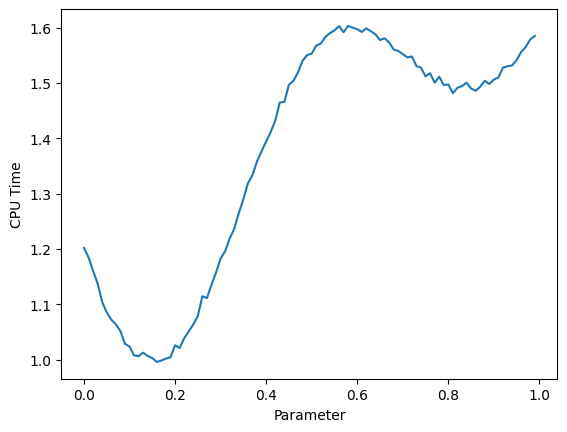
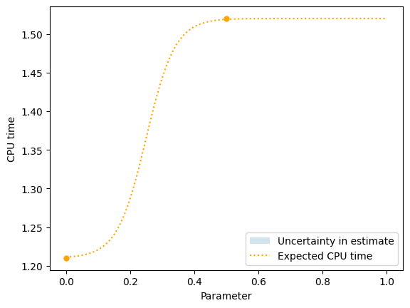
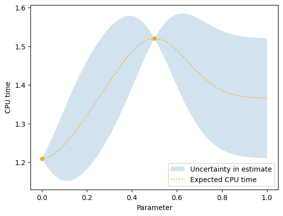
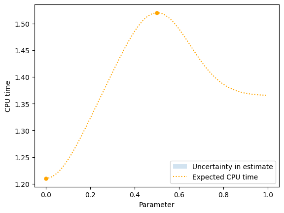
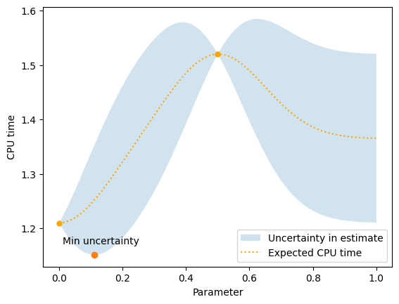
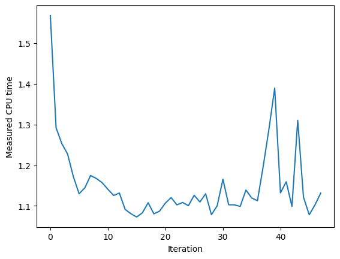

```python
import matplotlib.pyplot as plt
import numpy as np
from tqdm.notebook import trange

from bayesian_optimization import jit_plus_server, plot_example_gpr
```


```python
x = np.arange(0, 1, 0.01)
y = [jit_plus_server([i]) for i in x]
plt.plot(x, y)
plt.xlabel("Parameter")
plt.ylabel("CPU Time");
```


    

    


```python
np.random.seed(17)

jit_plus_server([0]), jit_plus_server([0.5])
```


    (1.2025010344211848, 1.5500903091206684)


```python
class GPR1:
    def __init__(self, parameters, measurements):
        self.x = parameters
        self.y = np.array(measurements)
        self.mean_y = self.y.mean()

    def estimate(self, query_parameter):
        return self.mean_y
```


```python
x = np.arange(0, 1, 0.1)
parameter = 0.0
weight = np.exp(-((x - parameter) ** 2))
plt.plot(x, weight);
```


    

    


```python
class GPR2:
    def __init__(self, parameters, measurements, sigma):
        self.x = parameters
        self.y = np.array(measurements)
        self.sigma = sigma

        self.mean_y = self.y.mean()
        self.y -= self.mean_y

    def kernel(self, x1, x2):
        distance_squared = ((x1 - x2) ** 2).sum()
        return np.exp(-distance_squared / (2 * self.sigma**2))

    def estimate(self, query_parameter):
        weights = [self.kernel(x, query_parameter) for x in self.x]
        weights = np.array(weights)
        weights = weights / weights.sum()
        return self.mean_y + weights @ self.y
```


```python
parameters = np.array([0.5, 0.0])
measurements = np.array([1.52, 1.21])
gpr = GPR2(parameters, measurements, sigma=0.25)
gpr.estimate(0.25), gpr.estimate(0.4)
```


    (1.365, 1.4482426828846955)


```python
np.random.seed(17)

ax = plt.gca()
plot_example_gpr(GPR2, ax, parameters, measurements, err_bars=True)
plt.xlabel("Parameter")
plt.ylabel("CPU time");
```


    

    


```python
class GPR3:
    def __init__(self, parameters, measurements, sigma):
        self.x = parameters
        self.y = np.array(measurements)
        self.sigma = sigma

        self.mean_y = self.y.mean()
        self.y -= self.mean_y

    def kernel(self, x1, x2):
        distance_squared = ((x1 - x2) ** 2).sum()
        return np.exp(-distance_squared / (2 * self.sigma**2))

    def estimate(self, query_parameter):
        kernels_x_query = np.array([self.kernel(x, query_parameter) for x in self.x])
        kernels_x_x = np.array(
            [[self.kernel(x1, x2) for x1 in self.x] for x2 in self.x]
        )
        weights = kernels_x_query.T @ np.linalg.inv(kernels_x_x)
        return self.mean_y + weights @ self.y
```


```python
gpr = GPR3(parameters, measurements, sigma=0.15)
gpr.estimate(0.25), gpr.estimate(0.4)
```


    (1.365, 1.4851511395406307)


```python
np.random.seed(17)

ax = plt.gca()
plot_example_gpr(GPR3, ax, parameters, measurements, err_bars=True)
plt.xlabel("Parameter")
plt.ylabel("CPU time");
```


    

    


```python
class GPR4:
    def __init__(self, parameters, measurements, sigma):
        self.x = parameters
        self.y = np.array(measurements)
        self.sigma = sigma

        self.mean_y = self.y.mean()
        # Need at least 2 values to compute std dev.
        if len(self.y) > 1:
            self.std_y = self.y.std()
        else:
            self.std_y = 1
        self.y -= self.mean_y

    def kernel(self, x1, x2):
        distance_squared = ((x1 - x2) ** 2).sum()
        return np.exp(-distance_squared / (2 * self.sigma**2))

    def estimate(self, query_parameter):
        kernels_x_query = np.array([self.kernel(x, query_parameter) for x in self.x])
        kernels_x_x = np.array(
            [[self.kernel(x1, x2) for x1 in self.x] for x2 in self.x]
        )
        weights = kernels_x_query.T @ np.linalg.pinv(kernels_x_x)
        expectation = self.mean_y + weights @ self.y
        uncertainty_squared = 1 - weights @ kernels_x_query
        uncertainty = np.sqrt(uncertainty_squared)
        return expectation, self.std_y * uncertainty
```


```python
gpr = GPR4(parameters, measurements, sigma=0.15)
gpr.estimate(0.25), gpr.estimate(0.4)
```


    ((1.365, 0.14508247066963484), (1.4851511395406307, 0.09276343849139895))


```python
np.random.seed(17)

ax = plt.gca()
plot_example_gpr(GPR4, ax, parameters, measurements, err_bars=True)
plt.xlabel("Parameter")
plt.ylabel("CPU time");
```


    

    


```python
np.random.seed(17)

gpr = GPR4(parameters, measurements, sigma=0.15)
x_hats = np.linspace(0, 1, 100)
y_hats, sigma_y_hats = zip(*[gpr.estimate(x_hat) for x_hat in x_hats])
k = 1
lcb = np.array(y_hats) - k * np.array(sigma_y_hats)
i = np.where(lcb == lcb.min())
x_hats[i]
```


    array([0.11111111])


```python
np.random.seed(17)

ax = plt.gca()
plot_example_gpr(GPR4, ax, parameters, measurements, err_bars=True)
plt.xlabel("Parameter")
plt.ylabel("CPU time")
plt.scatter(x_hats[i], lcb.min())
plt.text(x_hats[i] - 0.1, lcb.min() + 0.02, "Min uncertainty");
```


    

    


## Optimizing all seven compiler parameters


```python
def evaluate(gpr, x):
    # Ensure the parameter values are in [0, 1]
    x = np.mod(x, 1)
    y, sigma_y = gpr.estimate(x)
    lcb = y - sigma_y
    return x, lcb


def random_search(gpr, num_parameters, num_iterations=1000):
    step_size = 0.1
    x_current = np.random.normal(size=num_parameters)
    x_current, lcb_current = evaluate(gpr, x_current)
    trace = []
    for _ in range(num_iterations):
        x_test = x_current + step_size * np.random.normal(size=num_parameters)
        x_test, lcb_test = evaluate(gpr, x_test)
        if lcb_test < lcb_current:
            lcb_current = lcb_test
            x_current = x_test
        trace.append(lcb_current)
    return x_current, np.array(trace)
```


```python
np.random.seed(17)


gpr = GPR4(parameters, measurements, sigma=0.15)
x_opt, trace = random_search(gpr, num_parameters=1)
x_opt
```


    array([0.11096591])


```python
plt.plot(trace, ".--")
plt.xlabel("Iteration")
plt.ylabel("lcb_current");
```


    

    


```python
class BayesianOptimizer:
    def __init__(self, num_parameters):
        self.num_parameters = num_parameters
        self.parameters = []
        self.measurements = []
        self.x0 = np.array([0.5] * num_parameters)

    def ask(self):
        if len(self.measurements) == 0:
            return self.x0
        return self.new_parameter()

    def new_parameter(self):
        gpr = GPR4(self.parameters, self.measurements, sigma=0.15)
        return random_search(gpr, self.num_parameters, num_iterations=500)[0]

    def tell(self, parameter, measurement):
        self.parameters.append(parameter)
        self.measurements.append(measurement)
```


```python
np.random.seed(7)
bo = BayesianOptimizer(num_parameters=7)
for _ in trange(48):
    parameter = bo.ask()
    cpu_time = jit_plus_server(parameter)
    bo.tell(parameter, cpu_time)
```


      0%|          | 0/48 [00:00<?, ?it/s]


```python
plt.plot(bo.measurements)
plt.xlabel("Iteration")
plt.ylabel("Measured CPU time");
```


    

    

