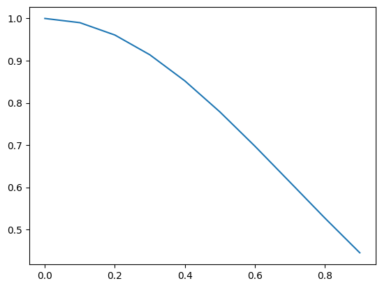
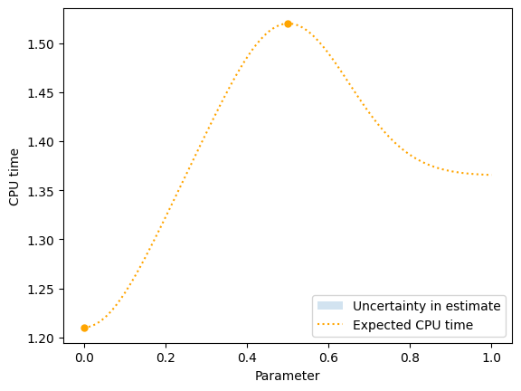
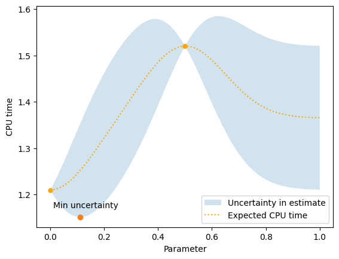
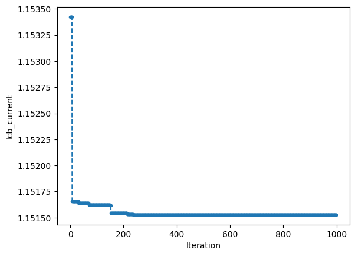

# Bayesian Optimization

https://www.miguelgondu.com/blogposts/2023-07-31/intro-to-bo/


```python
import matplotlib.pyplot as plt
import numpy as np
from skopt import Optimizer, gp_minimize
from tqdm.notebook import trange

from bayesian_optimization import jit_plus_server, plot_example_gpr
```


```python
x = np.arange(0, 1, 0.01)
y = [jit_plus_server([i]) for i in x]
plt.plot(x, y)
plt.xlabel("Parameter")
plt.ylabel("CPU Time");
```


    

    


```python
np.random.seed(17)

jit_plus_server([0]), jit_plus_server([0.5])
```


    (1.2025010344211848, 1.5500903091206684)


```python
class GPR1:
    def __init__(self, parameters, measurements):
        self.x = parameters
        self.y = np.array(measurements)
        self.mean_y = self.y.mean()

    def estimate(self, query_parameter):
        return self.mean_y
```


```python
x = np.arange(0, 1, 0.1)
parameter = 0.0
weight = np.exp(-((x - parameter) ** 2))
plt.plot(x, weight);
```


    

    


```python
class GPR2:
    def __init__(self, parameters, measurements, sigma):
        self.x = parameters
        self.y = np.array(measurements)
        self.sigma = sigma

        self.mean_y = self.y.mean()
        self.y -= self.mean_y

    def kernel(self, x1, x2):
        distance_squared = ((x1 - x2) ** 2).sum()
        return np.exp(-distance_squared / (2 * self.sigma**2))

    def estimate(self, query_parameter):
        weights = [self.kernel(x, query_parameter) for x in self.x]
        weights = np.array(weights)
        weights = weights / weights.sum()
        return self.mean_y + weights @ self.y
```


```python
parameters = np.array([0.5, 0.0])
measurements = np.array([1.52, 1.21])
gpr = GPR2(parameters, measurements, sigma=0.25)
gpr.estimate(0.25), gpr.estimate(0.4)
```


    (1.365, 1.4482426828846955)


```python
np.random.seed(17)

ax = plt.gca()
plot_example_gpr(GPR2, ax, parameters, measurements, err_bars=True)
plt.xlabel("Parameter")
plt.ylabel("CPU time");
```


    

    


```python
class GPR3:
    def __init__(self, parameters, measurements, sigma):
        self.x = parameters
        self.y = np.array(measurements)
        self.sigma = sigma

        self.mean_y = self.y.mean()
        self.y -= self.mean_y

    def kernel(self, x1, x2):
        distance_squared = ((x1 - x2) ** 2).sum()
        return np.exp(-distance_squared / (2 * self.sigma**2))

    def estimate(self, query_parameter):
        kernels_x_query = np.array([self.kernel(x, query_parameter) for x in self.x])
        kernels_x_x = np.array(
            [[self.kernel(x1, x2) for x1 in self.x] for x2 in self.x]
        )
        weights = kernels_x_query.T @ np.linalg.inv(kernels_x_x)
        return self.mean_y + weights @ self.y
```


```python
gpr = GPR3(parameters, measurements, sigma=0.15)
gpr.estimate(0.25), gpr.estimate(0.4)
```


    (1.365, 1.4851511395406307)


```python
np.random.seed(17)

ax = plt.gca()
plot_example_gpr(GPR3, ax, parameters, measurements, err_bars=True)
plt.xlabel("Parameter")
plt.ylabel("CPU time");
```


    

    


```python
class GPR4:
    def __init__(self, parameters, measurements, sigma):
        self.x = parameters
        self.y = np.array(measurements)
        self.sigma = sigma

        self.mean_y = self.y.mean()
        # Need at least 2 values to compute std dev.
        if len(self.y) > 1:
            self.std_y = self.y.std()
        else:
            self.std_y = 1
        self.y -= self.mean_y

    def kernel(self, x1, x2):
        distance_squared = ((x1 - x2) ** 2).sum()
        return np.exp(-distance_squared / (2 * self.sigma**2))

    def estimate(self, query_parameter):
        kernels_x_query = np.array([self.kernel(x, query_parameter) for x in self.x])
        kernels_x_x = np.array(
            [[self.kernel(x1, x2) for x1 in self.x] for x2 in self.x]
        )
        weights = kernels_x_query.T @ np.linalg.pinv(kernels_x_x)
        expectation = self.mean_y + weights @ self.y
        uncertainty_squared = 1 - weights @ kernels_x_query
        uncertainty = np.sqrt(uncertainty_squared)
        return expectation, self.std_y * uncertainty
```


```python
gpr = GPR4(parameters, measurements, sigma=0.15)
gpr.estimate(0.25), gpr.estimate(0.4)
```


    ((1.365, 0.14508247066963484), (1.4851511395406307, 0.09276343849139895))


```python
np.random.seed(17)

ax = plt.gca()
plot_example_gpr(GPR4, ax, parameters, measurements, err_bars=True)
plt.xlabel("Parameter")
plt.ylabel("CPU time");
```


    

    


```python
np.random.seed(17)

gpr = GPR4(parameters, measurements, sigma=0.15)
x_hats = np.linspace(0, 1, 100)
y_hats, sigma_y_hats = zip(*[gpr.estimate(x_hat) for x_hat in x_hats])
k = 1
lcb = np.array(y_hats) - k * np.array(sigma_y_hats)
i = np.where(lcb == lcb.min())
x_hats[i]
```


    array([0.11111111])


```python
np.random.seed(17)

ax = plt.gca()
plot_example_gpr(GPR4, ax, parameters, measurements, err_bars=True)
plt.xlabel("Parameter")
plt.ylabel("CPU time")
plt.scatter(x_hats[i], lcb.min())
plt.text(x_hats[i] - 0.1, lcb.min() + 0.02, "Min uncertainty");
```


    

    


## Optimizing all seven compiler parameters


```python
def evaluate(gpr, x):
    # Ensure the parameter values are in [0, 1]
    x = np.mod(x, 1)
    y, sigma_y = gpr.estimate(x)
    lcb = y - sigma_y
    return x, lcb


def random_search(gpr, num_parameters, num_iterations=1000):
    step_size = 0.1
    x_current = np.random.normal(size=num_parameters)
    x_current, lcb_current = evaluate(gpr, x_current)
    trace = []
    for _ in range(num_iterations):
        x_test = x_current + step_size * np.random.normal(size=num_parameters)
        x_test, lcb_test = evaluate(gpr, x_test)
        if lcb_test < lcb_current:
            lcb_current = lcb_test
            x_current = x_test
        trace.append(lcb_current)
    return x_current, np.array(trace)
```


```python
np.random.seed(17)


gpr = GPR4(parameters, measurements, sigma=0.15)
x_opt, trace = random_search(gpr, num_parameters=1)
x_opt
```


    array([0.11096591])


```python
plt.plot(trace, ".--")
plt.xlabel("Iteration")
plt.ylabel("lcb_current");
```


    

    


```python
class BayesianOptimizer:
    def __init__(self, num_parameters):
        self.num_parameters = num_parameters
        self.parameters = []
        self.measurements = []
        self.x0 = np.array([0.5] * num_parameters)

    def ask(self):
        if len(self.measurements) == 0:
            return self.x0
        return self.new_parameter()

    def new_parameter(self):
        gpr = GPR4(self.parameters, self.measurements, sigma=0.15)
        return random_search(gpr, self.num_parameters, num_iterations=500)[0]

    def tell(self, parameter, measurement):
        self.parameters.append(parameter)
        self.measurements.append(measurement)
```


```python
np.random.seed(7)
bo = BayesianOptimizer(num_parameters=7)
for _ in trange(48):
    parameter = bo.ask()
    cpu_time = jit_plus_server(parameter)
    bo.tell(parameter, cpu_time)
```


      0%|          | 0/48 [00:00<?, ?it/s]


```python
plt.plot(bo.measurements)
plt.xlabel("Iteration")
plt.ylabel("Measured CPU time");
```


    

    


```python
def f(x):
    return jit_plus_server(x)


res = gp_minimize(f, [(0.0, 1.0)] * 7)
res
```


              fun: 1.0741683509160753
                x: [0.0, 0.1645154997161642, 0.0, 0.14860109169418706, 0.15450440433199167, 0.0, 0.1573533283838304]
        func_vals: [ 1.483e+00  1.299e+00 ...  1.076e+00  1.092e+00]
          x_iters: [[0.9505428900132081, 0.4662570884902242, 0.4536753543417824, 0.8107386699627013, 0.300800419180937, 0.7276852018786215, 0.983343586937705], [0.006457465031792566, 0.31514822385587843, 0.3645925262461109, 0.29411545984823456, 0.7322300364577708, 0.3810796910538483, 0.37571356688086066], [0.20648423501023877, 0.4059568733651626, 0.2800630922140909, 0.14219028758064559, 0.5897616000671844, 0.4457521125885734, 0.24460758432850543], [0.47107340482377413, 0.22846805426656008, 0.338707804192315, 0.6224099686001775, 0.09019509841287689, 0.5382257082818528, 0.3863636539586247], [0.2504480641094953, 0.0688740210179586, 0.5281090361360566, 0.4368148030594404, 0.6118550870708113, 0.3111998916925755, 0.132525109833493], [0.42459254470999563, 0.4532312942585197, 0.6224936112772299, 0.32105957035882854, 0.5736063540759813, 0.2795117029282141, 0.723583155288023], [0.5371032693873481, 0.24226893256629461, 0.964878867637184, 0.05228853425486425, 0.28752317247425224, 0.8548849411030509, 0.10081675865427511], [0.1793647281833515, 0.9177878352679655, 0.6562026000134868, 0.8620554336306679, 0.9042631981328264, 0.40868764624282994, 0.41025481809760056], [0.676085402275938, 0.8661289577426643, 0.8579113273341855, 0.5733462345996885, 0.8887498164954386, 0.2789417296301259, 0.39911487312406735], [0.7230509610507342, 0.45434882958065614, 0.545532554493297, 0.38704172814219073, 0.2110927536785397, 0.5363590257915973, 0.7005903738863446], [0.15432442322711196, 0.3983385775383926, 0.1955209689942971, 0.01627531861790872, 0.602058424202936, 0.446213154972514, 0.1599130030431709], [0.0, 0.5094600904310705, 0.9566587274745549, 0.9404613247588058, 0.6204763063526297, 0.4979091952725701, 0.0], [0.24129630680456451, 0.0, 0.33050298207627915, 0.057894434482082646, 0.3763512274715211, 0.48544049558190505, 0.0], [0.4010196554793208, 0.12286275648248542, 0.12303457803780041, 0.0, 0.43273498151857126, 0.7468343713342068, 0.160507835038974], [0.0, 0.0, 0.0, 0.24765254766961783, 1.0, 0.0, 0.12870129795516558], [0.0, 0.9522611181548722, 0.0, 0.6524141449197535, 0.47881118720209875, 0.4917736737223696, 0.02996824552019447], [1.0, 1.0, 0.0, 0.0, 0.39728327202139013, 0.16235142152434576, 0.0], [0.0, 0.0, 0.0, 0.11955598188757538, 0.0, 0.9544081156590364, 0.1756985437967113], [0.0, 0.0, 0.0, 0.0, 0.0, 0.0, 0.26612824448250083], [0.0, 0.0, 1.0, 0.0, 0.0, 0.7942294606657353, 0.23746921797618836], [0.0, 1.0137629682568915e-19, 0.0, 0.0, 0.06851096776127949, 0.09791645800266238, 1.0], [0.0, 0.0, 0.0, 0.10467338538493305, 0.0, 0.5796552598332869, 0.5138759764764328], [0.0, 1.0, 0.0, 0.0, 0.0, 0.0, 1.0], [0.0, 0.0, 0.0, 0.18701314275626968, 1.0, 0.0, 0.24441487272053927], [0.0, 0.0, 0.0, 1.0, 0.0, 1.0, 1.0], [0.0, 0.0, 0.0, 0.0, 1.0, 0.2983709971288371, 0.16777753243334778], [0.0, 0.0, 0.0, 0.18134896909471973, 0.0, 0.0, 0.18785197660796624], [0.0, 0.0, 0.0, 0.29420709720535, 0.0, 0.0, 0.1908965686346432], [1.0, 0.0, 1.0, 0.0, 1.0, 0.0, 1.0], [0.0, 0.0, 0.0, 0.13117495483736608, 0.0, 0.0, 0.12493804986976378], [0.3592734517702141, 0.0, 0.0, 0.16636907046166252, 0.0, 0.0, 0.15175252329648695], [0.0, 0.0, 0.0, 0.3331467654945081, 0.0, 0.0, 1.0], [0.0, 0.0, 0.0, 0.1385890322420665, 0.0, 0.0, 0.16407471081025912], [0.0, 0.0, 0.0, 0.1283207885951816, 0.0, 0.0, 0.15646874241701628], [0.0, 0.0, 0.0, 0.1228612686491672, 0.0, 0.0, 0.16601251836365857], [0.0, 8.732978456063329e-18, 0.0, 0.0, 1.0, 1.0, 1.0], [0.0, 0.1985752894395088, 0.0, 0.13017635403935807, 0.0, 0.0, 0.16341710213675215], [0.0, 0.4051787240351032, 0.0, 0.13301910679395176, 0.0, 0.0, 0.09911730064004504], [0.0, 0.18936051926765474, 0.0, 0.14555442294618282, 0.0, 0.0, 0.21744066933060444], [0.0, 0.1633862421459429, 0.0, 0.17473776369622368, 0.0, 0.0, 0.13856145912936063], [0.0, 0.16959044286490194, 0.0, 0.1536277878693484, 0.0, 0.0, 0.09788738410419404], [0.0, 1.0, 0.0, 0.0, 0.0, 0.0, 0.4509337278758676], [0.0, 0.18005180546571278, 0.0, 0.2088108073820646, 0.0, 0.0, 0.15243869703826524], [0.0, 0.16253182924200738, 0.0, 0.1637200162838658, 0.1883321687411437, 0.0, 0.1517144539227277], [0.0, 0.17850899861317293, 0.0, 0.1742400065095865, 0.3602714039191687, 0.0, 0.14575076908227153], [0.0, 0.1585578294758855, 0.0, 0.1960861611066117, 0.0, 0.0, 0.03212037838396622], [0.0, 0.19505229095294974, 0.0, 0.21240573751855496, 0.1584900143782267, 0.0, 0.12514979042334634], [0.0, 1.0, 0.0, 0.0, 1.0, 1.0, 1.0], [0.0, 0.12226996510520315, 0.0, 0.14292293450219917, 0.16978137171892557, 0.0, 0.18836520258208095], [0.0, 0.17985933584763295, 0.0, 0.09819192168176663, 0.16710416424684166, 0.0, 0.1479310554893474], [0.0, 0.12865814837629735, 0.0, 0.14909747186473368, 0.15484828059852931, 0.0, 0.13939793783069498], [0.0, 0.20472609721642018, 0.0, 0.14598533261715474, 0.18138631337546246, 0.0, 0.20337198598039774], [0.0, 0.1603706834219272, 0.0, 0.1353354812523073, 0.14898835800676216, 0.0, 0.14890320542261942], [0.0, 0.14874175758783312, 0.0, 0.16399388467352247, 0.15074751604255632, 0.0, 0.16262047359010248], [0.0, 0.17185721947699029, 0.0, 0.11957609087866228, 0.15836853397006534, 0.0, 0.14352403089707352], [0.0, 0.17215364507757325, 0.0, 0.11899087989858279, 0.15958864983083082, 0.0, 0.14351338831197186], [0.0, 0.16440429436663212, 0.0, 0.13764212800611314, 0.15250139122588857, 0.0, 0.1524888887113042], [0.0, 0.1594821881809285, 0.0, 0.14359180084233805, 0.15382368658939474, 0.0, 0.15651151160589874], [0.0, 0.1572774536995688, 0.0, 0.12028482554207515, 0.16994744378978485, 0.0, 0.15548140789002854], [0.0, 0.1645154997161642, 0.0, 0.14860109169418706, 0.15450440433199167, 0.0, 0.1573533283838304], [0.0, 0.1599368663255344, 0.0, 0.1591015805173497, 0.14901902258473615, 0.0, 0.15988897147513692], [0.0, 0.15958127044349474, 0.0, 0.1605477151277099, 0.1491332095654388, 0.0, 0.1610156554660975], [0.0, 0.15731154209826995, 0.0, 0.16470799419708881, 0.1495288816147093, 0.0, 0.1632770437060423], [0.0, 0.17838722500198956, 0.0, 0.14673909455500692, 0.15043074359218941, 0.0, 0.15061352495075783], [0.0, 0.1472989050141106, 0.0, 0.15665931755181192, 0.1553058609887965, 0.0, 0.16236652993911807], [0.0, 0.14685921397116214, 0.0, 0.15710658076144352, 0.15643390479206556, 0.0, 0.1633797493031848], [0.0, 0.13901501207339967, 0.0, 0.1650895619130822, 0.15995191574486436, 0.0, 0.16584398496812586], [0.0, 0.14231490622842125, 0.0, 0.16100977808765138, 0.15735542127784927, 0.0, 0.1650956924378317], [0.0, 0.14558862255952165, 0.0, 0.15624211623392076, 0.15435166270141007, 0.0, 0.16510453826724655], [0.0, 0.14703357144383283, 0.0, 0.13966693099418992, 0.15472983388882058, 0.0, 0.1632972447715282], [0.0, 0.16215329949165438, 0.0, 0.16043113858074357, 0.15010211392679965, 0.0, 0.16140533413560368], [0.0, 0.1416163324650062, 0.0, 0.13662558486110232, 0.16403674318554395, 0.0, 0.15084759956784977], [0.0, 0.15217672536956592, 0.0, 0.13081079409109886, 0.15822573645036295, 0.0, 0.1650102169033776], [0.0, 0.1562469984698191, 0.0, 0.15706209190948775, 0.15419803877233812, 0.0, 0.14521900525250037], [0.0, 0.15329937454361744, 0.0, 0.15771588589667684, 0.15592181982070571, 0.0, 0.14171241721442718], [0.0, 0.16872963388909457, 0.0, 0.15504600894979437, 0.15121566801470918, 0.0, 0.14968728394822994], [0.0, 0.15042465679328204, 0.0, 0.16112195217153785, 0.15852403460418346, 0.0, 0.14769263395823404], [0.0, 0.14907973123673554, 0.0, 0.1615797466450878, 0.16082445189593653, 0.0, 0.14763968531430682], [0.0, 0.17035070685971374, 0.0, 0.15489673246629787, 0.15210737386376597, 0.0, 0.15357217999894943], [0.0, 0.13949284507434861, 0.0, 0.15706269337623474, 0.16751069325645399, 0.0, 0.15421850497231654], [0.0, 0.17324347560979728, 0.0, 0.13999548784663648, 0.14543461893989665, 0.0, 0.15144430039944065], [0.0, 0.16667970909506616, 0.0, 0.15438310472512942, 0.14522782176658178, 0.0, 0.1626770095160112], [0.0, 0.16775737053743078, 0.0, 0.15881623137406384, 0.1461246142100717, 0.0, 0.16514489653593772], [0.0, 0.16773342810574096, 0.0, 0.15759870144265095, 0.14575779819791462, 0.0, 0.164681920877439], [0.0, 0.1682342974732939, 0.0, 0.1517873059239598, 0.14362956773057714, 0.0, 0.1619940841696781], [0.0, 0.15961784701980133, 0.0, 0.1391748740851769, 0.14055726002850727, 0.0, 0.15855093825091923], [0.0, 0.160951288002199, 0.0, 0.16926626825190952, 0.15828479931569728, 0.0, 0.16794546890526685], [0.0, 0.1597012636082084, 0.0, 0.1734226976858224, 0.1598219337073463, 0.0, 0.17041733019474464], [0.0, 0.15981248998484548, 0.0, 0.17290651346479974, 0.16011423385853352, 0.0, 0.17027284773586515], [0.0, 0.17458239309428203, 0.0, 0.14614085471745888, 0.15623723454903798, 0.0, 0.1479436638439915], [0.0, 0.1535449555502273, 0.0, 0.1437928971946246, 0.1411636585371233, 0.0, 0.15787586218363703], [0.0, 0.15262850411059833, 0.0, 0.14159986300687472, 0.1411417625434243, 0.0, 0.1594030167604208], [0.0, 0.15010358596335963, 0.0, 0.13619135004819755, 0.13939603951658244, 0.0, 0.1602682634973026], [0.0, 0.1707316962580306, 0.0, 0.15222120452637394, 0.15121651286711307, 0.0, 0.14635169891961178], [0.0, 0.15035721969711532, 0.0, 0.16760486231985833, 0.1515909596729463, 0.0, 0.16596719201218307], [0.0, 0.16086202767402966, 0.0, 0.13107523364931686, 0.1627311145371244, 0.0, 0.16450053863232286], [0.0, 0.1578531064436693, 0.0, 0.14937976672885858, 0.14913685641325636, 0.0, 0.1430180769133338], [0.0, 0.15876677174429105, 0.0, 0.1401980009972717, 0.16393305610489403, 0.0, 0.17223667862159345], [0.0, 0.15889713627539287, 0.0, 0.14100485519846814, 0.16387609390294036, 0.0, 0.1718809322322375], [0.0, 0.15728251008968755, 0.0, 0.13518173272942566, 0.1681135515018385, 0.0, 0.17573688946574675]]
           models: [GaussianProcessRegressor(kernel=1**2 * Matern(length_scale=[1, 1, 1, 1, 1, 1, 1], nu=2.5) + WhiteKernel(noise_level=1),
                                            n_restarts_optimizer=2, noise='gaussian',
                                            normalize_y=True, random_state=685425392), GaussianProcessRegressor(kernel=1**2 * Matern(length_scale=[1, 1, 1, 1, 1, 1, 1], nu=2.5) + WhiteKernel(noise_level=1),
                                            n_restarts_optimizer=2, noise='gaussian',
                                            normalize_y=True, random_state=685425392), GaussianProcessRegressor(kernel=1**2 * Matern(length_scale=[1, 1, 1, 1, 1, 1, 1], nu=2.5) + WhiteKernel(noise_level=1),
                                            n_restarts_optimizer=2, noise='gaussian',
                                            normalize_y=True, random_state=685425392), GaussianProcessRegressor(kernel=1**2 * Matern(length_scale=[1, 1, 1, 1, 1, 1, 1], nu=2.5) + WhiteKernel(noise_level=1),
                                            n_restarts_optimizer=2, noise='gaussian',
                                            normalize_y=True, random_state=685425392), GaussianProcessRegressor(kernel=1**2 * Matern(length_scale=[1, 1, 1, 1, 1, 1, 1], nu=2.5) + WhiteKernel(noise_level=1),
                                            n_restarts_optimizer=2, noise='gaussian',
                                            normalize_y=True, random_state=685425392), GaussianProcessRegressor(kernel=1**2 * Matern(length_scale=[1, 1, 1, 1, 1, 1, 1], nu=2.5) + WhiteKernel(noise_level=1),
                                            n_restarts_optimizer=2, noise='gaussian',
                                            normalize_y=True, random_state=685425392), GaussianProcessRegressor(kernel=1**2 * Matern(length_scale=[1, 1, 1, 1, 1, 1, 1], nu=2.5) + WhiteKernel(noise_level=1),
                                            n_restarts_optimizer=2, noise='gaussian',
                                            normalize_y=True, random_state=685425392), GaussianProcessRegressor(kernel=1**2 * Matern(length_scale=[1, 1, 1, 1, 1, 1, 1], nu=2.5) + WhiteKernel(noise_level=1),
                                            n_restarts_optimizer=2, noise='gaussian',
                                            normalize_y=True, random_state=685425392), GaussianProcessRegressor(kernel=1**2 * Matern(length_scale=[1, 1, 1, 1, 1, 1, 1], nu=2.5) + WhiteKernel(noise_level=1),
                                            n_restarts_optimizer=2, noise='gaussian',
                                            normalize_y=True, random_state=685425392), GaussianProcessRegressor(kernel=1**2 * Matern(length_scale=[1, 1, 1, 1, 1, 1, 1], nu=2.5) + WhiteKernel(noise_level=1),
                                            n_restarts_optimizer=2, noise='gaussian',
                                            normalize_y=True, random_state=685425392), GaussianProcessRegressor(kernel=1**2 * Matern(length_scale=[1, 1, 1, 1, 1, 1, 1], nu=2.5) + WhiteKernel(noise_level=1),
                                            n_restarts_optimizer=2, noise='gaussian',
                                            normalize_y=True, random_state=685425392), GaussianProcessRegressor(kernel=1**2 * Matern(length_scale=[1, 1, 1, 1, 1, 1, 1], nu=2.5) + WhiteKernel(noise_level=1),
                                            n_restarts_optimizer=2, noise='gaussian',
                                            normalize_y=True, random_state=685425392), GaussianProcessRegressor(kernel=1**2 * Matern(length_scale=[1, 1, 1, 1, 1, 1, 1], nu=2.5) + WhiteKernel(noise_level=1),
                                            n_restarts_optimizer=2, noise='gaussian',
                                            normalize_y=True, random_state=685425392), GaussianProcessRegressor(kernel=1**2 * Matern(length_scale=[1, 1, 1, 1, 1, 1, 1], nu=2.5) + WhiteKernel(noise_level=1),
                                            n_restarts_optimizer=2, noise='gaussian',
                                            normalize_y=True, random_state=685425392), GaussianProcessRegressor(kernel=1**2 * Matern(length_scale=[1, 1, 1, 1, 1, 1, 1], nu=2.5) + WhiteKernel(noise_level=1),
                                            n_restarts_optimizer=2, noise='gaussian',
                                            normalize_y=True, random_state=685425392), GaussianProcessRegressor(kernel=1**2 * Matern(length_scale=[1, 1, 1, 1, 1, 1, 1], nu=2.5) + WhiteKernel(noise_level=1),
                                            n_restarts_optimizer=2, noise='gaussian',
                                            normalize_y=True, random_state=685425392), GaussianProcessRegressor(kernel=1**2 * Matern(length_scale=[1, 1, 1, 1, 1, 1, 1], nu=2.5) + WhiteKernel(noise_level=1),
                                            n_restarts_optimizer=2, noise='gaussian',
                                            normalize_y=True, random_state=685425392), GaussianProcessRegressor(kernel=1**2 * Matern(length_scale=[1, 1, 1, 1, 1, 1, 1], nu=2.5) + WhiteKernel(noise_level=1),
                                            n_restarts_optimizer=2, noise='gaussian',
                                            normalize_y=True, random_state=685425392), GaussianProcessRegressor(kernel=1**2 * Matern(length_scale=[1, 1, 1, 1, 1, 1, 1], nu=2.5) + WhiteKernel(noise_level=1),
                                            n_restarts_optimizer=2, noise='gaussian',
                                            normalize_y=True, random_state=685425392), GaussianProcessRegressor(kernel=1**2 * Matern(length_scale=[1, 1, 1, 1, 1, 1, 1], nu=2.5) + WhiteKernel(noise_level=1),
                                            n_restarts_optimizer=2, noise='gaussian',
                                            normalize_y=True, random_state=685425392), GaussianProcessRegressor(kernel=1**2 * Matern(length_scale=[1, 1, 1, 1, 1, 1, 1], nu=2.5) + WhiteKernel(noise_level=1),
                                            n_restarts_optimizer=2, noise='gaussian',
                                            normalize_y=True, random_state=685425392), GaussianProcessRegressor(kernel=1**2 * Matern(length_scale=[1, 1, 1, 1, 1, 1, 1], nu=2.5) + WhiteKernel(noise_level=1),
                                            n_restarts_optimizer=2, noise='gaussian',
                                            normalize_y=True, random_state=685425392), GaussianProcessRegressor(kernel=1**2 * Matern(length_scale=[1, 1, 1, 1, 1, 1, 1], nu=2.5) + WhiteKernel(noise_level=1),
                                            n_restarts_optimizer=2, noise='gaussian',
                                            normalize_y=True, random_state=685425392), GaussianProcessRegressor(kernel=1**2 * Matern(length_scale=[1, 1, 1, 1, 1, 1, 1], nu=2.5) + WhiteKernel(noise_level=1),
                                            n_restarts_optimizer=2, noise='gaussian',
                                            normalize_y=True, random_state=685425392), GaussianProcessRegressor(kernel=1**2 * Matern(length_scale=[1, 1, 1, 1, 1, 1, 1], nu=2.5) + WhiteKernel(noise_level=1),
                                            n_restarts_optimizer=2, noise='gaussian',
                                            normalize_y=True, random_state=685425392), GaussianProcessRegressor(kernel=1**2 * Matern(length_scale=[1, 1, 1, 1, 1, 1, 1], nu=2.5) + WhiteKernel(noise_level=1),
                                            n_restarts_optimizer=2, noise='gaussian',
                                            normalize_y=True, random_state=685425392), GaussianProcessRegressor(kernel=1**2 * Matern(length_scale=[1, 1, 1, 1, 1, 1, 1], nu=2.5) + WhiteKernel(noise_level=1),
                                            n_restarts_optimizer=2, noise='gaussian',
                                            normalize_y=True, random_state=685425392), GaussianProcessRegressor(kernel=1**2 * Matern(length_scale=[1, 1, 1, 1, 1, 1, 1], nu=2.5) + WhiteKernel(noise_level=1),
                                            n_restarts_optimizer=2, noise='gaussian',
                                            normalize_y=True, random_state=685425392), GaussianProcessRegressor(kernel=1**2 * Matern(length_scale=[1, 1, 1, 1, 1, 1, 1], nu=2.5) + WhiteKernel(noise_level=1),
                                            n_restarts_optimizer=2, noise='gaussian',
                                            normalize_y=True, random_state=685425392), GaussianProcessRegressor(kernel=1**2 * Matern(length_scale=[1, 1, 1, 1, 1, 1, 1], nu=2.5) + WhiteKernel(noise_level=1),
                                            n_restarts_optimizer=2, noise='gaussian',
                                            normalize_y=True, random_state=685425392), GaussianProcessRegressor(kernel=1**2 * Matern(length_scale=[1, 1, 1, 1, 1, 1, 1], nu=2.5) + WhiteKernel(noise_level=1),
                                            n_restarts_optimizer=2, noise='gaussian',
                                            normalize_y=True, random_state=685425392), GaussianProcessRegressor(kernel=1**2 * Matern(length_scale=[1, 1, 1, 1, 1, 1, 1], nu=2.5) + WhiteKernel(noise_level=1),
                                            n_restarts_optimizer=2, noise='gaussian',
                                            normalize_y=True, random_state=685425392), GaussianProcessRegressor(kernel=1**2 * Matern(length_scale=[1, 1, 1, 1, 1, 1, 1], nu=2.5) + WhiteKernel(noise_level=1),
                                            n_restarts_optimizer=2, noise='gaussian',
                                            normalize_y=True, random_state=685425392), GaussianProcessRegressor(kernel=1**2 * Matern(length_scale=[1, 1, 1, 1, 1, 1, 1], nu=2.5) + WhiteKernel(noise_level=1),
                                            n_restarts_optimizer=2, noise='gaussian',
                                            normalize_y=True, random_state=685425392), GaussianProcessRegressor(kernel=1**2 * Matern(length_scale=[1, 1, 1, 1, 1, 1, 1], nu=2.5) + WhiteKernel(noise_level=1),
                                            n_restarts_optimizer=2, noise='gaussian',
                                            normalize_y=True, random_state=685425392), GaussianProcessRegressor(kernel=1**2 * Matern(length_scale=[1, 1, 1, 1, 1, 1, 1], nu=2.5) + WhiteKernel(noise_level=1),
                                            n_restarts_optimizer=2, noise='gaussian',
                                            normalize_y=True, random_state=685425392), GaussianProcessRegressor(kernel=1**2 * Matern(length_scale=[1, 1, 1, 1, 1, 1, 1], nu=2.5) + WhiteKernel(noise_level=1),
                                            n_restarts_optimizer=2, noise='gaussian',
                                            normalize_y=True, random_state=685425392), GaussianProcessRegressor(kernel=1**2 * Matern(length_scale=[1, 1, 1, 1, 1, 1, 1], nu=2.5) + WhiteKernel(noise_level=1),
                                            n_restarts_optimizer=2, noise='gaussian',
                                            normalize_y=True, random_state=685425392), GaussianProcessRegressor(kernel=1**2 * Matern(length_scale=[1, 1, 1, 1, 1, 1, 1], nu=2.5) + WhiteKernel(noise_level=1),
                                            n_restarts_optimizer=2, noise='gaussian',
                                            normalize_y=True, random_state=685425392), GaussianProcessRegressor(kernel=1**2 * Matern(length_scale=[1, 1, 1, 1, 1, 1, 1], nu=2.5) + WhiteKernel(noise_level=1),
                                            n_restarts_optimizer=2, noise='gaussian',
                                            normalize_y=True, random_state=685425392), GaussianProcessRegressor(kernel=1**2 * Matern(length_scale=[1, 1, 1, 1, 1, 1, 1], nu=2.5) + WhiteKernel(noise_level=1),
                                            n_restarts_optimizer=2, noise='gaussian',
                                            normalize_y=True, random_state=685425392), GaussianProcessRegressor(kernel=1**2 * Matern(length_scale=[1, 1, 1, 1, 1, 1, 1], nu=2.5) + WhiteKernel(noise_level=1),
                                            n_restarts_optimizer=2, noise='gaussian',
                                            normalize_y=True, random_state=685425392), GaussianProcessRegressor(kernel=1**2 * Matern(length_scale=[1, 1, 1, 1, 1, 1, 1], nu=2.5) + WhiteKernel(noise_level=1),
                                            n_restarts_optimizer=2, noise='gaussian',
                                            normalize_y=True, random_state=685425392), GaussianProcessRegressor(kernel=1**2 * Matern(length_scale=[1, 1, 1, 1, 1, 1, 1], nu=2.5) + WhiteKernel(noise_level=1),
                                            n_restarts_optimizer=2, noise='gaussian',
                                            normalize_y=True, random_state=685425392), GaussianProcessRegressor(kernel=1**2 * Matern(length_scale=[1, 1, 1, 1, 1, 1, 1], nu=2.5) + WhiteKernel(noise_level=1),
                                            n_restarts_optimizer=2, noise='gaussian',
                                            normalize_y=True, random_state=685425392), GaussianProcessRegressor(kernel=1**2 * Matern(length_scale=[1, 1, 1, 1, 1, 1, 1], nu=2.5) + WhiteKernel(noise_level=1),
                                            n_restarts_optimizer=2, noise='gaussian',
                                            normalize_y=True, random_state=685425392), GaussianProcessRegressor(kernel=1**2 * Matern(length_scale=[1, 1, 1, 1, 1, 1, 1], nu=2.5) + WhiteKernel(noise_level=1),
                                            n_restarts_optimizer=2, noise='gaussian',
                                            normalize_y=True, random_state=685425392), GaussianProcessRegressor(kernel=1**2 * Matern(length_scale=[1, 1, 1, 1, 1, 1, 1], nu=2.5) + WhiteKernel(noise_level=1),
                                            n_restarts_optimizer=2, noise='gaussian',
                                            normalize_y=True, random_state=685425392), GaussianProcessRegressor(kernel=1**2 * Matern(length_scale=[1, 1, 1, 1, 1, 1, 1], nu=2.5) + WhiteKernel(noise_level=1),
                                            n_restarts_optimizer=2, noise='gaussian',
                                            normalize_y=True, random_state=685425392), GaussianProcessRegressor(kernel=1**2 * Matern(length_scale=[1, 1, 1, 1, 1, 1, 1], nu=2.5) + WhiteKernel(noise_level=1),
                                            n_restarts_optimizer=2, noise='gaussian',
                                            normalize_y=True, random_state=685425392), GaussianProcessRegressor(kernel=1**2 * Matern(length_scale=[1, 1, 1, 1, 1, 1, 1], nu=2.5) + WhiteKernel(noise_level=1),
                                            n_restarts_optimizer=2, noise='gaussian',
                                            normalize_y=True, random_state=685425392), GaussianProcessRegressor(kernel=1**2 * Matern(length_scale=[1, 1, 1, 1, 1, 1, 1], nu=2.5) + WhiteKernel(noise_level=1),
                                            n_restarts_optimizer=2, noise='gaussian',
                                            normalize_y=True, random_state=685425392), GaussianProcessRegressor(kernel=1**2 * Matern(length_scale=[1, 1, 1, 1, 1, 1, 1], nu=2.5) + WhiteKernel(noise_level=1),
                                            n_restarts_optimizer=2, noise='gaussian',
                                            normalize_y=True, random_state=685425392), GaussianProcessRegressor(kernel=1**2 * Matern(length_scale=[1, 1, 1, 1, 1, 1, 1], nu=2.5) + WhiteKernel(noise_level=1),
                                            n_restarts_optimizer=2, noise='gaussian',
                                            normalize_y=True, random_state=685425392), GaussianProcessRegressor(kernel=1**2 * Matern(length_scale=[1, 1, 1, 1, 1, 1, 1], nu=2.5) + WhiteKernel(noise_level=1),
                                            n_restarts_optimizer=2, noise='gaussian',
                                            normalize_y=True, random_state=685425392), GaussianProcessRegressor(kernel=1**2 * Matern(length_scale=[1, 1, 1, 1, 1, 1, 1], nu=2.5) + WhiteKernel(noise_level=1),
                                            n_restarts_optimizer=2, noise='gaussian',
                                            normalize_y=True, random_state=685425392), GaussianProcessRegressor(kernel=1**2 * Matern(length_scale=[1, 1, 1, 1, 1, 1, 1], nu=2.5) + WhiteKernel(noise_level=1),
                                            n_restarts_optimizer=2, noise='gaussian',
                                            normalize_y=True, random_state=685425392), GaussianProcessRegressor(kernel=1**2 * Matern(length_scale=[1, 1, 1, 1, 1, 1, 1], nu=2.5) + WhiteKernel(noise_level=1),
                                            n_restarts_optimizer=2, noise='gaussian',
                                            normalize_y=True, random_state=685425392), GaussianProcessRegressor(kernel=1**2 * Matern(length_scale=[1, 1, 1, 1, 1, 1, 1], nu=2.5) + WhiteKernel(noise_level=1),
                                            n_restarts_optimizer=2, noise='gaussian',
                                            normalize_y=True, random_state=685425392), GaussianProcessRegressor(kernel=1**2 * Matern(length_scale=[1, 1, 1, 1, 1, 1, 1], nu=2.5) + WhiteKernel(noise_level=1),
                                            n_restarts_optimizer=2, noise='gaussian',
                                            normalize_y=True, random_state=685425392), GaussianProcessRegressor(kernel=1**2 * Matern(length_scale=[1, 1, 1, 1, 1, 1, 1], nu=2.5) + WhiteKernel(noise_level=1),
                                            n_restarts_optimizer=2, noise='gaussian',
                                            normalize_y=True, random_state=685425392), GaussianProcessRegressor(kernel=1**2 * Matern(length_scale=[1, 1, 1, 1, 1, 1, 1], nu=2.5) + WhiteKernel(noise_level=1),
                                            n_restarts_optimizer=2, noise='gaussian',
                                            normalize_y=True, random_state=685425392), GaussianProcessRegressor(kernel=1**2 * Matern(length_scale=[1, 1, 1, 1, 1, 1, 1], nu=2.5) + WhiteKernel(noise_level=1),
                                            n_restarts_optimizer=2, noise='gaussian',
                                            normalize_y=True, random_state=685425392), GaussianProcessRegressor(kernel=1**2 * Matern(length_scale=[1, 1, 1, 1, 1, 1, 1], nu=2.5) + WhiteKernel(noise_level=1),
                                            n_restarts_optimizer=2, noise='gaussian',
                                            normalize_y=True, random_state=685425392), GaussianProcessRegressor(kernel=1**2 * Matern(length_scale=[1, 1, 1, 1, 1, 1, 1], nu=2.5) + WhiteKernel(noise_level=1),
                                            n_restarts_optimizer=2, noise='gaussian',
                                            normalize_y=True, random_state=685425392), GaussianProcessRegressor(kernel=1**2 * Matern(length_scale=[1, 1, 1, 1, 1, 1, 1], nu=2.5) + WhiteKernel(noise_level=1),
                                            n_restarts_optimizer=2, noise='gaussian',
                                            normalize_y=True, random_state=685425392), GaussianProcessRegressor(kernel=1**2 * Matern(length_scale=[1, 1, 1, 1, 1, 1, 1], nu=2.5) + WhiteKernel(noise_level=1),
                                            n_restarts_optimizer=2, noise='gaussian',
                                            normalize_y=True, random_state=685425392), GaussianProcessRegressor(kernel=1**2 * Matern(length_scale=[1, 1, 1, 1, 1, 1, 1], nu=2.5) + WhiteKernel(noise_level=1),
                                            n_restarts_optimizer=2, noise='gaussian',
                                            normalize_y=True, random_state=685425392), GaussianProcessRegressor(kernel=1**2 * Matern(length_scale=[1, 1, 1, 1, 1, 1, 1], nu=2.5) + WhiteKernel(noise_level=1),
                                            n_restarts_optimizer=2, noise='gaussian',
                                            normalize_y=True, random_state=685425392), GaussianProcessRegressor(kernel=1**2 * Matern(length_scale=[1, 1, 1, 1, 1, 1, 1], nu=2.5) + WhiteKernel(noise_level=1),
                                            n_restarts_optimizer=2, noise='gaussian',
                                            normalize_y=True, random_state=685425392), GaussianProcessRegressor(kernel=1**2 * Matern(length_scale=[1, 1, 1, 1, 1, 1, 1], nu=2.5) + WhiteKernel(noise_level=1),
                                            n_restarts_optimizer=2, noise='gaussian',
                                            normalize_y=True, random_state=685425392), GaussianProcessRegressor(kernel=1**2 * Matern(length_scale=[1, 1, 1, 1, 1, 1, 1], nu=2.5) + WhiteKernel(noise_level=1),
                                            n_restarts_optimizer=2, noise='gaussian',
                                            normalize_y=True, random_state=685425392), GaussianProcessRegressor(kernel=1**2 * Matern(length_scale=[1, 1, 1, 1, 1, 1, 1], nu=2.5) + WhiteKernel(noise_level=1),
                                            n_restarts_optimizer=2, noise='gaussian',
                                            normalize_y=True, random_state=685425392), GaussianProcessRegressor(kernel=1**2 * Matern(length_scale=[1, 1, 1, 1, 1, 1, 1], nu=2.5) + WhiteKernel(noise_level=1),
                                            n_restarts_optimizer=2, noise='gaussian',
                                            normalize_y=True, random_state=685425392), GaussianProcessRegressor(kernel=1**2 * Matern(length_scale=[1, 1, 1, 1, 1, 1, 1], nu=2.5) + WhiteKernel(noise_level=1),
                                            n_restarts_optimizer=2, noise='gaussian',
                                            normalize_y=True, random_state=685425392), GaussianProcessRegressor(kernel=1**2 * Matern(length_scale=[1, 1, 1, 1, 1, 1, 1], nu=2.5) + WhiteKernel(noise_level=1),
                                            n_restarts_optimizer=2, noise='gaussian',
                                            normalize_y=True, random_state=685425392), GaussianProcessRegressor(kernel=1**2 * Matern(length_scale=[1, 1, 1, 1, 1, 1, 1], nu=2.5) + WhiteKernel(noise_level=1),
                                            n_restarts_optimizer=2, noise='gaussian',
                                            normalize_y=True, random_state=685425392), GaussianProcessRegressor(kernel=1**2 * Matern(length_scale=[1, 1, 1, 1, 1, 1, 1], nu=2.5) + WhiteKernel(noise_level=1),
                                            n_restarts_optimizer=2, noise='gaussian',
                                            normalize_y=True, random_state=685425392), GaussianProcessRegressor(kernel=1**2 * Matern(length_scale=[1, 1, 1, 1, 1, 1, 1], nu=2.5) + WhiteKernel(noise_level=1),
                                            n_restarts_optimizer=2, noise='gaussian',
                                            normalize_y=True, random_state=685425392), GaussianProcessRegressor(kernel=1**2 * Matern(length_scale=[1, 1, 1, 1, 1, 1, 1], nu=2.5) + WhiteKernel(noise_level=1),
                                            n_restarts_optimizer=2, noise='gaussian',
                                            normalize_y=True, random_state=685425392), GaussianProcessRegressor(kernel=1**2 * Matern(length_scale=[1, 1, 1, 1, 1, 1, 1], nu=2.5) + WhiteKernel(noise_level=1),
                                            n_restarts_optimizer=2, noise='gaussian',
                                            normalize_y=True, random_state=685425392), GaussianProcessRegressor(kernel=1**2 * Matern(length_scale=[1, 1, 1, 1, 1, 1, 1], nu=2.5) + WhiteKernel(noise_level=1),
                                            n_restarts_optimizer=2, noise='gaussian',
                                            normalize_y=True, random_state=685425392), GaussianProcessRegressor(kernel=1**2 * Matern(length_scale=[1, 1, 1, 1, 1, 1, 1], nu=2.5) + WhiteKernel(noise_level=1),
                                            n_restarts_optimizer=2, noise='gaussian',
                                            normalize_y=True, random_state=685425392), GaussianProcessRegressor(kernel=1**2 * Matern(length_scale=[1, 1, 1, 1, 1, 1, 1], nu=2.5) + WhiteKernel(noise_level=1),
                                            n_restarts_optimizer=2, noise='gaussian',
                                            normalize_y=True, random_state=685425392), GaussianProcessRegressor(kernel=1**2 * Matern(length_scale=[1, 1, 1, 1, 1, 1, 1], nu=2.5) + WhiteKernel(noise_level=1),
                                            n_restarts_optimizer=2, noise='gaussian',
                                            normalize_y=True, random_state=685425392), GaussianProcessRegressor(kernel=1**2 * Matern(length_scale=[1, 1, 1, 1, 1, 1, 1], nu=2.5) + WhiteKernel(noise_level=1),
                                            n_restarts_optimizer=2, noise='gaussian',
                                            normalize_y=True, random_state=685425392), GaussianProcessRegressor(kernel=1**2 * Matern(length_scale=[1, 1, 1, 1, 1, 1, 1], nu=2.5) + WhiteKernel(noise_level=1),
                                            n_restarts_optimizer=2, noise='gaussian',
                                            normalize_y=True, random_state=685425392), GaussianProcessRegressor(kernel=1**2 * Matern(length_scale=[1, 1, 1, 1, 1, 1, 1], nu=2.5) + WhiteKernel(noise_level=1),
                                            n_restarts_optimizer=2, noise='gaussian',
                                            normalize_y=True, random_state=685425392), GaussianProcessRegressor(kernel=1**2 * Matern(length_scale=[1, 1, 1, 1, 1, 1, 1], nu=2.5) + WhiteKernel(noise_level=1),
                                            n_restarts_optimizer=2, noise='gaussian',
                                            normalize_y=True, random_state=685425392), GaussianProcessRegressor(kernel=1**2 * Matern(length_scale=[1, 1, 1, 1, 1, 1, 1], nu=2.5) + WhiteKernel(noise_level=1),
                                            n_restarts_optimizer=2, noise='gaussian',
                                            normalize_y=True, random_state=685425392), GaussianProcessRegressor(kernel=1**2 * Matern(length_scale=[1, 1, 1, 1, 1, 1, 1], nu=2.5) + WhiteKernel(noise_level=1),
                                            n_restarts_optimizer=2, noise='gaussian',
                                            normalize_y=True, random_state=685425392)]
            space: Space([Real(low=0.0, high=1.0, prior='uniform', transform='normalize'),
                          Real(low=0.0, high=1.0, prior='uniform', transform='normalize'),
                          Real(low=0.0, high=1.0, prior='uniform', transform='normalize'),
                          Real(low=0.0, high=1.0, prior='uniform', transform='normalize'),
                          Real(low=0.0, high=1.0, prior='uniform', transform='normalize'),
                          Real(low=0.0, high=1.0, prior='uniform', transform='normalize'),
                          Real(low=0.0, high=1.0, prior='uniform', transform='normalize')])
     random_state: RandomState(MT19937)
            specs:     args:                    func: <function f at 0x311948900>
                                          dimensions: Space([Real(low=0.0, high=1.0, prior='uniform', transform='normalize'),
                                                             Real(low=0.0, high=1.0, prior='uniform', transform='normalize'),
                                                             Real(low=0.0, high=1.0, prior='uniform', transform='normalize'),
                                                             Real(low=0.0, high=1.0, prior='uniform', transform='normalize'),
                                                             Real(low=0.0, high=1.0, prior='uniform', transform='normalize'),
                                                             Real(low=0.0, high=1.0, prior='uniform', transform='normalize'),
                                                             Real(low=0.0, high=1.0, prior='uniform', transform='normalize')])
                                      base_estimator: GaussianProcessRegressor(kernel=1**2 * Matern(length_scale=[1, 1, 1, 1, 1, 1, 1], nu=2.5),
                                                                               n_restarts_optimizer=2, noise='gaussian',
                                                                               normalize_y=True, random_state=685425392)
                                             n_calls: 100
                                     n_random_starts: None
                                    n_initial_points: 10
                             initial_point_generator: random
                                            acq_func: gp_hedge
                                       acq_optimizer: auto
                                                  x0: None
                                                  y0: None
                                        random_state: RandomState(MT19937)
                                             verbose: False
                                            callback: None
                                            n_points: 10000
                                n_restarts_optimizer: 5
                                                  xi: 0.01
                                               kappa: 1.96
                                              n_jobs: 1
                                    model_queue_size: None
                                    space_constraint: None
                   function: base_minimize


```python
opt = Optimizer([(0.0, 1.0)] * 7)

for i in range(20):
    suggested = opt.ask()
    y = f(suggested)
    opt.tell(suggested, y)
    print("iteration:", i, suggested, y)
```

    iteration: 0 [0.7680126827075388, 0.2737507758854529, 0.0983303341353611, 0.8091855064246558, 0.34256136996670766, 0.9716276427243538, 0.7285953555342425] 1.3550926517318824
    iteration: 1 [0.03699749278437126, 0.588703820278698, 0.6000274190525222, 0.41738366270153626, 0.5114899549954842, 0.6427808176988448, 0.7608842307532359] 1.490286211314082
    iteration: 2 [0.10135848571137387, 0.26389232905151355, 0.9091648239636848, 0.6366276734933795, 0.9295026234894134, 0.8692203614896017, 0.8859290501193525] 1.3905625741385157
    iteration: 3 [0.29815079135778194, 0.8199988339564829, 0.729417771651919, 0.6984367252097662, 0.8016281898236042, 0.6797256597855701, 0.8636236456492951] 1.479833111288026
    iteration: 4 [0.8561659850508803, 0.737965577435155, 0.5063804260525114, 0.1639702842695039, 0.32116367267018514, 0.8596274025556738, 0.7196665504785855] 1.4058023097626622
    iteration: 5 [0.3912188154147921, 0.053181461628393115, 0.9474928219749631, 0.5847788246406278, 0.04205328698018907, 0.431948748778067, 0.2114155117606839] 1.3094682022364204
    iteration: 6 [0.040476397012771954, 0.2620758201414584, 0.9425003539928402, 0.11420573685098093, 0.14431730934662615, 0.0752289310892962, 0.27692598415376307] 1.1290531857423332
    iteration: 7 [0.11387841576552052, 0.9359812702281134, 0.50310402222633, 0.2272233333886628, 0.21871070797528674, 0.6393265134853796, 0.829147042973842] 1.32166088845114
    iteration: 8 [0.20075157827980566, 0.7844953310102083, 0.6309191434797845, 0.14583724484661023, 0.7310618344704412, 0.09555357293078351, 0.9562948779980489] 1.3209896335181701
    iteration: 9 [0.7268510918083014, 0.2540770137991975, 0.9548833797851523, 0.7238493919558965, 0.7872764598025879, 0.9550649289824495, 0.5768740417823913] 1.4831212685735602
    iteration: 10 [0.3063516944465522, 0.09908157816565125, 0.34663154883818637, 0.07729165398690829, 0.10159574686141487, 0.16242457093725818, 0.5698477006302447] 1.1645665549188884
    iteration: 11 [0.6231219121908943, 0.3696610846906904, 0.21467289121653846, 0.0, 0.21808549962035081, 0.0, 0.7164117999768661] 1.2776018749396734
    iteration: 12 [0.0, 0.2738679123157857, 1.0, 0.020108150628503893, 0.13906857056005223, 0.0, 0.12490210808838165] 1.1868997193969604
    iteration: 13 [0.45885084242936125, 0.47072247932887773, 0.8626629137864547, 0.20939416704237968, 0.10109281117426072, 0.33322063947195285, 0.27376052282456703] 1.2866732063867115
    iteration: 14 [0.0, 0.3804345983394888, 0.658047732475897, 0.7467323516776198, 0.1550268718138058, 0.14316329805253955, 0.8825194722639349] 1.307874300194869
    iteration: 15 [0.0, 0.18693166174561385, 0.44903251091190766, 0.0, 0.0, 0.13373011132340057, 0.8498688781988473] 1.2279141144239145
    iteration: 16 [0.0, 0.8210843763566003, 0.8159414962633382, 0.11051842522919528, 0.052094942730996116, 0.0, 0.3924506388929517] 1.2735824601208978
    iteration: 17 [0.06131890485210474, 0.0, 0.8051119196063816, 0.14297754809986293, 0.0, 0.06509054515428749, 0.34718106444774505] 1.2020012364364046
    iteration: 18 [0.0, 0.0, 0.2689186214553484, 0.12315897349958682, 0.17231819810305013, 0.26864914298010517, 0.17973846767146637] 1.085241572872803
    iteration: 19 [0.0, 0.0, 0.1555891459489536, 0.11269469835878497, 0.25640295245703787, 0.7552957444585834, 0.3422924935855937] 1.1837121114044051

