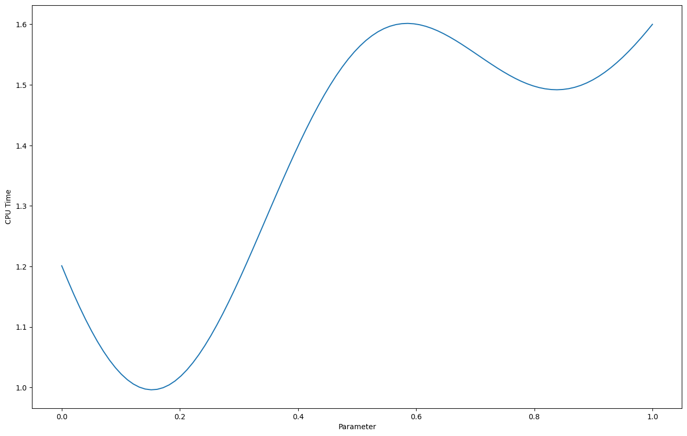
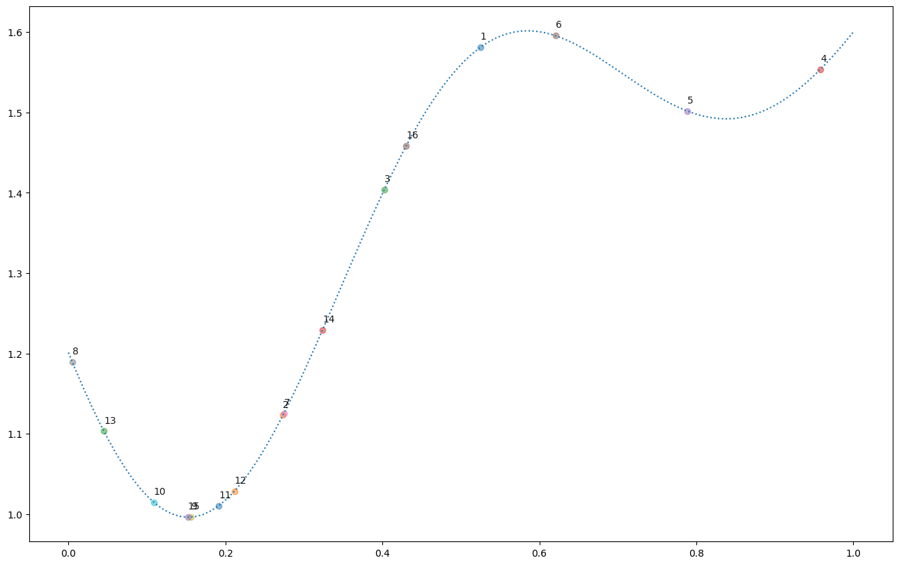

```python
import matplotlib.pyplot as plt
import numpy as np
import optuna

from bayesian_optimization import jit_plus_server, plot_example_gpr

plt.rc("figure", figsize=(16, 10))
```


```python
np.random.seed(20250127)


def jit_plus_server(parameters, is_noisy=False):
    x = np.array(parameters)
    d = len(x)
    x1 = x - 0.15 * np.ones(shape=(d,))
    x2 = x - 0.85 * np.ones(shape=(d,))
    cpu_time = 2 - np.exp(-10 * x1**2) - 0.5 * np.exp(-10 * x2**2)
    noise = 0.005 * np.random.normal()
    return cpu_time.mean() + is_noisy * noise


x = np.linspace(0, 1, 100)
y = [jit_plus_server([i]) for i in x]

plt.plot(x, y)
plt.xlabel("Parameter")
plt.ylabel("CPU Time");
```


    

    


```python
# Optimal value (min).
i = np.argmin(y)
print("x={:.4f} | y={:.4f}".format(x[i], y[i]))
```

    x=0.1515 | y=0.9962


Given an expensive black-box function, we can find the optimum value (minimizing) by trying all the different parameters.
By using bayesian optimization, we can reduce the number of trials before reaching the optimum value.


```python
np.random.seed(20250127)


def objective(trial):
    x = trial.suggest_float("x", 0, 1)
    return jit_plus_server([x])


study = optuna.create_study()
study.optimize(objective, n_trials=16)
```

    [I 2025-01-27 17:33:07,978] A new study created in memory with name: no-name-795d57fa-2ffb-46d9-adef-66b23bc601b5
    [I 2025-01-27 17:33:07,980] Trial 0 finished with value: 1.5808752609783658 and parameters: {'x': 0.5247385565776095}. Best is trial 0 with value: 1.5808752609783658.
    [I 2025-01-27 17:33:07,982] Trial 1 finished with value: 1.123186611629456 and parameters: {'x': 0.27336353198710606}. Best is trial 1 with value: 1.123186611629456.
    [I 2025-01-27 17:33:07,984] Trial 2 finished with value: 1.403767904339469 and parameters: {'x': 0.4024233299036146}. Best is trial 1 with value: 1.123186611629456.
    [I 2025-01-27 17:33:07,987] Trial 3 finished with value: 1.5537623547141344 and parameters: {'x': 0.9581787267693945}. Best is trial 1 with value: 1.123186611629456.
    [I 2025-01-27 17:33:07,989] Trial 4 finished with value: 1.5016808617198545 and parameters: {'x': 0.7882766278291756}. Best is trial 1 with value: 1.123186611629456.
    [I 2025-01-27 17:33:07,990] Trial 5 finished with value: 1.5954623267200787 and parameters: {'x': 0.6204016453259076}. Best is trial 1 with value: 1.123186611629456.
    [I 2025-01-27 17:33:07,992] Trial 6 finished with value: 1.125720578968909 and parameters: {'x': 0.2746846380659873}. Best is trial 1 with value: 1.123186611629456.
    [I 2025-01-27 17:33:07,993] Trial 7 finished with value: 1.1896509269298936 and parameters: {'x': 0.004818111447827844}. Best is trial 1 with value: 1.123186611629456.
    [I 2025-01-27 17:33:07,995] Trial 8 finished with value: 0.9963124480672132 and parameters: {'x': 0.15600962599011425}. Best is trial 8 with value: 0.9963124480672132.
    [I 2025-01-27 17:33:07,996] Trial 9 finished with value: 1.014783790462038 and parameters: {'x': 0.10878954382078876}. Best is trial 8 with value: 0.9963124480672132.
    [I 2025-01-27 17:33:07,999] Trial 10 finished with value: 1.0105470463827104 and parameters: {'x': 0.1915204692330313}. Best is trial 8 with value: 0.9963124480672132.
    [I 2025-01-27 17:33:08,004] Trial 11 finished with value: 1.0285414380235853 and parameters: {'x': 0.21141250346667828}. Best is trial 8 with value: 0.9963124480672132.
    [I 2025-01-27 17:33:08,008] Trial 12 finished with value: 1.1033623972172946 and parameters: {'x': 0.045137769629888524}. Best is trial 8 with value: 0.9963124480672132.
    [I 2025-01-27 17:33:08,011] Trial 13 finished with value: 1.2289172103904304 and parameters: {'x': 0.3236098877509567}. Best is trial 8 with value: 0.9963124480672132.
    [I 2025-01-27 17:33:08,014] Trial 14 finished with value: 0.9962102128858974 and parameters: {'x': 0.1520723350245612}. Best is trial 14 with value: 0.9962102128858974.
    [I 2025-01-27 17:33:08,019] Trial 15 finished with value: 1.4585647722981034 and parameters: {'x': 0.43044678720506147}. Best is trial 14 with value: 0.9962102128858974.


```python
study.best_params
```


    {'x': 0.1520723350245612}


```python
jit_plus_server([study.best_params["x"]])
```


    0.9962102128858974


```python
for t in study.trials:
    x_i = t.params["x"]
    y_i = t.values[0]
    text_i = t.number + 1
    plt.text(x_i, y_i + 0.01, text_i, alpha=0.9)
    plt.scatter(x_i, y_i, alpha=0.5)
plt.plot(x, y, linestyle="dotted");
```


    

    

