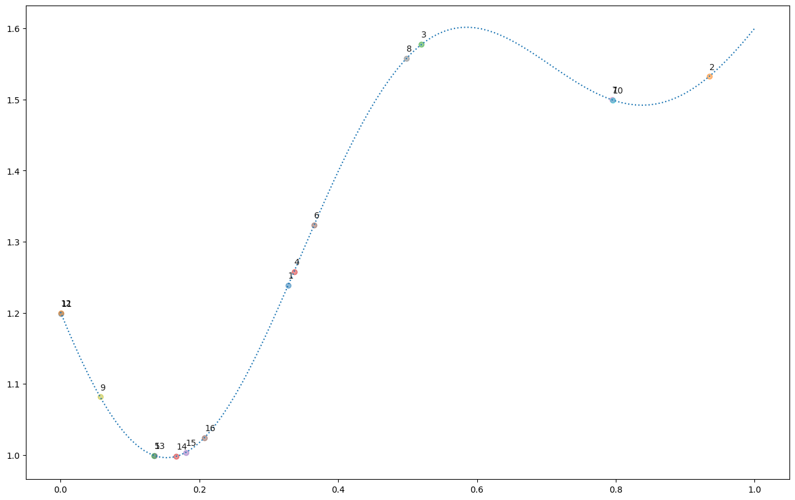

# Bayesian Optimization (V3)


```python
import matplotlib.pyplot as plt
import numpy as np
import optuna
from sklearn.gaussian_process import GaussianProcessRegressor
from sklearn.gaussian_process.kernels import RBF, WhiteKernel

from bayesian_optimization import jit_plus_server, plot_example_gpr

plt.rc("figure", figsize=(16, 10))
```


```python
np.random.seed(20250127)


def jit_plus_server(parameters, is_noisy=False):
    x = np.array(parameters)
    d = len(x)
    x1 = x - 0.15 * np.ones(shape=(d,))
    x2 = x - 0.85 * np.ones(shape=(d,))
    cpu_time = 2 - np.exp(-10 * x1**2) - 0.5 * np.exp(-10 * x2**2)
    noise = 0.005 * np.random.normal()
    return cpu_time.mean() + is_noisy * noise


x = np.linspace(0, 1, 100)
y = [jit_plus_server([i]) for i in x]

plt.plot(x, y)
plt.xlabel("Parameter")
plt.ylabel("CPU Time");
```


    

    


```python
# Optimal value (min).
i = np.argmin(y)
print("x={:.4f} | y={:.4f}".format(x[i], y[i]))
```

    x=0.1515 | y=0.9962


Given an expensive black-box function, we can find the optimum value (minimizing) by trying all the different parameters.
By using bayesian optimization, we can reduce the number of trials before reaching the optimum value.


```python
np.random.seed(20250127)


def objective(trial):
    x = trial.suggest_float("x", 0, 1)
    return jit_plus_server([x])


study = optuna.create_study()
study.optimize(objective, n_trials=16)
```

    [I 2025-01-30 14:42:22,644] A new study created in memory with name: no-name-3ad6af9f-4aa9-42d3-97fb-1b1a7e7a1dd3
    [I 2025-01-30 14:42:22,645] Trial 0 finished with value: 1.2387192470206816 and parameters: {'x': 0.3279755178882411}. Best is trial 0 with value: 1.2387192470206816.
    [I 2025-01-30 14:42:22,645] Trial 1 finished with value: 1.532254907801371 and parameters: {'x': 0.9344055124501031}. Best is trial 0 with value: 1.2387192470206816.
    [I 2025-01-30 14:42:22,646] Trial 2 finished with value: 1.5773892707340091 and parameters: {'x': 0.5200348750994868}. Best is trial 0 with value: 1.2387192470206816.
    [I 2025-01-30 14:42:22,646] Trial 3 finished with value: 1.2580248740077669 and parameters: {'x': 0.3365190963516762}. Best is trial 0 with value: 1.2387192470206816.
    [I 2025-01-30 14:42:22,646] Trial 4 finished with value: 0.9991686669222456 and parameters: {'x': 0.13519838743350332}. Best is trial 4 with value: 0.9991686669222456.
    [I 2025-01-30 14:42:22,646] Trial 5 finished with value: 1.3232707816760039 and parameters: {'x': 0.36531740253681066}. Best is trial 4 with value: 0.9991686669222456.
    [I 2025-01-30 14:42:22,647] Trial 6 finished with value: 1.4994471311243587 and parameters: {'x': 0.7945439564294345}. Best is trial 4 with value: 0.9991686669222456.
    [I 2025-01-30 14:42:22,647] Trial 7 finished with value: 1.5577640809958235 and parameters: {'x': 0.49845917072171697}. Best is trial 4 with value: 0.9991686669222456.
    [I 2025-01-30 14:42:22,647] Trial 8 finished with value: 1.0817313562805826 and parameters: {'x': 0.05711346985145205}. Best is trial 4 with value: 0.9991686669222456.
    [I 2025-01-30 14:42:22,647] Trial 9 finished with value: 1.4992597943886277 and parameters: {'x': 0.7951056527179743}. Best is trial 4 with value: 0.9991686669222456.
    [I 2025-01-30 14:42:22,649] Trial 10 finished with value: 1.1986193385165191 and parameters: {'x': 0.001043042206595235}. Best is trial 4 with value: 0.9991686669222456.
    [I 2025-01-30 14:42:22,650] Trial 11 finished with value: 1.1997598571428885 and parameters: {'x': 0.0005667756428723025}. Best is trial 4 with value: 0.9991686669222456.
    [I 2025-01-30 14:42:22,652] Trial 12 finished with value: 0.9993621667571381 and parameters: {'x': 0.13463586635225105}. Best is trial 4 with value: 0.9991686669222456.
    [I 2025-01-30 14:42:22,653] Trial 13 finished with value: 0.9980923490251096 and parameters: {'x': 0.1666933421730653}. Best is trial 13 with value: 0.9980923490251096.
    [I 2025-01-30 14:42:22,655] Trial 14 finished with value: 1.0036752533337454 and parameters: {'x': 0.18063128165426662}. Best is trial 13 with value: 0.9980923490251096.
    [I 2025-01-30 14:42:22,656] Trial 15 finished with value: 1.0243201425788377 and parameters: {'x': 0.2073563954458335}. Best is trial 13 with value: 0.9980923490251096.


```python
study.best_params
```


    {'x': 0.1666933421730653}


```python
jit_plus_server([study.best_params["x"]])
```


    0.9980923490251096


```python
for t in study.trials:
    x_i = t.params["x"]
    y_i = t.values[0]
    text_i = t.number + 1
    plt.text(x_i, y_i + 0.01, text_i, alpha=0.9)
    plt.scatter(x_i, y_i, alpha=0.5)
plt.plot(x, y, linestyle="dotted");
```


    

    


```python
def fit_gaussian_process(X: np.ndarray, y: np.ndarray):
    """https://www.miguelgondu.com/blogposts/2023-07-31/intro-to-bo/"""
    kernel = 1 * RBF() + WhiteKernel()
    model = GaussianProcessRegressor(kernel=kernel)
    model.fit(X, y)
    return model
```


```python
X = [0, 0.5, 1]
y = [jit_plus_server([x]) for x in X]
X, y
```


    ([0, 0.5, 1], [1.2011197049710782, 1.5593634495147009, 1.600013738081222])


```python
model = fit_gaussian_process(np.array(X).reshape(-1, 1), y)
model
```

    /Users/alextanhongpin/Library/Caches/pypoetry/virtualenvs/python-experimentation-for-engineers-8u4RfFJH-py3.12/lib/python3.12/site-packages/sklearn/gaussian_process/kernels.py:442: ConvergenceWarning: The optimal value found for dimension 0 of parameter k2__noise_level is close to the specified lower bound 1e-05. Decreasing the bound and calling fit again may find a better value.
      warnings.warn(


<style>#sk-container-id-1 {
  /* Definition of color scheme common for light and dark mode */
  --sklearn-color-text: #000;
  --sklearn-color-text-muted: #666;
  --sklearn-color-line: gray;
  /* Definition of color scheme for unfitted estimators */
  --sklearn-color-unfitted-level-0: #fff5e6;
  --sklearn-color-unfitted-level-1: #f6e4d2;
  --sklearn-color-unfitted-level-2: #ffe0b3;
  --sklearn-color-unfitted-level-3: chocolate;
  /* Definition of color scheme for fitted estimators */
  --sklearn-color-fitted-level-0: #f0f8ff;
  --sklearn-color-fitted-level-1: #d4ebff;
  --sklearn-color-fitted-level-2: #b3dbfd;
  --sklearn-color-fitted-level-3: cornflowerblue;

  /* Specific color for light theme */
  --sklearn-color-text-on-default-background: var(--sg-text-color, var(--theme-code-foreground, var(--jp-content-font-color1, black)));
  --sklearn-color-background: var(--sg-background-color, var(--theme-background, var(--jp-layout-color0, white)));
  --sklearn-color-border-box: var(--sg-text-color, var(--theme-code-foreground, var(--jp-content-font-color1, black)));
  --sklearn-color-icon: #696969;

  @media (prefers-color-scheme: dark) {
    /* Redefinition of color scheme for dark theme */
    --sklearn-color-text-on-default-background: var(--sg-text-color, var(--theme-code-foreground, var(--jp-content-font-color1, white)));
    --sklearn-color-background: var(--sg-background-color, var(--theme-background, var(--jp-layout-color0, #111)));
    --sklearn-color-border-box: var(--sg-text-color, var(--theme-code-foreground, var(--jp-content-font-color1, white)));
    --sklearn-color-icon: #878787;
  }
}

#sk-container-id-1 {
  color: var(--sklearn-color-text);
}

#sk-container-id-1 pre {
  padding: 0;
}

#sk-container-id-1 input.sk-hidden--visually {
  border: 0;
  clip: rect(1px 1px 1px 1px);
  clip: rect(1px, 1px, 1px, 1px);
  height: 1px;
  margin: -1px;
  overflow: hidden;
  padding: 0;
  position: absolute;
  width: 1px;
}

#sk-container-id-1 div.sk-dashed-wrapped {
  border: 1px dashed var(--sklearn-color-line);
  margin: 0 0.4em 0.5em 0.4em;
  box-sizing: border-box;
  padding-bottom: 0.4em;
  background-color: var(--sklearn-color-background);
}

#sk-container-id-1 div.sk-container {
  /* jupyter's `normalize.less` sets `[hidden] { display: none; }`
     but bootstrap.min.css set `[hidden] { display: none !important; }`
     so we also need the `!important` here to be able to override the
     default hidden behavior on the sphinx rendered scikit-learn.org.
     See: https://github.com/scikit-learn/scikit-learn/issues/21755 */
  display: inline-block !important;
  position: relative;
}

#sk-container-id-1 div.sk-text-repr-fallback {
  display: none;
}

div.sk-parallel-item,
div.sk-serial,
div.sk-item {
  /* draw centered vertical line to link estimators */
  background-image: linear-gradient(var(--sklearn-color-text-on-default-background), var(--sklearn-color-text-on-default-background));
  background-size: 2px 100%;
  background-repeat: no-repeat;
  background-position: center center;
}

/* Parallel-specific style estimator block */

#sk-container-id-1 div.sk-parallel-item::after {
  content: "";
  width: 100%;
  border-bottom: 2px solid var(--sklearn-color-text-on-default-background);
  flex-grow: 1;
}

#sk-container-id-1 div.sk-parallel {
  display: flex;
  align-items: stretch;
  justify-content: center;
  background-color: var(--sklearn-color-background);
  position: relative;
}

#sk-container-id-1 div.sk-parallel-item {
  display: flex;
  flex-direction: column;
}

#sk-container-id-1 div.sk-parallel-item:first-child::after {
  align-self: flex-end;
  width: 50%;
}

#sk-container-id-1 div.sk-parallel-item:last-child::after {
  align-self: flex-start;
  width: 50%;
}

#sk-container-id-1 div.sk-parallel-item:only-child::after {
  width: 0;
}

/* Serial-specific style estimator block */

#sk-container-id-1 div.sk-serial {
  display: flex;
  flex-direction: column;
  align-items: center;
  background-color: var(--sklearn-color-background);
  padding-right: 1em;
  padding-left: 1em;
}


/* Toggleable style: style used for estimator/Pipeline/ColumnTransformer box that is
clickable and can be expanded/collapsed.
- Pipeline and ColumnTransformer use this feature and define the default style
- Estimators will overwrite some part of the style using the `sk-estimator` class
*/

/* Pipeline and ColumnTransformer style (default) */

#sk-container-id-1 div.sk-toggleable {
  /* Default theme specific background. It is overwritten whether we have a
  specific estimator or a Pipeline/ColumnTransformer */
  background-color: var(--sklearn-color-background);
}

/* Toggleable label */
#sk-container-id-1 label.sk-toggleable__label {
  cursor: pointer;
  display: flex;
  width: 100%;
  margin-bottom: 0;
  padding: 0.5em;
  box-sizing: border-box;
  text-align: center;
  align-items: start;
  justify-content: space-between;
  gap: 0.5em;
}

#sk-container-id-1 label.sk-toggleable__label .caption {
  font-size: 0.6rem;
  font-weight: lighter;
  color: var(--sklearn-color-text-muted);
}

#sk-container-id-1 label.sk-toggleable__label-arrow:before {
  /* Arrow on the left of the label */
  content: "▸";
  float: left;
  margin-right: 0.25em;
  color: var(--sklearn-color-icon);
}

#sk-container-id-1 label.sk-toggleable__label-arrow:hover:before {
  color: var(--sklearn-color-text);
}

/* Toggleable content - dropdown */

#sk-container-id-1 div.sk-toggleable__content {
  max-height: 0;
  max-width: 0;
  overflow: hidden;
  text-align: left;
  /* unfitted */
  background-color: var(--sklearn-color-unfitted-level-0);
}

#sk-container-id-1 div.sk-toggleable__content.fitted {
  /* fitted */
  background-color: var(--sklearn-color-fitted-level-0);
}

#sk-container-id-1 div.sk-toggleable__content pre {
  margin: 0.2em;
  border-radius: 0.25em;
  color: var(--sklearn-color-text);
  /* unfitted */
  background-color: var(--sklearn-color-unfitted-level-0);
}

#sk-container-id-1 div.sk-toggleable__content.fitted pre {
  /* unfitted */
  background-color: var(--sklearn-color-fitted-level-0);
}

#sk-container-id-1 input.sk-toggleable__control:checked~div.sk-toggleable__content {
  /* Expand drop-down */
  max-height: 200px;
  max-width: 100%;
  overflow: auto;
}

#sk-container-id-1 input.sk-toggleable__control:checked~label.sk-toggleable__label-arrow:before {
  content: "▾";
}

/* Pipeline/ColumnTransformer-specific style */

#sk-container-id-1 div.sk-label input.sk-toggleable__control:checked~label.sk-toggleable__label {
  color: var(--sklearn-color-text);
  background-color: var(--sklearn-color-unfitted-level-2);
}

#sk-container-id-1 div.sk-label.fitted input.sk-toggleable__control:checked~label.sk-toggleable__label {
  background-color: var(--sklearn-color-fitted-level-2);
}

/* Estimator-specific style */

/* Colorize estimator box */
#sk-container-id-1 div.sk-estimator input.sk-toggleable__control:checked~label.sk-toggleable__label {
  /* unfitted */
  background-color: var(--sklearn-color-unfitted-level-2);
}

#sk-container-id-1 div.sk-estimator.fitted input.sk-toggleable__control:checked~label.sk-toggleable__label {
  /* fitted */
  background-color: var(--sklearn-color-fitted-level-2);
}

#sk-container-id-1 div.sk-label label.sk-toggleable__label,
#sk-container-id-1 div.sk-label label {
  /* The background is the default theme color */
  color: var(--sklearn-color-text-on-default-background);
}

/* On hover, darken the color of the background */
#sk-container-id-1 div.sk-label:hover label.sk-toggleable__label {
  color: var(--sklearn-color-text);
  background-color: var(--sklearn-color-unfitted-level-2);
}

/* Label box, darken color on hover, fitted */
#sk-container-id-1 div.sk-label.fitted:hover label.sk-toggleable__label.fitted {
  color: var(--sklearn-color-text);
  background-color: var(--sklearn-color-fitted-level-2);
}

/* Estimator label */

#sk-container-id-1 div.sk-label label {
  font-family: monospace;
  font-weight: bold;
  display: inline-block;
  line-height: 1.2em;
}

#sk-container-id-1 div.sk-label-container {
  text-align: center;
}

/* Estimator-specific */
#sk-container-id-1 div.sk-estimator {
  font-family: monospace;
  border: 1px dotted var(--sklearn-color-border-box);
  border-radius: 0.25em;
  box-sizing: border-box;
  margin-bottom: 0.5em;
  /* unfitted */
  background-color: var(--sklearn-color-unfitted-level-0);
}

#sk-container-id-1 div.sk-estimator.fitted {
  /* fitted */
  background-color: var(--sklearn-color-fitted-level-0);
}

/* on hover */
#sk-container-id-1 div.sk-estimator:hover {
  /* unfitted */
  background-color: var(--sklearn-color-unfitted-level-2);
}

#sk-container-id-1 div.sk-estimator.fitted:hover {
  /* fitted */
  background-color: var(--sklearn-color-fitted-level-2);
}

/* Specification for estimator info (e.g. "i" and "?") */

/* Common style for "i" and "?" */

.sk-estimator-doc-link,
a:link.sk-estimator-doc-link,
a:visited.sk-estimator-doc-link {
  float: right;
  font-size: smaller;
  line-height: 1em;
  font-family: monospace;
  background-color: var(--sklearn-color-background);
  border-radius: 1em;
  height: 1em;
  width: 1em;
  text-decoration: none !important;
  margin-left: 0.5em;
  text-align: center;
  /* unfitted */
  border: var(--sklearn-color-unfitted-level-1) 1pt solid;
  color: var(--sklearn-color-unfitted-level-1);
}

.sk-estimator-doc-link.fitted,
a:link.sk-estimator-doc-link.fitted,
a:visited.sk-estimator-doc-link.fitted {
  /* fitted */
  border: var(--sklearn-color-fitted-level-1) 1pt solid;
  color: var(--sklearn-color-fitted-level-1);
}

/* On hover */
div.sk-estimator:hover .sk-estimator-doc-link:hover,
.sk-estimator-doc-link:hover,
div.sk-label-container:hover .sk-estimator-doc-link:hover,
.sk-estimator-doc-link:hover {
  /* unfitted */
  background-color: var(--sklearn-color-unfitted-level-3);
  color: var(--sklearn-color-background);
  text-decoration: none;
}

div.sk-estimator.fitted:hover .sk-estimator-doc-link.fitted:hover,
.sk-estimator-doc-link.fitted:hover,
div.sk-label-container:hover .sk-estimator-doc-link.fitted:hover,
.sk-estimator-doc-link.fitted:hover {
  /* fitted */
  background-color: var(--sklearn-color-fitted-level-3);
  color: var(--sklearn-color-background);
  text-decoration: none;
}

/* Span, style for the box shown on hovering the info icon */
.sk-estimator-doc-link span {
  display: none;
  z-index: 9999;
  position: relative;
  font-weight: normal;
  right: .2ex;
  padding: .5ex;
  margin: .5ex;
  width: min-content;
  min-width: 20ex;
  max-width: 50ex;
  color: var(--sklearn-color-text);
  box-shadow: 2pt 2pt 4pt #999;
  /* unfitted */
  background: var(--sklearn-color-unfitted-level-0);
  border: .5pt solid var(--sklearn-color-unfitted-level-3);
}

.sk-estimator-doc-link.fitted span {
  /* fitted */
  background: var(--sklearn-color-fitted-level-0);
  border: var(--sklearn-color-fitted-level-3);
}

.sk-estimator-doc-link:hover span {
  display: block;
}

/* "?"-specific style due to the `<a>` HTML tag */

#sk-container-id-1 a.estimator_doc_link {
  float: right;
  font-size: 1rem;
  line-height: 1em;
  font-family: monospace;
  background-color: var(--sklearn-color-background);
  border-radius: 1rem;
  height: 1rem;
  width: 1rem;
  text-decoration: none;
  /* unfitted */
  color: var(--sklearn-color-unfitted-level-1);
  border: var(--sklearn-color-unfitted-level-1) 1pt solid;
}

#sk-container-id-1 a.estimator_doc_link.fitted {
  /* fitted */
  border: var(--sklearn-color-fitted-level-1) 1pt solid;
  color: var(--sklearn-color-fitted-level-1);
}

/* On hover */
#sk-container-id-1 a.estimator_doc_link:hover {
  /* unfitted */
  background-color: var(--sklearn-color-unfitted-level-3);
  color: var(--sklearn-color-background);
  text-decoration: none;
}

#sk-container-id-1 a.estimator_doc_link.fitted:hover {
  /* fitted */
  background-color: var(--sklearn-color-fitted-level-3);
}
</style><div id="sk-container-id-1" class="sk-top-container"><div class="sk-text-repr-fallback"><pre>GaussianProcessRegressor(kernel=1**2 * RBF(length_scale=1) + WhiteKernel(noise_level=1))</pre><b>In a Jupyter environment, please rerun this cell to show the HTML representation or trust the notebook. <br />On GitHub, the HTML representation is unable to render, please try loading this page with nbviewer.org.</b></div><div class="sk-container" hidden><div class="sk-item"><div class="sk-estimator fitted sk-toggleable"><input class="sk-toggleable__control sk-hidden--visually" id="sk-estimator-id-1" type="checkbox" checked><label for="sk-estimator-id-1" class="sk-toggleable__label fitted sk-toggleable__label-arrow"><div><div>GaussianProcessRegressor</div></div><div><a class="sk-estimator-doc-link fitted" rel="noreferrer" target="_blank" href="https://scikit-learn.org/1.6/modules/generated/sklearn.gaussian_process.GaussianProcessRegressor.html">?<span>Documentation for GaussianProcessRegressor</span></a><span class="sk-estimator-doc-link fitted">i<span>Fitted</span></span></div></label><div class="sk-toggleable__content fitted"><pre>GaussianProcessRegressor(kernel=1**2 * RBF(length_scale=1) + WhiteKernel(noise_level=1))</pre></div> </div></div></div></div>


```python
X_test = [0.25, 0.75]
y_test = [jit_plus_server([x]) for x in X_test]
y_pred = model.predict(np.array(X_test).reshape(-1, 1))
y_test, y_pred
```


    ([1.0815007207403942, 1.5202575685347275], array([1.4139729 , 1.62261357]))


